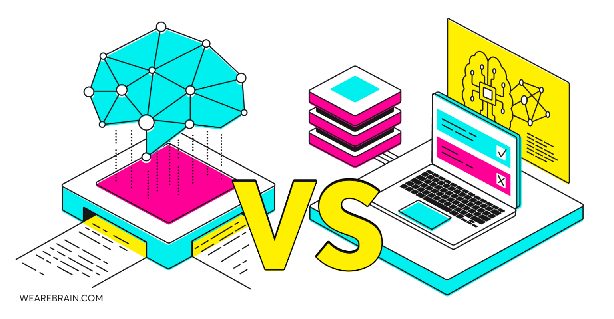
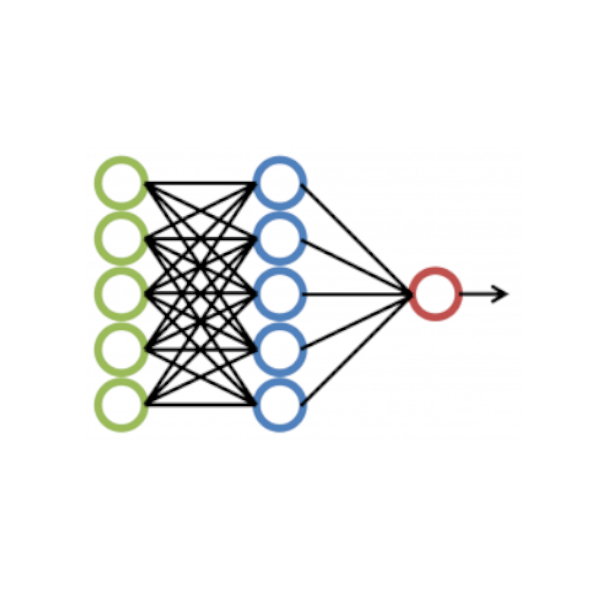

# IA responsable, segura i centrada en les persones

### Models d'intel·ligència artificial

**Unitat 0 · Mòdul 5071 · 5 hores**

---

## IA responsable: les idees clau de la Introducció

- Les dades poden contindre errors, desequilibris i biaixos.
- Un model pot perjudicar persones encara que la mètrica global siga alta.
- Cal protegir les dades personals i limitar-ne l'accés.
- Els resultats s'han de verificar quan poden tindre conseqüències.
- La responsabilitat continua sent de les persones i de l'organització.

Aquesta unitat amplia aquests principis amb decisions, proves i controls concrets.

---

## Un cicle de treball responsable

1. Definir el propòsit i el context.
2. Identificar persones, dades i riscos.
3. Escollir una solució proporcionada.
4. Provar errors i efectes desiguals.
5. Supervisar, corregir i revisar el sistema.

La responsabilitat es manté durant tot el cicle de vida.

---

## Comencem pel problema

Descrivim:

- la tasca que es vol millorar;
- l'usuari de l'eina i les persones afectades;
- la decisió que es prendrà amb el resultat;
- el cost d'una predicció incorrecta;
- qui respon del resultat final.

Un model no defineix per si sol un propòsit legítim.

---

## Quan no convé usar IA?

Considera primer una regla, una consulta o una revisió humana quan:

- les condicions són estables i es poden expressar amb regles;
- la tasca requereix poques dades i és fàcil de revisar;
- un error pot tindre un impacte alt;
- no hi ha dades representatives o autoritzades;
- no es pot explicar, controlar o corregir el sistema.

La solució més simple que compleix el propòsit pot ser la millor.

---

## Triar la tècnica també és una decisió de risc

- Una regla és adequada quan les condicions són clares i estables.
- Un model d'aprenentatge pot detectar patrons, però depén de les dades.
- Un model generatiu pot redactar o resumir, però pot inventar informació.
- Una persona ha d'assumir la decisió quan el risc és alt o l'evidència insuficient.

---

## Dades: origen, necessitat i límits

Abans de preparar un conjunt de dades:

- comprova'n la procedència, la llicència i la qualitat;
- usa només les dades necessàries per al propòsit;
- identifica dades personals, sensibles o que permeten reidentificar;
- defineix accés, conservació i eliminació;
- no puges dades reals confidencials a serveis públics.

Dades anonimitzades i pseudonimitzades no són conceptes intercanviables.

---

## Biaix i desigualtat d'errors

Un conjunt de dades pot reflectir decisions antigues, absències o desequilibris.

Pregunta:

- Quins grups o situacions apareixen poc?
- Canvia l'error segons l'idioma, el canal o el context?
- Qui queda més afectat pels falsos positius i falsos negatius?
- Les etiquetes representen realment el que volem predir?

Una bona mitjana no garanteix un bon resultat per a tothom.

---

## Mesurar més que l'encert global

Defineix exemples de prova abans de desplegar.

Revisa:

- encerts i errors per tipus de cas;
- diferències entre grups o condicions rellevants;
- casos difícils, ambigus i fora de distribució;
- conseqüències de cada classe d'error;
- si cal abstenir-se i demanar revisió.

La mètrica s'ha d'ajustar al risc de la decisió.

---

## Transparència i accessibilitat

Les persones han de poder entendre:

- quan interactuen amb un sistema automatitzat;
- per a què s'usa i quines dades necessita;
- què pot fer malament i quines són les seues limitacions;
- com demanar ajuda, correcció o revisió humana.

La informació ha de ser comprensible i accessible per a les persones usuàries.

---

## Supervisió humana amb capacitat real

Una persona revisora ha de poder:

- comprendre el paper i els límits del sistema;
- detectar resultats incoherents o incerts;
- corregir o anul·lar una recomanació;
- aturar l'ús quan apareguen riscos;
- derivar el cas a la persona responsable.

Una aprovació automàtica de totes les recomanacions no és supervisió efectiva.

---

## Seguretat: protegir dades i decisions

Controls bàsics:

- limitar permisos i accés a dades;
- protegir credencials, registres i còpies;
- validar entrades i eixides;
- registrar incidents sense emmagatzemar informació innecessària;
- provar fallades i preparar una alternativa manual.

En sistemes amb LLM, també cal provar instruccions malicioses, filtració de dades i ús indegut d'eines.

---

## Marc normatiu: saber on consultar

El treball amb IA pot implicar normes diferents segons les dades, el propòsit i el context.

- Protecció de dades: consulta els principis i obligacions del RGPD.
- Intel·ligència artificial: identifica les obligacions aplicables del Reglament Europeu d'IA.
- No deduïsques el risc legal només pel nom o la tecnologia del model.
- Contrasta la versió vigent amb fonts oficials i amb l'organització.

Aquesta unitat és una introducció formativa, no assessorament jurídic.

---

## Taller: una cua de suport tècnic

Un centre vol ordenar peticions fictícies de suport tècnic.

L'eina només pot suggerir una categoria i una prioritat; una persona valida la cua.

En equip:

1. redacteu el propòsit i una alternativa sense IA;
2. trieu quines dades calen i quines excloure;
3. imagineu errors diferents per idioma o canal;
4. proposeu mètriques i casos de prova;
5. definiu revisió humana, correcció i límits d'ús.

---

## La fitxa de riscos

Documenteu:

- propòsit, usuaris i persones afectades;
- dades, origen, llicències i minimització;
- errors previsibles i persones més exposades;
- mètriques, proves i resultats;
- mitigacions, supervisió i responsabilitats;
- comunicació, límits i condicions per aturar l'ús.

La fitxa es reutilitza i s'adapta en les pràctiques del mòdul.

---

## Evidència d'aprenentatge

L'equip presenta una fitxa i defensa:

- si la IA és adequada per al propòsit;
- quins riscos són prioritaris i per què;
- com les proves poden detectar els errors;
- qui pot corregir o aturar el sistema;
- què cal explicar a les persones afectades.

**No n'hi ha prou amb dir «cal usar la IA de manera ètica»: cal mostrar decisions, proves i controls.**

---

## Fonts oficials

- [Comissió Europea · marc regulador de la IA](https://digital-strategy.ec.europa.eu/en/policies/regulatory-framework-ai)
- [Comissió Europea · protecció de dades](https://commission.europa.eu/law/law-topic/data-protection_en)
- [EUR-Lex · Reglament (UE) 2024/1689](https://eur-lex.europa.eu/legal-content/ES/TXT/?uri=OJ%3AL_202401689)

