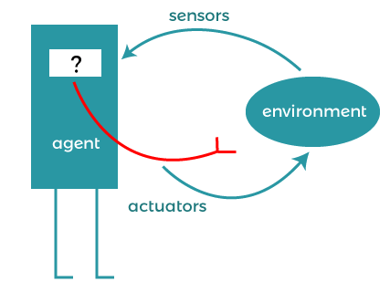
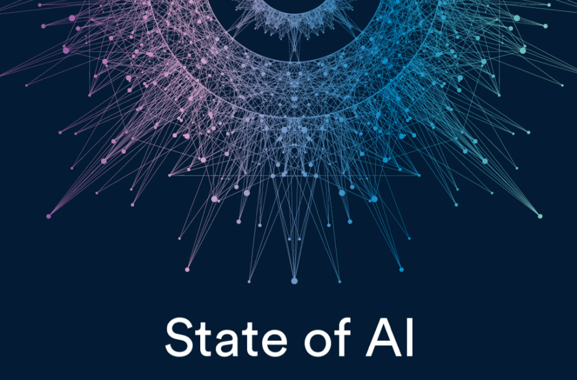

> Aquesta pàgina es genera automàticament a partir de la presentació MARP `1-introduccio-marp.md`. No l'edites directament.

# Introducció a la intel·ligència artificial

### Models d'intel·ligència artificial

## Què és la IA?

- **Intel·ligència**: capacitat d'aprendre, comprendre i resoldre problemes.
- **Intel·ligència artificial**: intel·ligència exhibida per màquines.
- Una màquina intel·ligent percep el seu entorn i pren accions per maximitzar les possibilitats d'èxit d'un objectiu.

## Agents intel·ligents

- Un **agent** percep l'entorn mitjançant sensors i actua amb actuadors.
- Un agent intel·ligent ha de:
  - tenir un objectiu mesurable;
  - interpretar l'estat de l'entorn;
  - seleccionar una acció;
  - avaluar el resultat i adaptar-se quan calga.

## Què estudiarem?

- Com formular un problema perquè un sistema el puga resoldre.
- Diferents tècniques per construir agents intel·ligents.
- Avantatges, limitacions i costos de cada tècnica.
- Camps d'aplicació i impacte sobre les persones.
- Riscos ètics, legals i de seguretat.

## Una mica d'història

## Fites rellevants

- **1950**: Turing proposa substituir la pregunta "pensen les màquines?" per un criteri observable.
- **1956**: conferència de Dartmouth i naixement del terme intel·ligència artificial.
- **Anys 80**: sistemes experts per automatitzar decisions en dominis concrets.
- **1997**: Deep Blue derrota Kasparov als escacs.
- **2016**: AlphaGo mostra el potencial de combinar aprenentatge i cerca.

## Models fundacionals

- Els Transformers han fet possibles models de llenguatge, visió i àudio a gran escala.
- Els models actuals poden ser **multimodals**: text, imatge, veu, vídeo i codi.
- També existeixen models oberts i models que poden executar-se localment.
- La capacitat no elimina els límits: poden equivocar-se, inventar informació o reproduir biaixos.

## Situació actual

- La IA ja és present en serveis, indústria, ciència, educació i administració.
- Un bon sistema no es valora només per la seua qualitat:
  - cost i latència;
  - privacitat i seguretat;
  - explicabilitat;
  - manteniment i dependència de proveïdors;
  - impacte sobre les persones afectades.

## Tenim una màquina intel·ligent?

## Intel·ligència humana i computacional

| Intel·ligència humana | Intel·ligència computacional |
| --- | --- |
| Biològica | Computacional |
| General | Específica |
| Conscient | Inconscient |
| Emocional | Racional |
| Adaptativa | Dissenyada |

La IA no intenta reproduir necessàriament una persona: construeix sistemes capaços de resoldre tasques definides.

## IA estreta i IA general

- **IA estreta o feble**: resol molt bé una tasca específica, com classificar imatges o planificar una ruta.
- **IA general o forta**: podria generalitzar la seua capacitat a qualsevol tasca intel·lectual humana.
- Els sistemes que utilitzem actualment són IA estreta, fins i tot quan resulten molt versàtils.

## Racionalitat

- Una decisió racional és la que maximitza la probabilitat d'aconseguir un objectiu segons la informació disponible.
- No sempre existeix una única resposta correcta.
- Cal definir:
  - l'objectiu;
  - les restriccions;
  - el cost de les accions;
  - com mesurarem l'èxit;
  - què ha de fer el sistema quan no tinga prou evidència.

## Paradigmes de la IA

## Paradigma simbòlic

- Representa coneixement amb símbols, fets i regles.
- Permet inferir conclusions i explicar com s'ha pres una decisió.
- Exemples:
  - sistemes experts;
  - sistemes basats en regles;
  - raonament basat en casos;
  - planificació i satisfacció de restriccions.

## Paradigma connexionista

- Representa la informació amb xarxes de neurones artificials.
- Aprén patrons a partir de dades.
- És útil en visió per computador, veu, llenguatge i control.
- Sovint ofereix menys explicabilitat que una solució basada en regles.

## Paradigma estadístic

- Analitza dades per estimar probabilitats i prendre decisions.
- Inclou classificació, regressió, agrupament i detecció d'anomalies.
- La qualitat del resultat depén de les dades, les mètriques i el context d'ús.

## Tècniques de IA

| Necessitat | Tècnica possible |
| --- | --- |
| Decisió estable, auditable i normativa | Regles o sistema expert |
| Ruta, planificació o restriccions | Cerca, CSP o optimització |
| Predicció a partir d'exemples | Aprenentatge automàtic |
| Text, imatge, veu o codi | Xarxes neuronals i models fundacionals |
| Consulta de documentació canviant | Recuperació d'informació o RAG |

## Seleccionar una solució

Abans d'usar IA, hem de preguntar-nos:

- Es pot resoldre amb una regla, una consulta o un procés convencional?
- Disposem de dades adequades i amb permís per usar-les?
- Necessitem una resposta explicable i auditable?
- Quin és el cost d'un error?
- Qui revisarà els casos incerts o sensibles?

## Aplicacions de la IA

## Alguns dominis

- **Robòtica**: percepció, planificació i control en el món físic.
- **PLN**: traducció, classificació, resum, assistents i cerca documental.
- **Visió per computador**: classificació, detecció, segmentació i seguiment.
- **Recomanació**: productes, música, continguts o recursos.
- **Salut, finances, indústria i transport**: suport a decisions i automatització.

## IA responsable

- Les dades poden contenir errors, desequilibris i biaixos.
- Un model pot perjudicar persones o grups encara que tinga una mètrica global alta.
- Cal protegir dades personals i controlar qui pot accedir al sistema.
- Els resultats generats necessiten verificació quan tenen conseqüències rellevants.
- La responsabilitat no desapareix perquè la decisió l'haja proposada un sistema.

# Idees clau

- La IA és un conjunt de tècniques, no una única tecnologia.
- El problema, les dades, el risc i el context determinen el model adequat.
- La qualitat inclou precisió, cost, seguretat, explicabilitat i impacte.
- Un sistema intel·ligent ha de conèixer també els seus límits.
