> Pàgina generada automàticament des de `1-introduccio-marp.md`.

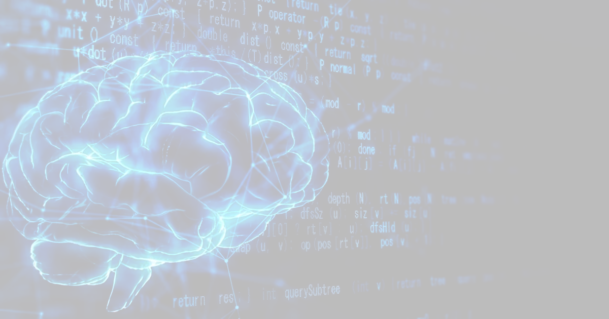

# 1. Introducció a la intel·ligència artificial

### Models d'intel·ligència artificial

## Què és la intel·ligència artificial?

| | |
| --- | --- |
| **Intel·ligència** | La intel·ligència és la capacitat d'aprendre, comprendre i resoldre problemes. |
| **Intel·ligència artificial** | La intel·ligència artificial estudia i construeix sistemes capaços de percebre, raonar, aprendre o actuar per assolir objectius. |
| **Màquina intel·ligent** | Un sistema intel·ligent utilitza informació de l’entorn per seleccionar accions orientades a un objectiu. |

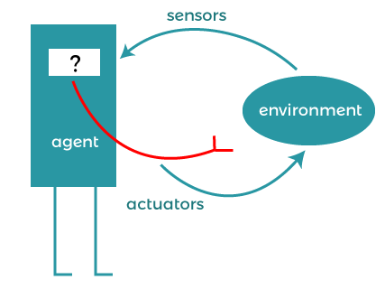

## Agents intel·ligents (I)

- Un **agent** percep l’entorn mitjançant **sensors** i hi actua amb **actuadors**.
- Un **agent racional** selecciona accions per maximitzar el rendiment esperat amb la informació disponible.
- L’**objectiu** descriu què es vol aconseguir.
- La **mesura de rendiment** permet avaluar el resultat: per exemple, neteja, temps i energia consumida.

## Agents intel·ligents (II)

- L'assignatura tracta sobre la **construcció d'agents intel·ligents**.
- Veurem:
  - Diferents **tècniques** per a construir agents intel·ligents.
  - Els seus **avantatges i inconvenients**.
  - Els seus **camps d'aplicació**.
  - Els seus **riscos i reptes ètics**.

# Una mica d'història

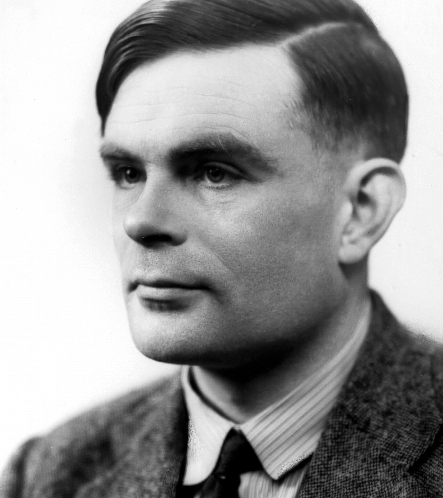

## 1950: Alan Turing

- Turing publica *Computing Machinery and Intelligence*.
- Proposa substituir «poden pensar les màquines?» pel **joc d’imitació**, una prova del comportament observable.
- La prova avalua la capacitat de conversar de manera semblant a una persona.
- Superar-la no demostra, per si sol, consciència o comprensió.

Font: [Turing (1950)](https://www.cse.msu.edu/~cse841/papers/Turing.html).

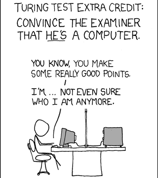

## El test

- En la versió habitual, una persona conversa per escrit amb **un humà i una màquina**, sense veure’ls.
- Ha d’identificar quin interlocutor és la màquina a partir de les respostes.
- El resultat depén de les preguntes, el temps i les condicions de la prova.
- Imitar una conversa humana no equival a demostrar totes les capacitats intel·lectuals humanes.

Font: [Turing (1950)](https://www.cse.msu.edu/~cse841/papers/Turing.html).

## La pregunta de Turing

- **Pregunta inicial:** «Poden pensar les màquines?»
- **Dificultat:** no hi ha una definició única i operativa de «pensar».
- **Proposta:** estudiar si una màquina pot participar amb èxit en el joc d’imitació.
- **Abast:** és un criteri de comportament en una situació concreta, no una prova general de consciència.

Aquest resum és una paràfrasi de l’article, no una citació literal.

Font: [Turing (1950), apartats 1 i 6](https://www.cse.msu.edu/~cse841/papers/Turing.html).

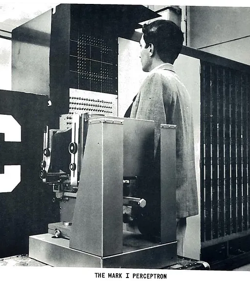

## 1955–1974: Els inicis

- **1955:** McCarthy i col·laboradors utilitzen el terme *intel·ligència artificial* en la proposta de Dartmouth.
- **1956:** se celebra la trobada de Dartmouth.
- **1958:** Rosenblatt publica el seu treball sobre el perceptró, un model que aprén a classificar.
- Les primeres demostracions generen expectatives que superen les capacitats dels sistemes de l’època.

Fonts: [Dartmouth (1955)](https://www-formal.stanford.edu/jmc/history/dartmouth/dartmouth.html), [Rosenblatt (1958)](https://www.cs.cmu.edu/~epxing/Class/10715/reading/Rosenblatt.perceptron.pdf).

## 1974–1993: Expectatives i límits

- Els **hiverns de la IA** són períodes de desencantament i reducció del finançament.
- Als anys 80 creix l’ús comercial dels **sistemes experts**, amb antecedents com DENDRAL als anys 60.
- Recollir i mantenir el coneixement expert resulta costós.
- Les dificultats comercials no fan desaparèixer la recerca ni els sistemes basats en regles.

Font: [Història de DENDRAL i dels sistemes experts](https://softwarepreservation.computerhistory.org/AI/DENDRAL/).

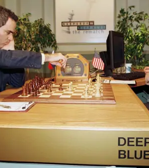

## 1997: Deep Blue

- Deep Blue, d’IBM, derrota el campió mundial Garri Kaspàrov en un matx d’escacs.
- Combina **cerca**, avaluació de posicions i maquinari especialitzat.
- Mostra que una màquina pot superar els millors humans en una tasca delimitada.
- Guanyar als escacs no demostra intel·ligència general.

Font: [IBM: Deep Blue](https://www.ibm.com/history/deep-blue).

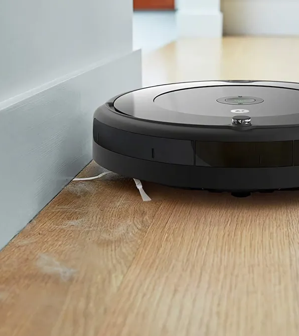

## 2002: Roomba

- iRobot llança Roomba el **2002** i contribueix a popularitzar els robots aspiradors domèstics.
- Combina sensors i accions per netejar el terra i reaccionar davant d’obstacles.
- L’autonomia no elimina el manteniment ni la preparació de l’entorn per part de l’usuari.
- Les funcions, com el retorn a la base o la creació de mapes, depenen del model i la generació.

Font: [Història d’iRobot](https://about.irobot.com/history).

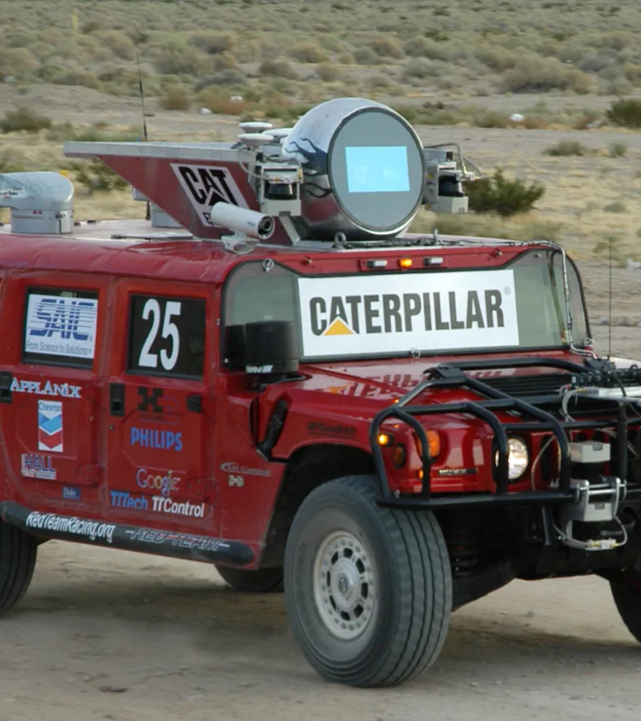

## 2004–2005: DARPA Grand Challenge

- El **2004**, 15 vehicles intenten recórrer autònomament una ruta desèrtica d’uns **229 km**.
- Cap vehicle completa el recorregut.
- El **2005**, cinc equips completen una nova ruta d’uns **212 km**.
- El repte impulsa la integració de percepció, planificació i control per a la conducció autònoma.

Fonts: [DARPA: 2004](https://www.darpa.mil/news/2014/grand-challenge-ten-years-later), [DARPA: 2005](https://www.darpa.mil/about/innovation-timeline/grand-challenge).

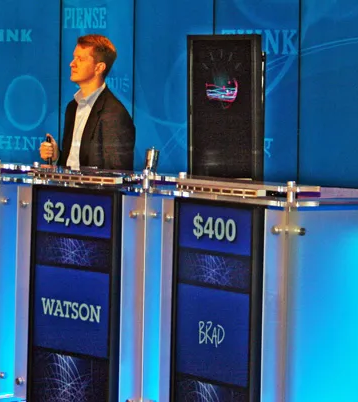

## 2011: Watson

- Watson, d’IBM, guanya a **Ken Jennings i Brad Rutter** en una competició de *Jeopardy!*.
- Processa preguntes en llenguatge natural i busca possibles respostes.
- Combina evidències i estima la confiança de cada resposta.
- L’èxit en el concurs no implica que comprenga qualsevol situació com una persona.

Font: [IBM: Watson a Jeopardy!](https://www.ibm.com/history/watson-jeopardy).

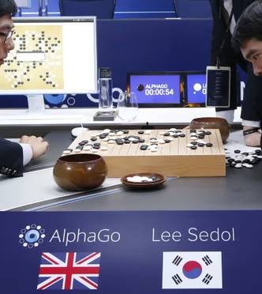

## 2016: AlphaGo

- AlphaGo derrota **Lee Sedol per 4–1** en un matx de Go.
- Combina **xarxes neuronals, aprenentatge per reforç i cerca**.
- El moviment 37 de la segona partida exemplifica una jugada sorprenent per als experts.
- Assolir un nivell superhumà no significa haver resolt matemàticament el joc.

Font: [Google DeepMind: AlphaGo](https://deepmind.google/research/alphago/).

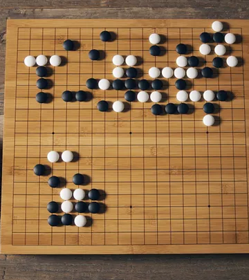

## 2017: AlphaGo Zero

- Parteix de les **regles del Go**, sense entrenar-se amb partides humanes.
- Aprén jugant contra si mateix mitjançant **aprenentatge per reforç**.
- Combina una xarxa neuronal amb cerca per seleccionar jugades.
- Després de tres dies d’entrenament, supera per **100–0** la versió d’AlphaGo que havia derrotat Lee Sedol.

Font: [Silver i Hassabis (2017)](https://deepmind.google/blog/alphago-zero-starting-from-scratch/).

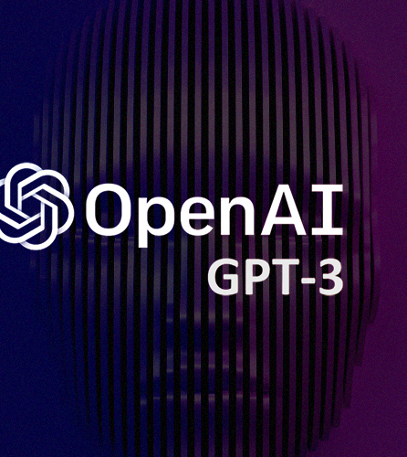

## 2020: GPT-3

- Model de llenguatge **autoregressiu** de la família GPT, basat en Transformers.
- La versió més gran presentada té **175.000 milions de paràmetres**.
- Genera text predient el token següent a partir del context.
- Pot fer tasques com traducció i resposta a preguntes amb instruccions i exemples dins del context, sense actualitzar els pesos.

Font: [Brown i col·laboradors (2020)](https://arxiv.org/abs/2005.14165).

## 2021: DALL·E

- El primer DALL·E genera imatges a partir de descripcions textuals.
- Utilitza un Transformer que modela seqüències de tokens de text i d’imatge.
- El model té **12.000 milions de paràmetres**: aquesta xifra no és la mida d’una base de dades en GB.
- S’entrena amb parelles de text i imatge.

Font: [Ramesh i col·laboradors (2021)](https://arxiv.org/abs/2102.12092).

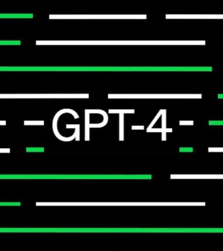

## 2023: GPT-4

- L’informe de 2023 presenta un model basat en **Transformers** que accepta text i imatges i produeix **text**.
- Pot generar explicacions, resums i codi; això no equival a generar directament imatges o àudio.
- L’informe no publica el nombre de paràmetres.
- Pot produir errors i informació inventada, encara que la resposta semble convincent.

Font: [Informe tècnic de GPT-4 (2023)](https://arxiv.org/abs/2303.08774).

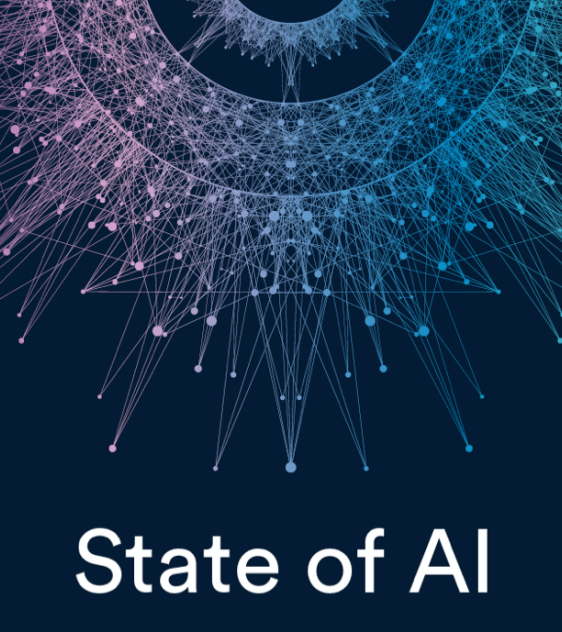

## Situació actual

- Els avenços en IA són constants.
- La IA està present en molts aspectes de la nostra vida.
- És una tecnologia amb moltes aplicacions...
- ... amb molts riscos.
- ... i amb reptes ètics i morals per resoldre.

## Món laboral

- La IA pot automatitzar tasques i canviar la manera de treballar.
- Automatitzar una tasca no implica substituir tota una professió.
- L’impacte depén del sector, de l’organització i de les decisions d’adopció.
- Cal saber avaluar les eines, revisar-ne els resultats i adaptar els processos.
- Aquest curs us ajudarà a desenvolupar criteris i competències per a aplicar la IA.

# Tenim ja una màquina intel·ligent?

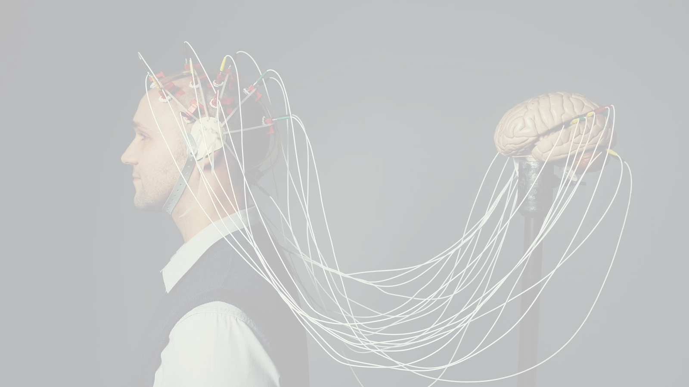

## Intel·ligència humana (I)

- És una capacitat molt complexa, com a resultat de milions d'anys d'evolució.
- Alguns dels aspectes de la intel·ligència humana:
  - Aprendre
  - Resoldre problemes
  - Adaptar-se a nous entorns
  - Prendre decisions
  - Comunicar-se i col·laborar amb altres humans
  - Sentir emocions

## Intel·ligència humana (II)

- La intel·ligència humana implica percepció, memòria, aprenentatge, raonament i interacció social.
- Aquests processos es relacionen entre si i amb l’experiència de cada persona.
- Els models computacionals permeten estudiar i reproduir aspectes concrets d’aquestes capacitats.
- Resoldre una tasca amb èxit no implica utilitzar els mateixos mecanismes que una persona.
- **Com podem avaluar les capacitats i els límits d’un sistema?**

## Intel·ligència computacional

- La IA estudia i construeix sistemes capaços de percebre, raonar, aprendre o actuar per assolir objectius.
- Alguns enfocaments s’inspiren en la intel·ligència humana; altres busquen solucions diferents.
- Avaluem els sistemes segons les tasques que resolen i les condicions en què funcionen.
- És un camp de la **informàtica** amb aportacions de les matemàtiques, la psicologia i altres disciplines.

## Intel·ligència humana i artificial

| Aspecte | Persones | Sistemes d’IA |
| --- | --- | --- |
| Aprenentatge | Experiència, cos i interacció social | Dades, regles i interacció, segons el sistema |
| Adaptació | Transferència entre contextos | Variable; cal avaluar-la en cada tasca |
| Decisions | Raonament, emocions i biaixos | Objectius definits, aproximacions i biaixos |
| Limitacions | Errors i recursos limitats | Errors i dependència del disseny i les dades |

El rendiment observable no demostra, per si sol, consciència o experiència subjectiva.

## IA estreta, IA general i IA forta

- **IA estreta:** especialitzada en tasques o dominis delimitats; pot superar el rendiment humà en aquests àmbits.
- **IA general (AGI):** capacitat d’aprendre i transferir coneixement entre una gran varietat de tasques. La definició i l’avaluació són objecte de debat.
- **IA forta, en sentit filosòfic:** tesi que un sistema computacional pot tenir comprensió o estats mentals reals.
- Són distincions diferents: amplitud de capacitats i naturalesa de la comprensió. No convé usar «general» i «forta» com a sinònims automàtics.

Font: [McCarthy sobre el debat de la IA forta](https://www-formal.stanford.edu/jmc/chinese.html).

# Racionalitat

## Què és una decisió racional?

- Un agent racional selecciona l’acció amb **més utilitat o rendiment esperat**, segons la informació disponible.
- Cal considerar els possibles resultats, les seues probabilitats, els costos i les restriccions.
- **Exemple:** un robot pot triar una ruta més llarga si redueix prou el risc de col·lisió.
- Racionalitat no significa omniscència: una bona decisió pot tenir un resultat desfavorable.

Font: [Poole i Mackworth: utilitat esperada](https://artint.info/3e/html/ArtInt3e.Ch12.S1.html).

# Paradigmes de la IA

## Definicions

- Un **paradigma** és un enfocament per a representar i resoldre problemes.
- En IA podem destacar els enfocaments **simbòlic**, **connexionista** i **estadístic**.
- Aquesta classificació és orientativa: els enfocaments se solapen i es poden combinar.
- Per exemple, una xarxa neuronal també es pot entrenar amb mètodes estadístics.

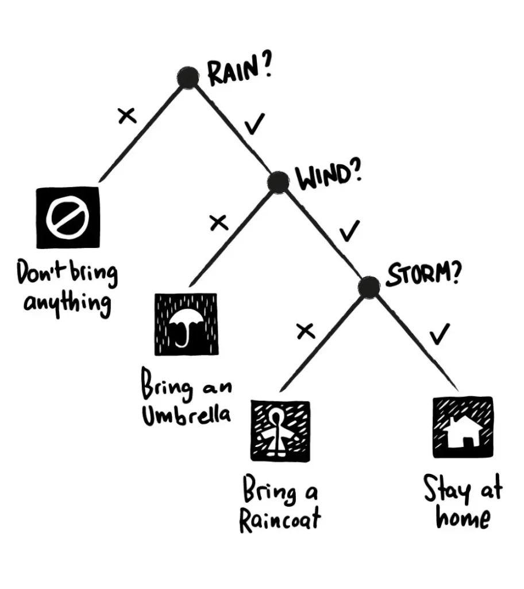

## Paradigma simbòlic

- Representa coneixement explícit amb **símbols, fets, relacions i regles**.
- Manipula aquestes representacions per inferir conclusions o construir plans.
- La validesa dels resultats depén del coneixement i de les regles utilitzades.
- Exemples: **sistemes basats en regles**, **planificació** i **raonament lògic**.

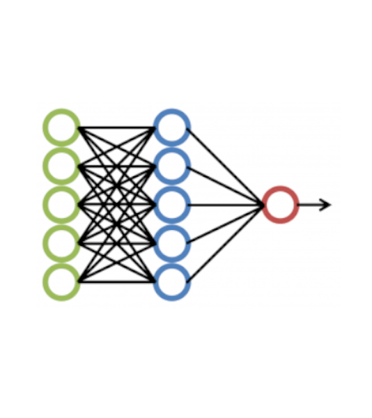

## Paradigma connexionista

- Utilitza **xarxes de neurones artificials**, unitats de càlcul interconnectades.
- Ajusta els pesos de les connexions durant l’aprenentatge.
- La inspiració biològica és parcial: aquestes xarxes no reprodueixen fidelment el cervell.
- Aplicacions: reconeixement d’imatges, llenguatge i control.

Font: [Stanford CS231n: neurones artificials](https://cs231n.github.io/neural-networks-1/).

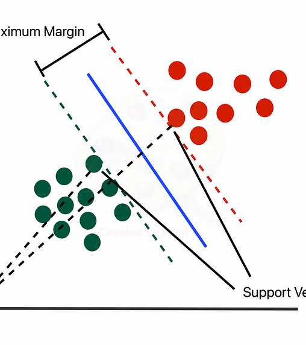

## Paradigma estadístic

- Utilitza models estadístics i probabilístics per a analitzar dades i representar la incertesa.
- Estima patrons o relacions i avalua les prediccions amb dades.
- La qualitat depén de les dades, dels supòsits del model i del context d’ús.
- Es combina amb altres enfocaments, incloses les xarxes neuronals.
- Exemples: classificació, regressió i agrupament.

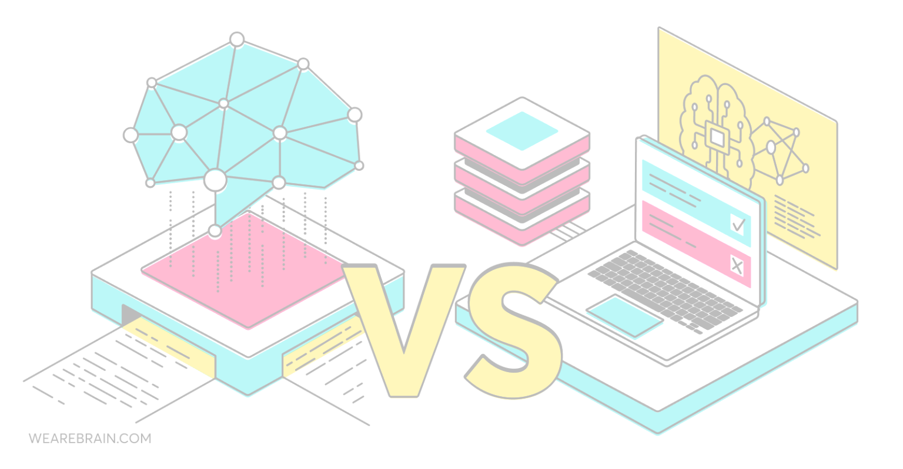

# Tècniques de la IA

## Definicions

- **Tècnica**: Conjunt de procediments o recursos que s'han d'aplicar per a aconseguir un objectiu.
- **Tècniques de la IA**: Conjunt de tècniques, algorismes i mètodes que s'apliquen per a resoldre problemes d'IA.
- Una tècnica pot combinar idees de diferents paradigmes.

## Tècniques de la IA

- Algunes de les tècniques més utilitzades són:
  - **Sistemes experts**
  - **Xarxes neuronals**
  - **Algorismes genètics**
  - **Sistemes multiagent**
  - **Algorismes de cerca**
  - **Algorismes de planificació**
  - **Algorismes d'aprenentatge**

## Sistemes experts

- Un sistema expert utilitza coneixement especialitzat per resoldre problemes en un domini concret.
- Combina una representació del coneixement amb mecanismes de raonament.
- Pot donar suport a tasques que requereixen experiència, però els resultats depenen de la qualitat del coneixement incorporat.

## Sistemes experts (II)

### Sistemes basats en casos

- S'intenta resoldre un problema a partir de casos similars resolts anteriorment.
- Es recuperen casos similars i s'adapten a la nova situació.
- Una vegada solucionat el problema, el cas es guarda per a utilitzar-lo en el futur.
- Els casos nous, una vegada revisats, poden ampliar el coneixement reutilitzable del sistema.
- Camps d'aplicació: **Medicina**, **enginyeria**, **disseny**, etc.

## Sistemes experts (III)

### Sistemes basats en regles

- La base de coneixement conté **fets i regles**, sovint definits amb ajuda d’experts.
- El motor d’inferència aplica les regles per derivar **nous fets o conclusions**.
- **Exemple:** «si el sòl està sec, cal regar» + «el sòl està sec» → «cal regar».
- Inferir conclusions no és el mateix que aprendre o generar noves regles.
- Aplicacions: diagnòstic, control de processos i suport a decisions.

Font: [Poole i Mackworth: inferència amb clàusules definides](https://artint.info/2e/html2e/ArtInt2e.Ch5.S3.SS2.html).

## Sistemes experts (IV)

### Sistemes basats en lògica difusa

- Representen conceptes graduals, com «temperatura alta» o «velocitat baixa».
- Un **grau de pertinença entre 0 i 1** indica fins a quin punt un valor encaixa en un conjunt difús.
- **Exemple:** 28 °C pot pertànyer a «calor» amb grau 0,7, segons la funció definida. No significa un 70 % de probabilitat que faça calor.
- Les regles s’activen gradualment i combinen els seus resultats.
- Aplicacions: control de temperatura, robòtica i altres sistemes de control.

Font: [Fuzzy sets, Scholarpedia](https://www.scholarpedia.org/article/Fuzzy_sets).

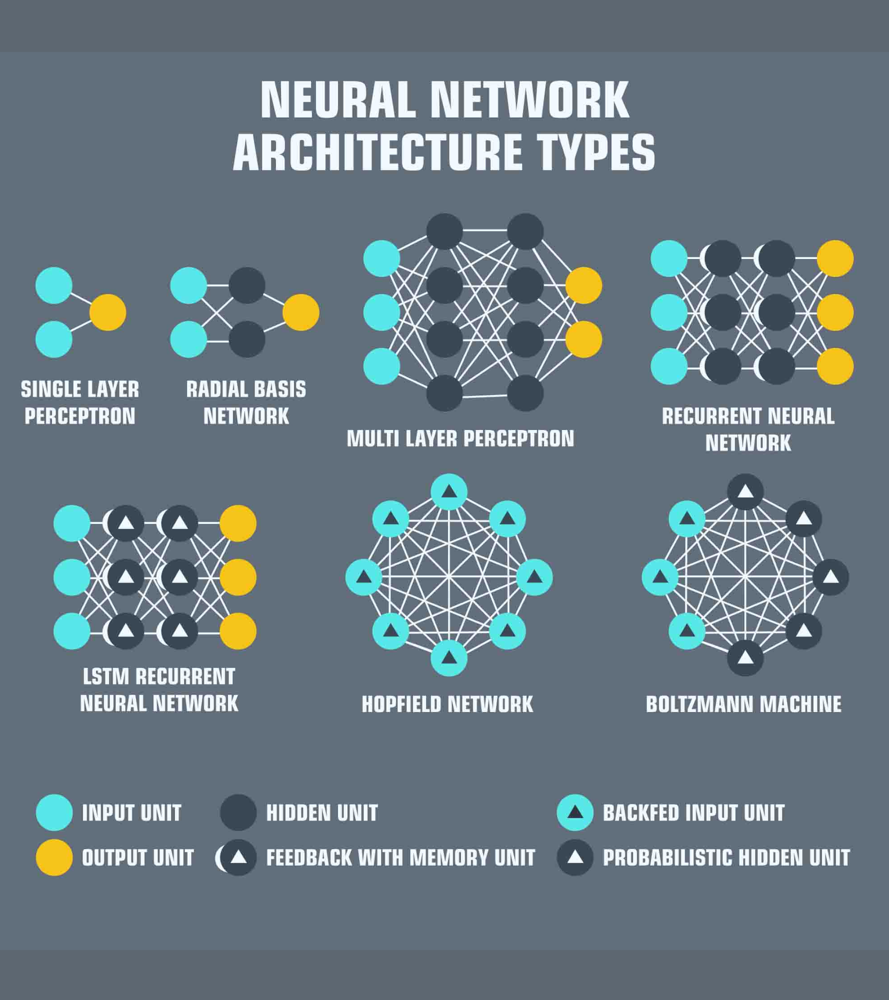

## Xarxes neuronals

- Models formats per **unitats de càlcul** i connexions amb pesos que s’ajusten durant l’entrenament.
- En una xarxa de **propagació endavant**, la informació va de l’entrada a l’eixida sense cicles.
- En un perceptró multicapa, cada capa transforma l’eixida de l’anterior.
- Altres arquitectures incorporen recurrència o connexions entre capes no consecutives.
- Aplicacions: classificació, regressió i generació de contingut.

Font: [Deep Learning, capítol 6](https://www.deeplearningbook.org/contents/mlp.html).

## Tipus de xarxes neuronals

- **Perceptró:** model senzill de classificació amb una frontera de decisió lineal.
- **Xarxes profundes:** combinen múltiples capes de transformació per aprendre representacions.
- **Xarxes recurrents:** mantenen un estat que s’actualitza en processar una seqüència.
- **Xarxes convolucionals:** utilitzen filtres compartits per detectar patrons locals, per exemple en imatges.

Aquestes categories se solapen: una xarxa convolucional o recurrent també pot ser profunda.

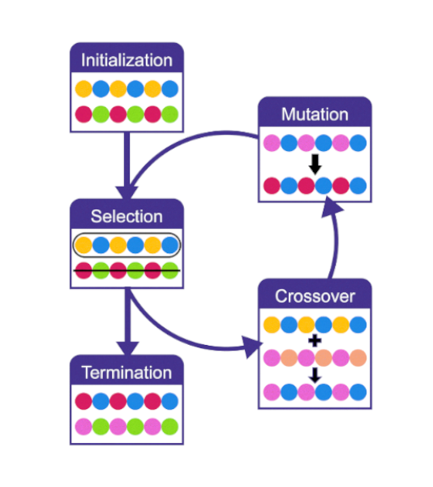

## Algorismes genètics

- Els algorismes genètics són una tècnica d'**optimització** basada en la teoria de l'evolució de Darwin.
- Es tracta de generar una població d'individus i aplicar-los operadors genètics.
- La selecció afavoreix els individus amb millor valor de la **funció d’aptitud**, definida segons el problema.
- Útils per a resoldre problemes d'**optimització i de cerca**.

## Sistemes multiagent

- Un sistema multiagent és un sistema compost per diversos agents que interactuen entre ells.
- Un agent és un sistema computacional que actua en un entorn.
- Els agents poden ser **reactius**, **deliberatius** o **socials**.
- Útils per a resoldre problemes de **planificació**, **disseny**, **control**, etc.

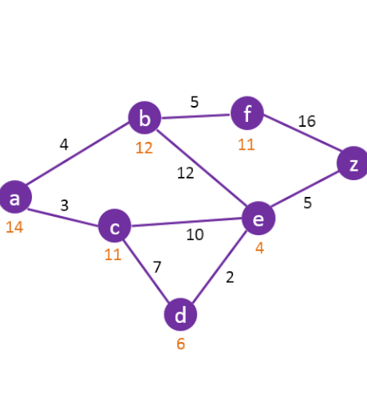

## Algorismes de cerca

- Exploren estats i accions per trobar una solució.
- **Cerca no informada:** no utilitza una estimació heurística del cost restant.
  - Amplada, profunditat, profunditat limitada, aprofundiment iteratiu i **cost uniforme**.
- **Cerca informada:** utilitza una heurística per orientar l’exploració.
  - Cerca voraç i **A\***.
- Cost uniforme ordena pel cost acumulat; A* combina aquest cost amb l’estimació del cost restant.

Font: [Poole i Mackworth: cerca A*](https://artint.info/html1e/ArtInt_57.html).

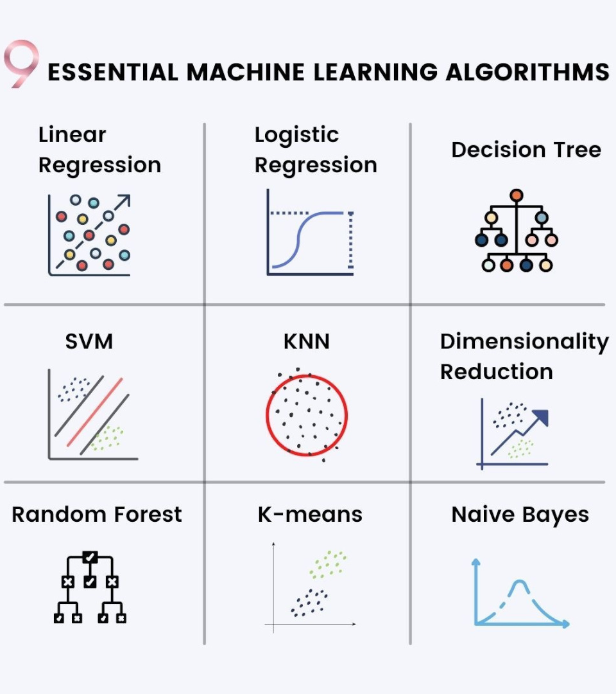

## Algorismes d’aprenentatge

- Ajusten un model a partir de dades o de la interacció amb un entorn.
- **Supervisat:** aprén amb exemples que inclouen la resposta esperada; classificació i regressió.
- **No supervisat:** busca estructura en dades sense respostes etiquetades; per exemple, agrupament.
- **Per reforç:** aprén a seleccionar accions a partir de recompenses; per exemple, Q-learning.

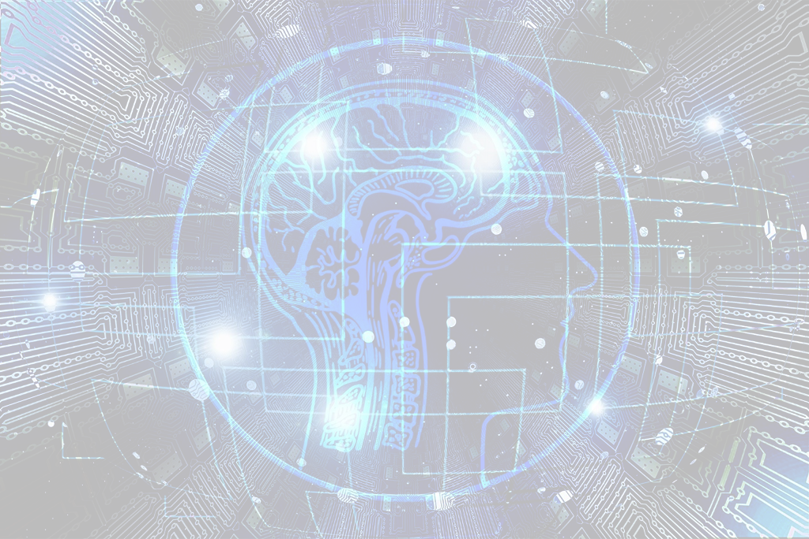

# Aplicacions de la IA

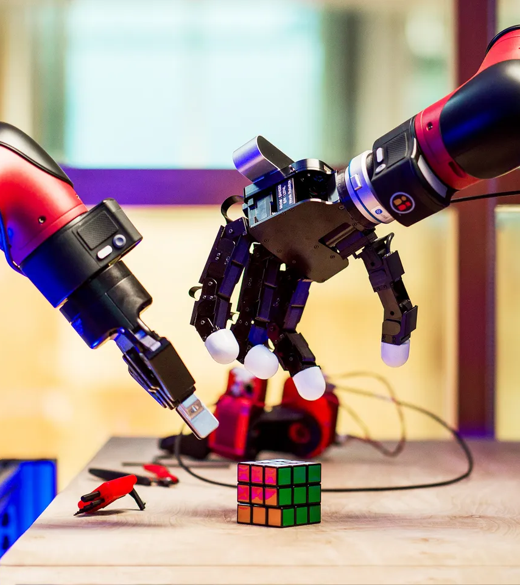

## Robòtica

- La robòtica és una de les aplicacions més conegudes de la IA.
- La robòtica estudia el disseny, la construcció i el control de robots.
- Un robot és un sistema físic programable que actua sobre el seu entorn.
- Els robots poden ser **autònoms** o **teleoperats**.
- Camps d'aplicació: **Indústria**, **sanitat**, **exploració espacial**, **militar**, **domèstic**, etc.

## Processament del llenguatge natural

- El **PLN** estudia mètodes per a analitzar, representar i generar llenguatge humà.
- El context i l’ambigüitat fan que una mateixa expressió puga tenir interpretacions diferents.
- Les respostes d’un sistema poden ser útils sense implicar comprensió humana.
- Aplicacions: **traducció automàtica**, **resum de textos**, **classificació de documents** i **assistents conversacionals**.

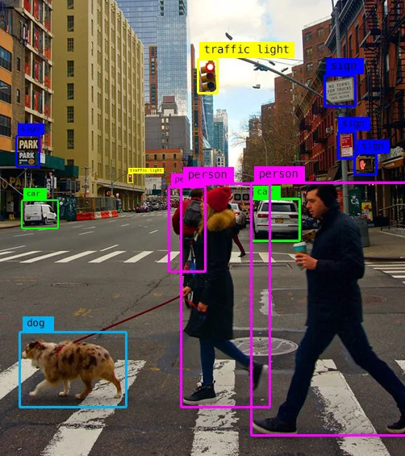

## Visió per computador

- Extrau i interpreta informació d’imatges i vídeos per resoldre tasques concretes.
- **Classificació:** assigna una categoria a una imatge.
- **Detecció i segmentació:** localitzen objectes o assignen categories als píxels.
- Aplicacions: inspecció industrial, seguiment d’objectes i reconstrucció 3D.
- Els resultats poden canviar amb la il·luminació, el punt de vista i la qualitat de la imatge.

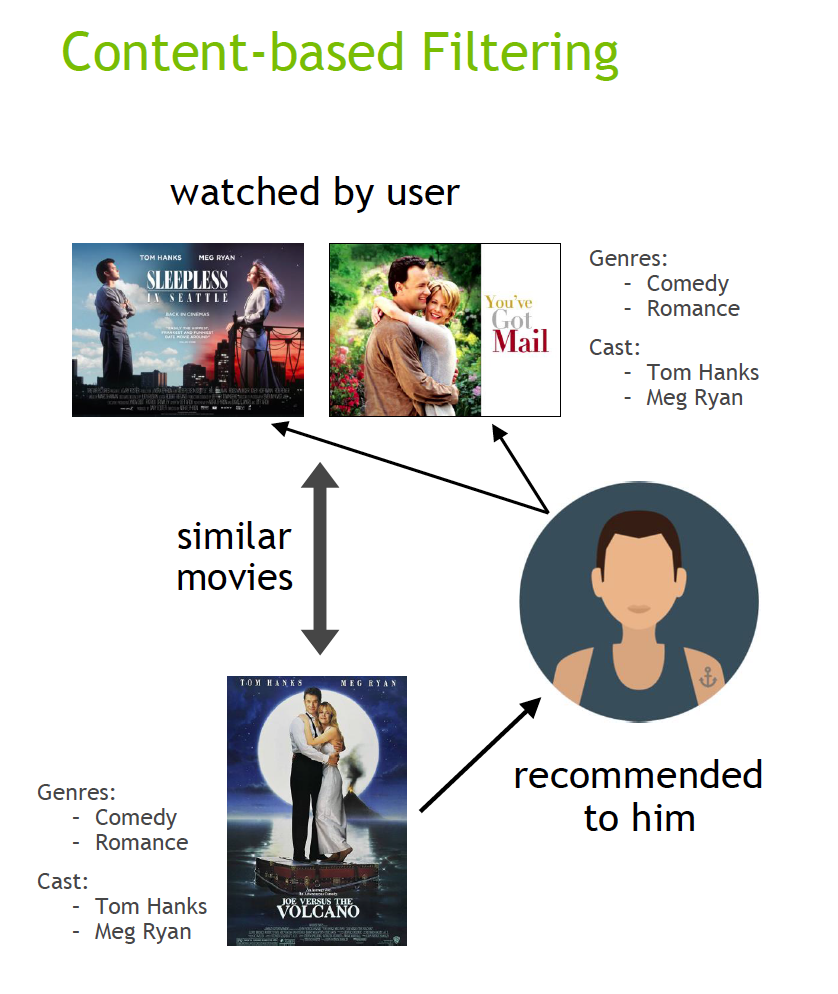

## Sistemes de recomanació

- Un sistema de recomanació és un sistema que recomana un conjunt d'elements a un usuari.
- Els humans utilitzem la recomanació per a prendre decisions.
- L'accés a grans quantitats de dades ha fet que els sistemes de recomanació siguen cada vegada més importants.
- Camps d'aplicació: **Recomanació de productes**, **recomanació de música**, **recomanació de pel·lícules**, **recomanació de llibres**, **recomanació de notícies**, etc.

## Jocs

- Els jocs ens serveixen per a entendre la intel·ligència.
- Els humans utilitzem els jocs per a aprendre, per a divertir-nos i per a competir.
- Les regles i els resultats mesurables fan dels jocs un bon banc de proves per a la IA.
- Camps d'aplicació: **Jocs de tauler**, **jocs de cartes**, **jocs de rol**, **jocs d'estratègia**, etc.

## Altres aplicacions

- **Medicina**: suport al diagnòstic, cirurgia assistida i medicina personalitzada.
- **Enginyeria**: Disseny, control de processos.
- **Finances**: Predicció de mercats, recomanació d'inversions.
- **Àmbit militar**: drons i sistemes autònoms.
- **Àmbit domèstic**: robots, assistents virtuals i domòtica.
- **Transport**: Vehicles autònoms, planificació de rutes.

## Referències

- [Artificial Intelligence: A Modern Approach](http://aima.cs.berkeley.edu/)
- [Artificial Intelligence: Foundations of Computational Agents](http://artint.info/2e/html/ArtInt2e.html)
- [Deep Learning](https://www.deeplearningbook.org/)
- [Machine Learning](https://www.cs.ubc.ca/~murphyk/MLbook/)
- [Fast.ai](https://www.fast.ai/)

## Treball pràctic 1 · Analitza una aplicació d'IA

Tria una aplicació documentada i explica:

- quin problema resol, qui la fa servir i què rep o produeix;
- quines tècniques del tema 1.1 hi intervenen;
- quines proves en mostren els resultats i quins límits tenen.

**Lliurament:** informe breu i explicació de 3 minuts.

[Guia, estructura i criteris d'avaluació](treball-practic-1.md)

La pregunta sobre persones afectades, riscos i controls obrirà el tema 1.2.
