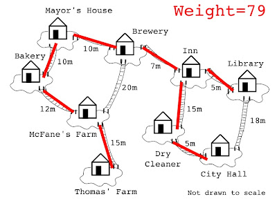

<style scoped>
h1, h2, h3, h4, h5, h6, p {
  color: #FFFFFF;
  font-weight: 800;
  text-shadow:
    0px 0px 3px #000000;
}
</style>


# Busqueda en espais d'estats

## Conceptes previs

### Models d'intel·ligència artificial


---

<style scoped>section { font-size:32px; }</style>

# Conceptes previs

* Per a poder afrontar els temes relacionats en **búsquedes** necessitarem alguns **conceptes previs**.
* En aquesta unitat ens centrarem en assolir-los.
* Els conceptes que necessitarem són:
    * Grafs
    * Arbres
    * Llistes i cues
    * Algorismes sobre grafs i arbres
    * Complexitat temporal i espacial

---

<!--
_class: invert lead
-->


## Grafs


---

<style scoped>section { font-size:28px; }</style>

### Teoria de grafs

* **Branca de les matemàtiques** que estudia les **relacions**.
* Un graf és un conjunt de punts (**nodes**) connectats per línies (**arestes**).
* Molts problemes es representen com a grafs o xarxes:
    * **Transport**: carreteres, vies de tren,  fluvials, etc.
    * **Comunicacions**: xarxes informàtiques, socials, etc.
    * **Distribució** (xarxes elèctriques, d'aigua, etc.).
    * **Relacions** (relacions entre persones, conceptes, etc.).
    * **Dependències** (dependències entre tasques, processos, etc.).
* **Exemple**: Graf no dirigit amb 6 nodes i 7 arestes.


---
<style scoped>section { font-size:33px; }</style>

### Història

#### Els ponts de Königsberg (1/2)

* Els grafs van ser introduïts per **Leonhard Euler** al segle XVIII per resoldre el **problema dels ponts de Königsberg**.
* El problema consistia en trobar un camí que passés per **tots els ponts** de la ciutat sense passar per **cap pont més d'una vegada**.
* El problema es pot representar com a graf sense perdua de generalitat.


---

<style scoped>section { font-size:28px; }</style>

### Història

#### Els ponts de Königsberg (2/2)

* Euler va demostrar que **no existeix cap camí** que passi per tots els ponts sense passar per cap pont més d'una vegada.
* Per això va introduir el concepte de **graf eulerià**.
* Un graf és eulerià si té **tots els nodes de grau parell**.
* El graf dels ponts de Königsberg no és eulerià perquè té 4 nodes de grau imparell.
* Aquesta demostració va ser el **punt de partida** de la teoria de grafs.


---

<style scoped>section { font-size:28px; }</style>

### Definicions (1/2)

| Terme | Definició |
|-------|-----------|
| **Node** | Element bàsic d'un graf. També es coneix com a **vèrtex**. |
| **Aresta** | Connexió entre dos nodes. També es coneix com a **arc**. |
| **Graf** | Conjunt de nodes connectats per arestes. |
| **Pes** | Valor associat a una aresta. |
| **Graf pesat** | Graf on les arestes tenen un pes. |
| **Cicle** | Camí que comença i acaba en el mateix node. |
| **Graf cíclic** | Graf que té cicles. |
| **Graf dirigit** | Graf on les arestes tenen una direcció. |

---
<style scoped>section { font-size:28px; }</style>

### Definicions (2/2)

| Terme | Definició |
|-------|-----------|
| **Font** | Node d'on solament eixen arestes. |
| **Sumider** | Node on solament arriben arestes. |
| **DAG** | _Directed Acyclic Graph_. Graf acíclic dirigit. Molt utilitzat en programació. |
| **Graf complet** | Graf on tots els nodes estan connectats entre ells. |
| **Graf connex** | Graf on hi ha un camí entre qualsevol parell de nodes. |
|**Relació entre els nodes** | En un graf no importa la distància entre els nodes ni la posició dels nodes en l'espai. |
| **Isomorfisme** | Dos grafs són isomorfs si es poden transformar l'un en l'altre sense canviar la relació entre els nodes. |

---


---

### Estructures de dades en la representació de grafs

* Hi ha dues estructures de dades bàsiques per a representar grafs:
    * **Matriu d'adjacència**
    * **Llista d'adjacència**
* Vejam les diferències entre ambdues i els avantatges i inconvenients de cadascuna.

---
<style scoped>section { font-size:28px; }</style>

#### Matriu d'adjacència (1/2)

* Una matriu d'adjacència és una **matriu quadrada** on les files i les columnes representen els nodes del graf.
* Si hi ha una aresta entre dos nodes, el valor de la matriu en la posició corresponent serà 1, en cas contrari serà 0.
* Si el graf és **dirigit** la matriu no serà simètrica.
* Si el graf te **pesos** les posicions de la matriu contindran els pesos de les arestes.
* En python podem utilitzar una llista de llistes per a representar la matriu.


---

<style scoped>section { font-size:28px; }</style>

#### Matriu d'adjacència (2/2)

* **Avantatges**:
    * És fàcil saber si hi ha una aresta entre dos nodes.
    * És fàcil saber quins nodes estan connectats a un node i el grau d'un node.
* **Inconvenients**:
    * La matriu serà molt gran i ocuparà molt espai en memòria, encara que el graf sigui espars (pocs nodes connectats).
        * Per representar matrius esparses es poden utilitzar estructures de dades especials, com ara diccionaris de tuples. El cost espacial en aquest cas serà molt menor però algunes de les ventatges de la matriu d'adjacència es perden.
* Apropiat per a grafs densos o per a grafs que no es van a modificar.

---
<style scoped>section { font-size:30px; }</style>
#### Llista d'adjacència (1/2)

* Una llista d'adjacència és una **llista de llistes** o un **diccionari** on cada llista o clau representa un node i conté els nodes adjacents.
* Si el graf no és dirigit i _B_ és adjacent a _A_, _A_ també serà adjacent a _B_.
* Si el graf té pesos, la llista contindrà tuples amb el node adjacent i el pes de l'aresta.
* Generalment, sol ser més eficient que la matriu d'adjacència, ja que no ocupa tant espai en memòria.


---
<style scoped>section { font-size:31px; }</style>

#### Llista d'adjacència (2/2)

* **Avantatges**:
    * És més eficient en espai que la matriu d'adjacència.
    * És fàcil saber quins nodes estan connectats a un node i el grau d'un node.
    * Ens permet modificar el graf afegint o eliminant nodes i arestes.
* **Inconvenients**:
    * No és fàcil saber si hi ha una aresta entre dos nodes.
    * La implementació pot ser més complexa que la matriu d'adjacència.
* Apropiat per a grafs esparsos o per a grafs que es van a modificar.

---

#### Matrius d'adjacència vs llistes d'adjacència

| Operació        | Matriu d'adjacència | Llista d'adjacència |
|-----------------|:-------------------:|:-------------------:|
| Espai           |       O(n^2)        |      O(n + m)       |
| Adjacència      |        O(1)         |        O(n)         |
| Grau d'un node  |        O(n)         |        O(1)         |
| Afegir node     |       O(n^2)        |        O(1)         |
| Afegir aresta   |        O(1)         |        O(1)         |
| Eliminar node   |       O(n^2)        |      O(n + m)       |
| Eliminar aresta |        O(1)         |        O(n)         |

---

### Tipus de problemes  (1/2)

<style scoped>section { font-size:32px; }</style>

Alguns dels problemes típics sobre grafs són:

* **Camí mínim**: trobar el camí amb el cost mínim entre dos nodes o per tots (Camí hamiltonià).
* **Connexió**: trobar si dos nodes estan connectats.
* **Cicles**: trobar si un graf té cicles.
* **Components**: trobar els components d'un graf.


---

<style scoped>section { font-size:33px; }</style>


### Tipus de problemes (2/2)

* **Colorejat de grafs**: nombre mínim de colors per a pintar els nodes d'un graf de manera que dos nodes adjacents no tinguin el mateix color.
* **Ordenació topològica**: trobar un ordre lineal dels nodes d'un graf dirigit acíclic.
* **Flux màxim**: trobar el flux màxim entre dos nodes.


---

### Algorismes sobre grafs

<style scoped>section { font-size:28px; }</style>

Alguns dels més importants:

* **A***: algorisme de cerca informada.
* Recorreguts en **amplada** (BFS) i **profunditat** (DFS)
* Ordenació topològica de grafs dirigids acíclics (DAGs)
* Algorisme de **Dijkstra** o **UCS (Uniform Cost Search)**
* Algorisme de **Prim**
* Algorisme de **Kruskal**
* Algorisme de **Ford-Fulkerson**



---

<!--
_class: invert lead
-->

## Arbres


---

<style scoped>section { font-size:32px; }</style>

### Arbres

* Un **arbre** és un tipus especilitzat de **graf**.
* Els arbres tenen les següents propietats:
    * **Connex**: hi ha un camí entre qualsevol parell de nodes.
    * **Acíclic**: no hi ha cicles.
    * **No dirigit**: les arestes no tenen direcció.
    * **Unic**: no hi ha més d'un camí entre qualsevol parell de nodes.


---

### Utilitat dels arbres

* Els arbres són molt utilitzats en programació per a representar **jerarquies**.
* Exemples:
    * **Sistemes de fitxers**.
    * **Sintaxi d'un llenguatge**.
    * **Estructures de dades**.
        * S'utilitzen per a implementar altres estructures de dades com ara les taules de símbols o els diccionaris.

---

### Tipus d'arbres

* **Arbre general**: cada node pot tenir un nombre arbitrari de fills.
* **Arbre n-ari**: cada node té com a màxim n fills.
* **Arbre binari**: cada node té com a màxim dos fills.
* **Arbre binari de cerca**: cada node té com a màxim dos fills i el valor dels nodes de l'esquerra és menor que el del node i el dels nodes de la dreta és major.
* **Heaps**: són arbres binaris balancejats que compleixen una propietat addicional. Els heaps es poden utilitzar per a implementar cues de prioritat.

---

### Arbres binaris de búsqueda

* Un **arbre binari de búsqueda** és un arbre binari on el valor dels nodes de l'esquerra és menor que el del node i el dels nodes de la dreta és major.
* Permeten accedir a les dades de forma **eficient**. El cost d'accés és $$O(log(n))$$.
* Si ocòrren moltes insercions i eliminacions, l'arbre pot deixar de ser balancejat i el cost d'accés pot augmentar fins a $$O(n)$$.
    * Per a evitar aquest problema es poden utilitzar arbres balancejats com ara els AVL o els Red-Black.
* Qualsevol arbre es pot representar com a arbre binari de búsqueda i, a partir d'ara, **parlarem sempre d'aquest tipus d'arbres** si no diem el contrari.


---

### Estructures de dades en la representació d'arbres

* La forma més habitual de representar un arbre és mitjançant una llista enllaçada.
* Cada node està format per un valor i punters als dos fills.

```python
class Node:
    def __init__(self, value):
        self.value = value
        self.left = None
        self.right = None

root = Node(1)
root.left = Node(2)
root.right = Node(3)

root.left.left = Node(4)
```

---

### Recorregut d'arbres

* Quan tingam que fer qualsevol operació sobre l'arbre partirem del node arrel i anirem recorrent els nodes fins a arribar al node que ens interessa.
* La recursivitat és una eina molt útil per a recórrer arbres. En arbres grans, però, pot ser més eficient utilitzar un recorregut iteratiu amb una pila o una cua.

```python

def buscar(node, value):
    if node is None:
        return False
    if node.value == value:
        return True
    return buscar(node.left, value) or buscar(node.right, value)
```

---

## Llistes, cues i piles


---

### Llistes enllaçades

* Una **llista enllaçada** és una estructura de dades que permet **inserir** i **eliminar** elements de forma eficient.
* L'**accés** als elements és **seqüencial**.
* Una llista enllaçada està formada per una sèrie de nodes enllaçats entre ells.
* Cada node conté un valor i (com a mínim) un punter al següent node.
* El primer node de la llista és el **cap** i l'últim node és la **cua**.
* Els nodes de la llista no tenen per què estar en posicions contigües de memòria.


---

### Vector vs llista enllaçada

* Les llistes en Python són vectors dinàmics.
* Si s'afegeix un element a un vector i no hi ha espai suficient, s'ha de crear un vector nou i copiar tots els elements.
* Si s'elimina un element d'un vector, s'ha de moure tots els elements posteriors una posició cap a l'esquerra.
* En una llista enllaçada, per contra, solament cal modificar els punters dels nodes afectats.
* Si anem a inserir i eliminar elements de forma freqüent, les llistes enllaçades són més eficients que els vectors.
* En python les llistes enllaçades es poden implementar mitjançant la classe `deque` del mòdul `collections`.

| Operació        | Vector | Llista enllaçada |
|-----------------|:------:|:----------------:|
| Accés           |  O(1)  |       O(n)       |
| Inserció        |  O(n)  |       O(1)       |
| Eliminació      |  O(n)  |       O(1)       |

---

### Cua

* Una **cua** és una estructura on els elements s'**inserixen** per un extrem i s'**eliminen** per l'altre.
* Les cues funcionen segons el principi **FIFO** (First In First Out).
* Les cues es poden implementar mitjançant una llista enllaçada o un vector.
* En python podem utilitzar la classe `deque` del mòdul `collections`.
* Alguns algorismes que utilitzen cues són el **BFS** (Breadth First Search), **UCS** i l'**Algorisme de Ford-Fulkerson**.


---

### Cua de prioritat

* Una **cua de prioritat** és una estructura basada en una cua on els elements tenen associat un **valor de prioritat**.
* Els elements s'**inserixen** per un extrem i s'**eliminen** per l'altre.
* Els elements s'ordenen segons el seu valor de prioritat.
* Les cues de prioritat es poden implementar mitjançant un **heap** o un array ordenat (menys eficient).
* En python podem utilitzar la classe `PriorityQueue` del mòdul `queue` o la classe `heapq` del mòdul `heapq`.


---

### Pila

* Una **pila** és una estructura on els elements s'**inserixen** i s'**eliminen** pel mateix extrem.
* Les piles funcionen segons el principi **LIFO** (Last In First Out).
* Les piles es poden implementar mitjançant una llista enllaçada o un vector.
* En python podem utilitzar la classe `deque` del mòdul `collections`.
* Alguns algorismes que utilitzen piles són el **DFS** (Depth First Search) i el **Backtracking**.


---

## Complexitat


---

### Complexitat temporal i espacial (1/2)

* La **complexitat temporal** d'un algorisme és el **temps d'execució** en funció de la **mida de les dades d'entrada (n)**.
* La **complexitat espacial** d'un algorisme és l'**espai en memòria** que necessita en funció de **n**.
* La complexitat temporal i espacial es mesura en funció de la **notació asimptòtica**.
* La notació asimptòtica ens permet **classificar** els algorismes segons el seu **comportament** en funció de n.
* També es coneix com a **complexitat asimptòtica** o d'**O-gran**.

---

### Complexitat temporal i espacial (2/2)

* La notació asimptòtica es divideix en tres classes:
    * **O-gran**: ens dona una cota superior del temps d'execució o de l'espai en memòria.
    * **Omega**: ens dona una cota inferior del temps d'execució o de l'espai en memòria.
    * **Theta**: ens dona una cota superior i una cota inferior del temps d'execució o de l'espai en memòria.
    * **O-gran** és la més utilitzada.
* La notació asimptòtica s'expressa en funció de **n**.

---

### Com calcular la complexitat temporal

* Per a calcular la complexitat temporal d'un algorisme hem de seguir els següents passos:
    * **Identificar** els bucles i les crides recursives.
    * **Comptar** el nombre d'iteracions de cada bucle i el nombre de crides recursives.
    * **Sumar** els resultats.
    * **Simplificar** l'expressió resultant.
    * **Descartar** els termes de menor ordre i els coeficients.
    * **Expressar** el resultat en funció de n.

---

### Com calcular la complexitat temporal

#### Exemple: algorisme de cerca binària. (1/3)

* L'algorisme té un bucle que s'executa mentre l'índex d'inici sigui menor o igual que l'índex de final.
* En cada iteració es calcula l'índex mig i es compara amb l'element a cercar.
* Si l'element és menor, l'índex final es desplaça cap a l'esquerra, si és major, l'índex inicial es desplaça cap a la dreta.
* En cada iteració el nombre d'elements a cercar es redueix a la meitat.

--- 

### Com calcular la complexitat temporal

#### Exemple: algorisme de cerca binària. (2/3)

```python
def binary_search(array, value):
    start = 0
    end = len(array) - 1
    while start <= end:
        mid = (start + end) // 2
        if array[mid] == value:
            return mid
        elif array[mid] < value:
            start = mid + 1
        else:
            end = mid - 1
    return -1
```

---

### Com calcular la complexitat temporal

#### Exemple: algorisme de cerca binària. (3/3)

* Càlcul de la complexitat temporal:
    * El bucle s'executa $$log(n)$$ vegades (en cada iteració el nombre d'elements a cercar es redueix a la meitat)
    * En cada iteració es fan $$O(1)$$ operacions.
    * La complexitat temporal de l'algorisme és $$O(log(n))$$.

---

### Exemples de notació asimptòtica

* $$O(1)$$: constant. No depèn de n. Accés a un element d'un vector.
* $$O(log(n))$$: logarítmica. Cerca binària.
* $$O(n)$$: lineal. Recorregut d'un vector.
* $$O(n log(n))$$: quasi-lineal. Algorisme de mergesort.
* $$O(n^x)$$: polinòmica. Recorregut d'una matriu.
* $$O(x^n)$$: exponencial. Torres de Hanoi.
* $$O(n!)$$: factorial. Problema del viatjant de comerç per força bruta.

---


---