<style scoped>
h1, p {
  color: #FFFFFF;
  text-shadow:
    0px 0px 3px #000000;
}
</style>

# 7. Processament del llenguatge natural

Models d'intel·ligència artificial


---

<style scoped>section { font-size:33px; }</style>

## Processament del llenguatge natural

- **Definició:** camp de la IA que tracta de la interacció entre els ordinadors i el llenguatge humà.
- Se centra en la **comprensió** i **generació** de llenguatge humà.
- Un dels camps més actius i complexos de la IA.


---

## Aplicacions

- Traducció automàtica.
- Reconeixement de veu.
- Síntesi de veu.
- Generació i resum de text.
- Anàlisi de sentiments.
- Classificació de text.

---

## Introducció (I)

- Camp multidisciplinari que combina:
  - Lingüística.
  - Intel·ligència artificial.
  - Ciències cognitives.
  - Informàtica.
  - etc.

---

## Introducció (II)

- És un problema **difícil** perquè:
  - El llenguatge humà és **ambigu**.
  - El llenguatge humà és **ric**.
  - El llenguatge humà és **contextual**.
  - El llenguatge humà és **cultural**.
- Aquestes característiques fan que el llenguatge humà no sigui **formal** i, per tant, no es puga tractar amb les tècniques de la IA tradicional.

---

<!--
_class: invert lead
-->

<style scoped>
h1, h2, h3, h4, h5, h6, p {
  color: #FFFFFF;
  font-weight: 800;
  text-shadow:
    0px 0px 3px #000000;
}
</style>

# El text com a dada


---

## Introducció

- El text és una font de dades **molt important**.
- Els humans **generem** i **consumim** text de forma **massiva**
- El saber com tractar el text és **crític** per a moltes aplicacions.

> Anomenem **text** a una seqüència coherent de símbols que pot ser interpretada com a un conjunt de paraules, utilitzant les regles gramaticals i sintàctiques d'una llengua.

---

## Significat

- Qué entenem per **significat**?:
  - el significat d'una paraula és el concepte que representa.
  - el significat d'una frase és el concepte que representa la combinació de les paraules que la formen.
  - el significat d'un text és el concepte que representa la combinació de les frases que el formen.

$$\text{significant}(\text{simbol}) \Leftrightarrow \text{significat}(\text{idea})$$
$$\text{arbre} \Leftrightarrow \text{\{🌲, 🌳, 🌴, } \dots \}$$

---

<style scoped>section { font-size:32px; }</style>

## Significat en els ordinadors

- Com poden coneixer els ordinadors el significat de les paraules, frases i textos?.
- Técniques classiques: bases de dades de sinónims i hyperònims.
  - `WordNet`: base de dades lèxica que relaciona paraules entre si.
  - Els sinónims permeten relacionar paraules amb el mateix significat.
    - Ex: `roïn` és un sinònim de `dolent`, `malparit`, `miserable`, etc.
  - Els hyperònims permeten relacionar paraules amb significats més generals.
    - Exemple: `carnivor`, `vertebrat` serien hyperònims de `gat`.

---

<style scoped>section { font-size:32px; }</style>

## Problemes de WordNet i semblants

- Molt útil però sense matís semàntic.
  - Ex: `gat` i `felí` són sinònims, però no tenen el mateix significat.
- Tots els sínonims no seran útils en tots els contextos.
  - Ex: `cabró` és un sinònim de `roïn`, però no sempre es poden intercanviar.
- Actualitzar la base de dades és un procés **manual**, **costós** i subjectiu.
  - Ex: `the shit` és un sinònim de `the best` en anglès que no apareix en WordNet.
- Les solucions modernes es basen en les representacions del text.

---

<style scoped>section { font-size:32px; }</style>

## Representacions del text (I)

- Els ordinadors necessiten representar el text com a dades numèriques.
- Necessitarem un **vocabulari** que relacioni les unitats de text amb els números.
- Quina unitat de text triem per a representar el text i com ho fem?.
- Aquestes decisions determinaran la **complexitat** del model, el tamany del **vocabulari** i la **precisió** del model.
- Els models de representació del text són **molt importants** en el processament del llenguatge natural.
- A continuació veurem algunes de les tècniques més utilitzades.

---

<style scoped>section { font-size:31.5px; }</style>

## Representació de caràcters

- Cada caràcter es representa per un número.
  - El diccionari serà molt petit (en el cas de l'ASCII, 128 caràcters).
  - El model ha de ser molt complex, ja que ha d'aprendre a combinar els caràcters per a formar paraules.
  - Exemple: "AND" es pot representar com a $[65, 78, 68]$


---

## Representació de paraules

- Cada paraula és representada per un número.
  - El diccionari serà molt gran, ja que cada paraula serà una entrada en el diccionari.
  - El model serà més senzill, ja que les paraules són unitats semàntiques.
  - Exemple: Si el nostre vocabulari és `["gat", "gos", "cavall", "ocell", "peix"]`, llavors "gat" es pot representar com a $1$ i "cavall" com a $3$.

---

## Representació de subparaules

- Cada subparaula és representada per un número.
  - El diccionari serà més petit que el de paraules, ja que les subparaules són unitats semàntiques.
  - El model serà més senzill, ja que les subparaules són unitats semàntiques.
    - Permet representar paraules rares i que no estan en el vocabulari.
    - Útil per a llengües amb moltes paraules compostes i derivades.

---

<style scoped>section { font-size:30.5px; }</style>

## Tokens i tokenització (I)

- Indepententment de l'enfocament, el text s'ha de **dividir** en **tokens**.
  - Ex: "New York in winter" $\rightarrow$ `["New", "York", "in", "winter"]`
- **Token**: unitat mínima de text que pot ser considerada com a una unitat semàntica.
  - Una paraula, subparaula, signe de puntuació, número, etc; qualsevol unitat que es triï com a unitat mínima.
- **Tokenització**: procés de dividir un text en tokens i que facilita el tractament i comprensió del text.
  - És un procés **no trivial**. Depèn de la llengua i del domini.
    - Exemple: "New York" és un token o dos?

---

<style scoped>section { font-size:35px; }</style>

## Tokens i tokenització (II)

- Qüestions a tindre en compte:
  - **Puntuació**: es considera un token o no?. Pot variar la interpretació del text.
  - **Majuscules/Minúscules**: es consideren tokens diferents o no?.
  - **Stopwords**: paraules que no aporten informació al text (articles, preposicions, etc.).
  - **Idioma i domini**: el procés de tokenització depèn de l'idioma i del domini del text.

---

<style scoped>section { font-size:32.5px; }</style>

## Tokens i tokenització (III)

- N-grams: seqüències de n tokens consecutius.
- Algunes paraules tenen significat propi, però la seva combinació amb altres paraules també té un significat. Ex: "New York".
- Els n-grams permeten representar aquestes combinacions de paraules, augmentant el vocabulari amb les combinacions d'n-tokens que triem.
- Bigrams: seqüències de dos tokens consecutius, trigrams: seqüències de tres tokens consecutius, etc.
- Problema: augmenta molt el vocabulari i la complexitat del model.

---

<style scoped>section { font-size:34px; }</style>

## Vectorització (I)

- Encara que els tokens son molt útils, presenten alguns problemes:
  - No són fàcils de manipular per a les màquines.
  - No són fàcils de comparar.
  - No permeten calcular la similitud entre paraules i textos.
- La **vectorització** és el procés de convertir un text en un vector numèric.
- Els vectors són més fàcils de manipular per a les màquines i de comparar.

---

## Vectorització (II)

- Algunes técniques de vectorització (embeddings):
  - **NNLM**: model basat en xarxes neuronals. El nombre de dimensions és fixe.
  - **Word2Vec**: cada paraula és un vector en un espai semàntic. El nombre de dimensions és fixe.
  - **FastText**: creat per Facebook. Similar a Word2Vec, però permet representar paraules rares i que no estan en el vocabulari.
  - **GloVe**: model basat en NNLM i Word2Vec.

---

<style scoped>section { font-size:28px; }</style>

## Word2Vec

- Es basa en la idea que les paraules amb significats similars apareixen en contextos similars.
  - "You shall know a word by the company it keeps" (J.R. Firth, 1957).
- Quan una paraula **p** apareix en un text, les paraules properes a `p` són el seu **context**.
- Els diferents contextos de `p` defineixen el significat de `p`.


---

<style scoped>section { font-size:30.6px; }</style>

## Word2Vec (II)

- Per cada paraula obtenim un vector **dens** i de **longitud fixa**.
- Cada dimensió del vector representa un **aspecte semàntic** de la paraula.
- Representen la seva **posició** en un espai semàntic n-dimensional.
- Els vectors de paraules amb contextos semblants estaran propers en l'espai semàntic.

> Facilita calcular la similitud entre paraules.

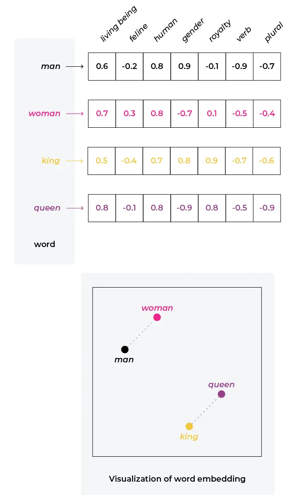

---

<style scoped>section { font-size:31px; }</style>

## Word2Vec (III)

- Els vectors de parales també s'anomenen **embeddings** o **representacions de xarxa**.
- **FastText** és una variant de **Word2Vec** que utilitza subparaules.
  - Permet representar paraules rares i que no estan en el vocabulari.
  - Útil per a llengües amb moltes paraules compostes i derivades.
- Els _embeddings_ generats poden ser utilitzats en una gran varietat de tasques, com pot ser la classificació de textos, anàlisi de sentiments, etc.
- Són models que necessiten un entrenament previ amb totes les paraules del vocabulari. A continuació veurem un exemple.

---

<!--
_class: invert lead
-->

<style scoped>
h1, p {
  color: #FFFFFF;
  text-shadow:
    0px 0px 3px #000000;
}
</style>

# Representació de textos

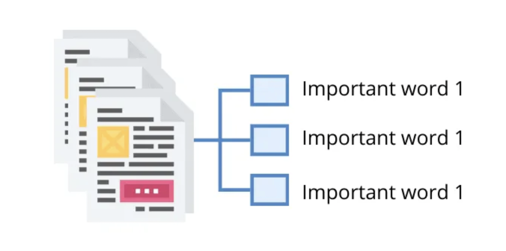

---

<style scoped>section { font-size:30.6px; }</style>

## Representació de textos

- Fins ara hem vist com representar paraules, veurem com representar textos, per poder veure les relacions entre les paraules que el formen.
- Algunes de les tècniques utilitzades són:
  - **One-hot encoding**: cada token $\rightarrow$ una dimensió; valor $\rightarrow$ 1 si el token està i 0 si no.
  - **Bag of Words**: model basat en freqüències. El valor de cada cel·la son les aparicions del token en el document. Simple i molt utilitzat.
  - **TF-IDF**: model basat en freqüències i inversa de freqüències
  - **Word Embeddings**. Vectorització de paraules amb _Word2Vec_, _FastText_, etc

---

<style scoped>section { font-size:30px; }</style>

### One-hot encoding

- El model **one-hot encoding** és un model basat en tokens.
- Els vectors generats són **dispersos** i **grans**, ja que cada token és una dimensió.
- Cada token és una dimensió i el valor de cada cel·la és 1 si el token està i 0 si no.
- Els vectors generats són **independents** de la semàntica.
- No facilita calcular la similitud entre paraules i textos.

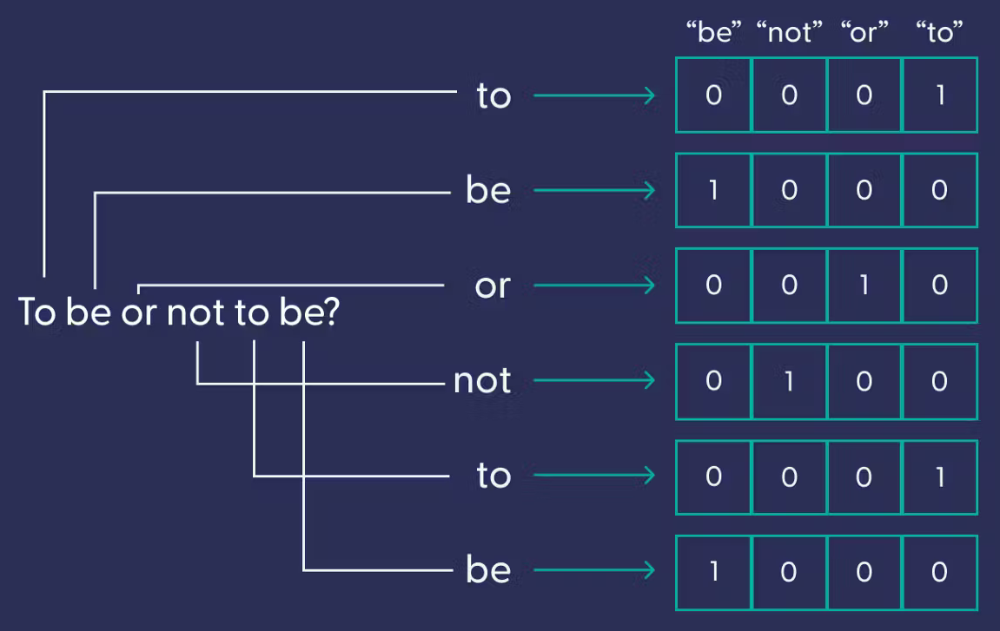

---

<style scoped>section { font-size:31.5px; }</style>

### Bag of Words (BoW)

- El model **BoW** és un model basat en freqüències.
- Es pot entendre com una suma dels vectors one-hot.
- Els vectors generats són **independents** de la semàntica.
- El nombre del token es pot entendre com a **ordre** i en molts casos no és així. Aquesta discrepància pot afectar a la qualitat del model.

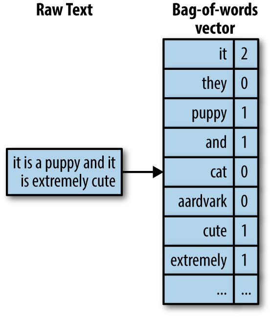

---

<style scoped>section { font-size:33px; }</style>

### TF-IDF

- El model **TF-IDF** és un model basat en freqüències i inversa de freqüències.
- Semblant al model **BoW**, però té en compte la freqüència del token en el document i en el conjunt de documents.
- El valor de cada cel·la és el producte de la freqüència del token en el document i la inversa de la freqüència del token en el conjunt de documents.
- Dona més importància als tokens que apareixen en pocs documents. Raó: els tokens que apareixen en molts documents no solen aportar informació rellevant.

---

### Word Embeddings

- Els _embeddings_ generats per Word2Vec són vectors de _n_ dimensions.
- Els vectors generats són **densos**, de **longitud fixa** i amb **sentit semàntic**.
- Per a representar un **text** pot utilitzar-se la mitjana dels _embeddings_ de les paraules que el formen, el màxim, la suma, etc.

---

#### Generació de _embeddings_ amb Word2Vec i la llibreria Gensim

```python
from gensim.models import Word2Vec

sentences = [
    ["Gavi", "company", "Pedri"],
    ["Xavi", "entrena", "Barça"],
    ["Gavi", "juga", "Barça"],
    ["Gavi", "chuta"],
    ["Kepa", "para"],
    ["Xavi", "entrena"],
]
model = Word2Vec(sentences, min_count=1)
```

---

#### Visualització dels _embeddings_

```python
gavi = model.wv["Gavi"]
print(gavi)
```

```python
[
    -0.00536227  0.00236431  0.0510335   0.09009273
                                         - 0.0930295 - 0.07116809 0.06458873  0.08972988
                                         - 0.05015428 - 0.03763372
]
```

---

#### Busquem paraules similars

```python
model.wv.most_similar("Gavi")
```

```python
[('Barça', 0.5436005592346191),
 ('Pedri', 0.3792896568775177),
 ('entrena', 0.3004249036312103),
 ('Xavi', 0.10494352877140045),
 ('juga', -0.1311161071062088),
 ('chuta', -0.1897382140159607),
 ('para', -0.22418655455112457),
 ('Kepa', -0.2726020812988281),
 ('company', -0.7287455797195435)]
```

---

<style scoped>section { font-size:32px; }</style>

#### Similitud del cosinus

- Els _embeddings_ generats per Word2Vec són vectors de _n_ dimensions.
- Per a calcular la similitud entre dos vectors s'utilitza la **similitud del cosinus**.
- El resultat és un valor entre -1 i 1.
  - -1: vectors oposats.
  - 0: vectors ortogonals.
  - 1: vectors iguals.
- Aquesta mesura és molt utilitzada en el processament del llenguatge natural.

---

<!--
_class: invert lead
-->

<style scoped>
h1, h2, h3, h4, h5, h6, p {
  color: #FFFFFF;
  font-weight: 800;
  text-shadow:
    0px 0px 3px #000000;
}
</style>

# Conversió de text a veu i veu a text


---

<style scoped>section { font-size:31.5px; }</style>

## Reconeixement de veu i transcripció automàtica

- La **síntesi de veu** i la **transcripció automàtica** són tasques de **processament del llenguatge natural**.
  - La síntesi de veu és el procés de **convertir un arxiu de text en un arxiu d'àudio**.
  - La transcripció automàtica és el procés de **convertir un arxiu d'àudio en un arxiu de text**.
- Ambdues són unes tècniques molt importants en el processament del llenguatge natural; encara que no solen estar en primer pla.
- En aquest apartat veurem com funcionen aquestes tècniques.

---

<style scoped>section { font-size:31px; }</style>

## Síntesi de veu

- La **síntesi de veu** és el procés de **convertir un arxiu de text en un arxiu d'àudio**.
- Aquesta tecnologia ha millorat molt en els últims anys, gràcies als models de llenguatge i a les xarxes neuronals.
- Hi ha diversos enfocaments, a continuació veurem els més importants.


---

### Síntesi de veu: concatenació de sons

- Es basa en la grabació de **sons** i la seva **concatenació** per a formar paraules i frases.
- Es busquen els sons més adaptats al context i es combinen de manera que soni el més natural possible.
- Requereix una gran quantitat de dades i dificulata adapatar-se a contextos nous.

---

### Síntesi de veu: síntesi basada en formants

- Els **formants** són les **frequencies** de les cordes vocàliques.
- S'ajusten els formants per representar els diferents sons i es combinen per a formar paraules i frases.
- La síntesi de formants permet obtindre veus clares i precises.
- Requereixen menys dades que la síntesi per concatenació de sons, tenen, però menys naturalitat i expressivitat.

---

### Síntesi de veu: síntesi basada en unitats

- Es basa en la **síntesi d'unitats** més petites que les paraules, com ara **fonemes** o **diftongs**.
  - Aquestes unitats s'enmagatzemen en una base de dades i es combinen de forma dinàmica segons el text.
  - La síntesi de unitats permet obtenir veus més naturals i expressives.
  - Requereixen menys dades que la síntesi per concatenació de sons.

---

<style scoped>section { font-size:32px; }</style>

### Síntesi de veu: basada en xarxes neuronals (I)

- Les xarxes neuronals són capaces de sintetitzar veus a partir de text.
- Aquestes xarxes s'entrenen amb grans quantitats de dades de veu i text i són capaces de sintetitzar veus molt naturals.
- S'utiltzen Xarxes Neural Recurrents (RNN) específiques, com ara les xarxes LSTM o GRU o models més moderns com ara les xarxes Transformer.
- Aquestes xarxes són capaces de sintetitzar veus molt naturals i expressives, sempre que tinguin suficientes dades d'entrenament i suficient capacitat de procés.

---

<style scoped>section { font-size:31.5px; }</style>

### Síntesi de veu: basada en xarxes neuronals (II)

- Aquests models es basen en els espectrogrames de les veus (representació de la veu en funció del temps i la freqüència).

- Funcionen en quatre etapes:
  - **Etapa de seqüència a seqüència**: el text es converteix en una seqüència de vectors.
  - **Etapa de seqüència a espectrograma**: els vectors es converteixen en espectrogrames.
  - **Etapa de síntesi**: els espectrogrames es converteixen en veu.
  - **Etapa de postprocessament**: es millora la qualitat de la veu.

---


---

## Transcripció automàtica

- En l'actualitat el **reconeixement de veu** és una tasca **molt madura**.
- Els assistents virtuals com **Siri**, **Alexa** o **Google Assistant** són capaços de reconèixer veu amb una gran precisió.
- Si volem implementar un sistema de reconeixement de veu, podem utilitzar eines com **Google Cloud Speech-to-Text** o **IBM Watson Speech to Text**.
- Aquestes eines es basen en les matèixes tècniques que hem vist per a la síntesi de veu.

---

<style scoped>section { font-size:31px; }</style>

### Models de reconeixement de veu i transcripció automàtica

- Els models de reconeixement de veu i transcripció automàtica són models de **seqüència a seqüència**.
- Aquests models són capaços de convertir una seqüència d'entrada en una seqüència de sortida.
- Alguns dels models més importants són:
  - **Whisper**: model de reconeixement de veu de **OpenAI**.
  - **DeepSpeech**: model de reconeixement de veu de **Mozilla**.
  - **Hugging Face Speech2Text**: model de reconeixement de veu.
  - **Bark**: Model de generació de veu de **Suno Labs**.

---

<!--
_class: invert lead
-->

<style scoped>
h1, p {
  color: #FFFFFF;
  text-shadow:
    0px 0px 3px #000000;
}
</style>

# Similitud entre textos

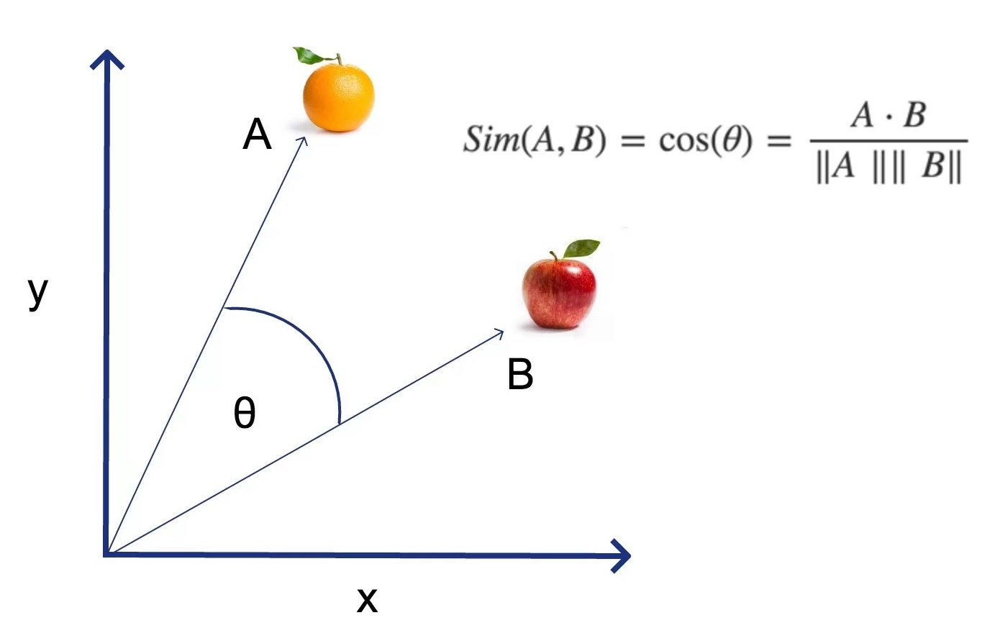

---

## Similitud entre textos

- La similitud entre textos és una mesura que indica com de semblants són dos textos.
- És una de les funcions més obvies del processament del llenguatge natural.
- El càlcul de la similitud entre textos, però, és una tasca **difícil**.
- Anem a veure algunes tècniques de les més utilitzades.

---

<style scoped>section { font-size:31px; }</style>

### Técniques per a calcular la similitud entre textos (I)

- **Basades en regles**: Es basen en regles predefinides; fàcils d'implementar i útils per a casos senzills.
  - **Distància de Levenshtein**: És el nombre mínim d'operacions per a transformar una cadena en una altra.
  - **Distància de Hamming**: És el nombre de posicions en les quals dues cadenes de la mateixa longitud difereixen.
  - **Recompte de paraules**: És el nombre comú de paraules entre dos textos.
  - **Distància de Jaccard**: És el nombre de paraules comunes entre dos textos dividit pel nombre total de paraules dels dos textos.

---

<style scoped>section { font-size:31px; }</style>

### Técniques per a calcular la similitud entre textos (II)

- **Basades en característiques sintàctiques**: Es basen en les característiques sintàctiques i gramaticals dels textos. Impliquen un procés de **parsejat** dels textos per analitzar la seva
  estructura sintàctica.
- **Basades en característiques semàntiques**: Es basen en les característiques semàntiques dels textos. Aquí models com Word2Vec són molt útils, al permetre representar el significat contextual de les paraules.
  - **Word Mover's Distance**: Mesura la distància entre dos textos com la distància entre els vectors de les paraules dels dos textos.
  - **Similitud del cosinus**: Utilitza el cosinus de l'angle entre ells.

---

<style scoped>section { font-size:33px; }</style>

### Técniques per a calcular la similitud entre textos (II)

- **Basades en l'aprenentatge automàtic**: Es basen en l'aprenentatge automàtic per a calcular la similitud entre textos.
  - **BERT i GPT**: Models de llenguatge basats en xarxes neuronals que pot ser utilitzat per a calcular la similitud entre textos.
  - **Universal Sentence Encoder**: Model específicament entrenat per al _transfer learning_ (aprenentatge per a la transferència; utilitzar un model entrenat per a una tasca per a una altra).

---

### Utilitats de la similitud entre textos

- **Correcció ortogràfica**: Per a corregir una paraula es busca la paraula més semblant.
- **Classificació de textos**: Per a classificar un text es busca el text més semblant.
- **Agrupació de textos**: Útil per a agrupar textos similars en clusters.
- **Búsqueda de resposte**: Per a trobar la resposta a una pregunta es busquen texts semblants a la pregunta.

---

<style scoped>section { font-size:30.5px; }</style>

### Word Embeddings

- Les técniques clàssiques d'NLP es basen en representacions no semàntiques com BoW o TF-IDF.
- Les modernes es basen en LLMs (Language Models) i Word Embeddings.
- Com ja hem vist, els _embeddings_ generats per Word2Vec són vectors de _n_ dimensions.
- Per a representar un text pot utilitzar-se la mitjana dels _embeddings_ de les paraules que el formen.
- Els vectors generats són **densos**, de **longitud fixa** i amb **sentit semàntic**.
- Facilita calcular la similitud entre paraules i textos.

---

### LLMS (Language Models)

- Els **LLMs** són models complexos basats en xarxes neuronals recurrents i l'arquitectura **Transformer**.
- Poden aprendre la semàntica del text i generar els seus propis _embeddings_ utilitzant el mecansime d'**atenció**.
- Demostren un gran rendiment en moltes tasques, com pot ser el càlcul de la similitud entre textos.
- Són complexos i necessiten un entrenament previ amb un gran volum de dades.

---

<!--
_class: invert lead
-->

<style scoped>
h1, p {
  color: #FFFFFF;
  text-shadow:
    0px 0px 3px #000000;
}
</style>

# Classificació de textos i anàlisi de sentiments


---

## Anàlisi de sentiments

- L'anàlisi de sentiments és un tipus de classificació i una de les tasques més utilitzades en el processament del llenguatge natural.
- L'objectiu és determinar l'actitud d'un autor respecte a un tema o producte.
- Es basa en la **polaritat** del text, que pot ser **positiva**, **negativa** o **neutra**.
- També poden buscar-se emocions concretes, com pot ser **alegria**, **tristesa**, **ira**, etc.

---

<style scoped>section { font-size:34px; }</style>

## Anàlisi subjectiva i objectiva

- L'anàlisi de sentiments pot ser **subjectiva** o **objectiva**.
- L'anàlisi subjectiva busca les **emocions i sentiments** de l'autor.
- L'anàlisi objectiva es basa en **fets i dades concretes**.
- Els dos tipus d'anàlisi són **complementaris** i poden utilitzar-se conjuntament.
- Ex: "_La pel·lícula té grans moments, però el final és molt trist_".
  - Anàlisi subjectiva: "_La pel·lícula és bona_".
  - Anàlisi objectiva: "_El final és trist_".

---

<style scoped>section { font-size:30.5px; }</style>

## Preprocessament del text

- El **tractament** de textos facilita obtenir bons resultats en NLP.
- Permet reduïr la **dimensionalitat** dels textos, eliminar el soroll i capturar la semàntica.
- Algunes de les tècniques més utilitzades són:
  - **Tokenització**: vist anteriorment.
  - **Normalització**: convertir el text a un format estàndard.
  - **Eliminació de stopwords**: eliminar paraules que no aporten informació.
  - **Stemming** i **lematització**: convertir les paraules a forma base.
  - **Gestió de negacions i modalitats**: convertir a un format estàndard.

---

### Preprocessament: tokenització

- Com ja hem vist, la tokenització és el procés de dividir un text en tokens.
- Els tokens poden ser paraules, subparaules, signes de puntuació, etc.
- Facilita una anàlisi més profund del text i extreure característiques rellevants.
- Ex: "El Barça està en crisi" $\rightarrow$ `["El", "Barça", "està", "en", "crisi"]`.

---

<style scoped>section { font-size:34px; }</style>

### Preprocessament: normalització

- La **normalització** implica el·liminar els elements que no aporten informació.
  - Nombres, signes de puntuació, etc.
- També implica convertir el text a un format estàndard, passant a minúscules i llevant espais innecessaris, per exemple.
  - Ex: "El Barça està en crisi! 😡" $\rightarrow$ "el Barça està en crisi".
- La normalització facilita la comparació entre textos i la detecció de paraules clau.

---

### Preprocessament: eliminació d'stopwords

- Les **stopwords** són paraules que no aporten informació al text.
- Són paraules molt comunes en un idioma, com pot ser articles, preposicions, etc.
- Els textos després de processar-se amb stopwords són més fàcils de tractar i més ràpids de processar.
- Ex: "El Barça està en crisi" $\rightarrow$ `["Barça", "crisi"]`.

---

<style scoped>section { font-size:34px; }</style>

### Preprocessament: stemming i lematització

- El **stemming** i la **lematització** són tècniques per a convertir les paraules a la seva forma base i facilitar l'agrupació de paraules relacionades.
- L'**stemming** és un procés heurístic basat en regles, mentre que la **lematització** és un procés basat en coneixements lingüístics.
  - Ex d'stemming: "jugar", "jugaré", "jugarà" $\rightarrow$ "jug".
  - Ex de lematització: "jugar", "jugaré", "jugarà" $\rightarrow$ "jugar".
- El stemming és més ràpid, però la lematització és més precisa.

---

### Preprocessament: negacions i modalitats

- Les **negacions** i **modalitats** poden canviar el significat d'una frase.
- Ex: _"El Barça no està en crisi"_, _"El Barça pot estar en crisi"_, _"Deuries anar a l'estadi"_.
- Els models de NLP no poden interpretar aquestes frases sense un tractament previ.
- Necessitem técniques específiques, com la detecció de **dobles negacions** i la **reassignació de polaritat**.

---

## Enfocaments per a l'anàlisi de sentiments

- Com en totes les tasques de NLP, l'anàlisi de sentiments pot ser abordada amb diferents enfocaments.
- Els enfocaments més utilitzats són:
  - Basats en **regles**
  - Basats en l'**aprenentatge automàtic supervisat**
  - Basats en l'**aprenentatge automàtic no supervisat**

---

### Enfocament basat en regles

- Els enfocaments basats en regles són els més senzills i ràpids.
- També s'anomenen **lexicon-based**.
- Es basen llistes de paraules per a determinar la polaritat del text.
- De cada paraula es busca la seva polaritat en el llistat i es fa una suma..
  - _"El Barça està en crisi"_. _"crisi"_ $\rightarrow$ **-1** $\rightarrow$ **negatiu**.
  - _"Me fa il·lusió anar a l'estadi"_. _"il·lusió"_ $\rightarrow$ **1** $\rightarrow$ **positiu**.
  - _"El partit va acabar en empat"_. _"empat"_ $\rightarrow$ **0** $\rightarrow$ **neutre**.

---

### Enfocament basat en l'AA supervisat

- Els enfocaments basats en l'aprenentatge automàtic supervisat són alguns dels més utilitzats.
- Consisteixen en entrenar un model amb un conjunt de dades etiquetades amb la polaritat del text.
- El model identifica els patrons en el text que determinen la polaritat.
- Alguns dels models més utilitzats són: **Naive Bayes**, **Support Vector Machines**, **Random Forest**, **Xarxes neuronals**

---

<style scoped>section { font-size:34px; }</style>

### Enfocament basat en l'AA no supervisat

- Els enfocaments basats en l'aprenentatge es basen en identificar patrons en el text sense necessitar etiquetes predefinides.
- Es poden utilitzar tècniques com la **clusterització** per a agrupar els textos en clusters segons la seva polaritat.
- Una vegada agrupats els textos, es poden etiquetar manualment els clusters.
- Aquestes tècniques són útils per a detectar patrons en el text i per a agrupar textos semblants (segons la distància entre textos).

---

<style scoped>section { font-size:33px; }</style>

## Models per a l'anàlisi de sentiments

Alguns dels models més utilitzats per a l'anàlisi de sentiments són:

- **BOW** + clasificador: model basat en BoW i un classificador.
- **Embeddings** + clasificador: Word2Vec, FastText, etc.
- **VADER**: model basat en regles, molt utilitzat en anglès.
- **Transformers**: com ja hem vist, els transformers són models específics per a NLP molt potents. Un dels models més utilitzats és **BERT**, de qüal utilitzarem una implementació en la segona
  pràctica.

---

## Xarxes neuronals per a l'anàlisi de sentiments

- Les xarxes neuronals són un dels models més utilitzats per a l'anàlisi de sentiments.
- Les xarxes neuronals són capaces d'aprendre els patrons en el text i de generar els seus propis _embeddings_.

---

<!--
_class: invert lead
-->

<style scoped>
h1, p {
  color: #FFFFFF;
  text-shadow:
    0px 0px 3px #000000;
}
</style>

# Models de llenguatge


---

## Models de llenguatge

- Fins ara hem vist com representar el text i com acomplir tasques com l'anàlisi de sentiments.
- Hem comentat que els models de llenguatge són eines molt potentes que poden ser utilitzades en moltes tasques.
- En aquesta secció veurem què són els models de llenguatge i com funcionen.
- També veurem alguns dels més utilitzats i les seves aplicacions.

---

<style scoped>section { font-size:31px; }</style>

## Aplicacions dels models de llenguatge

- Són dels camps més actius i complexos de la IA.
- Són la base de moltes aplicacions de NLP, com pot ser:
  - **Traducció automàtica**: traduir un text d'un idioma a un altre.
  - **Reconeixement de veu**: transcriure un text a partir d'un arxiu d'àudio.
  - **Síntesi de veu**: generar un arxiu d'àudio a partir d'un text.
  - **Generació i resum de text**: generar textos a partir d'un context.
  - **Anàlisi de sentiments**: determinar la polaritat d'un text.
  - **Classificació de text**: classificar un text en una categoria.
  - **Generació de textos**: generar textos a partir d'un tema o un estil.

---

<style scoped>section { font-size:30px; }</style>

### Definició

- Un **model de llenguatge** assigna una probabilitat a una seqüència de paraules.
  - Per tant, permet predir la següent paraula d'una seqüència.
  - Ex: "El barça està en \_\_\_" $\rightarrow$ `[{crisi: 0.8}, {forma: 0.1}, {casa: 0.1}]`
- Es basen en la idea que les paraules d'una seqüència no són independents, sinó que depenen de les paraules anteriors.
- Permeten calcular la "**validesa**" d'una seqüència de paraules.
  - No és el mateix que la **correcció** d'una seqüència de paraules.
  - Intentem modelar el llenguatge humà, amb els seus **matissos i ambigüitats**.

---

## Història: Models basats en regles

- Els models de llenguatge són un dels camps més antics del processament del llenguatge natural.
- Es basen en regles gramaticals i lingüístiques per definir les característiques del llenguatge.
- Les regles estan definides per experts i són difícils de modificar.
- No són flexibles i no poden adaptar-se a nous contextos.
- Ex: Gramàtica de Chomsky, Gramàtica de Montague, etc.

---

<style scoped>section { font-size:30.6px; }</style>

## Història: Models estocàstics

- Els models basats en regles van ser substituïts pels basats en **estadístiques**, més flexibles i que modelen millor el llenguatge. Els models de Markov van ser els primers en tindre resultats acceptables.
- Es basen en la idea que les paraules d'una seqüència no són independents, sinó que depenen de les paraules anteriors. Exemples:
  - **N-gram**: modela cada paraula en funció de les n paraules anteriors. (uni, bi, tri, etc).
  - **Skip-gram**: modela cada paraula en funció de les n paraules anteriors i posteriors.
  - **Syntax-based**: es basen en l'estructura sintàctica de les frases i no en la seva seqüència.

---

<style scoped>section { font-size:30px; }</style>

## Història: RNN

- Els models basats en estadístiques van ser substituïts per models basats en **xarxes neuronals**.
- Els primers models d'aquest tipus van ser els **RNN** (xarxes neuronals recurrents).
  - A diferència de les xarxes neuronals tradicionals, les RNN tenen **memòria**.
  - L'entrada d'una neurona pot anar determinada per la sortida d'ella mateixa.
  - Permeten processar seqüències de longitud variable.
  - Els models de llenguatge basats en RNN van ser els primers en obtenir resultats acceptables.

---

<style scoped>section { font-size:30px; }</style>

## Història: LLM

- Els models basats en RNN van ser substituïts per models basats en **transformers**.
- Els transformers són models basats en xarxes neuronals que utilitzen el mecanisme d'**atenció**.
  - Són més potents que les RNN i permeten obtenir resultats molt millors.
  - Són els models més utilitzats en l'actualitat.
  - Necessiten un entrenament previ amb un **gran** volum de dades (_corpus_)
  - Mostren la capacitat d'entendre el context, la semàntica i la sintàxis del text.

---

## Història: LLM (II)

- El mecanisme d'atenció és un mecanisme que permet a les xarxes neuronals aprendre a **centrar-se** en les parts importants de les seves entrades.
- És un mecanisme que imita el comportament humà.
- Podem entendre'l com una **capa** que s'afegeix a una xarxa neuronal.
- Els transformers són models basats en xarxes neuronals que utilitzen una variant del mecanisme d'atenció anomenada **self-attention**.

---

<!--
_class: invert lead
-->

<style scoped>
h1, p {
  color: #FFFFFF;
  text-shadow:
    0px 0px 3px #000000;
}
</style>

# Arquitectures per a NLP


---

<style scoped>section { font-size:30px; }</style>

## Cadenes de Markov

- Els **models ocults de Markov** (HMM) són models estocàstics que permeten modelar seqüències de paraules.

- Es basen en la idea que les paraules d’una seqüència no són independents, sinó que depenen de les paraules anteriors.

- Els HMM són capaços de modelar la probabilitat de transició entre paraules.

- El seu principal desavantatge és que no poden modelar dependències a llarg termini.

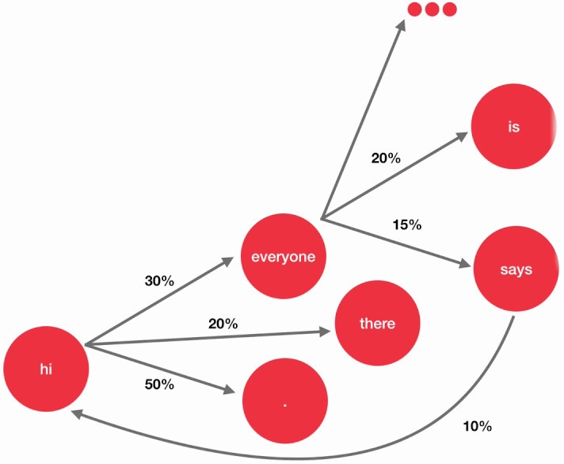

---

## Xarxes neuronals recurrents (RNN)

- Com ja hem parlat, les xarxes neuronals recurrents (RNN) són xarxes neuronals que poden processar seqüències de longitud variable de forma eficient.

- En aquesta secció veuren en més detall com funcionen les RNN i com són utilitzades en NLP.

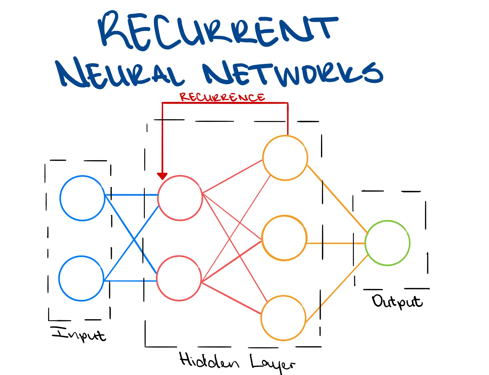

---

### Memòria

- La principal característica de les RNN és que tenen **memòria**.
- Com s'aconsegueix aquesta memòria?
  - La sortida d'una neurona pot anar determinada per la **sortida d'ella mateixa**.
  - Aixó permet que la informació puga processar-se un una mateixa capa, sense necessitat de capa addicional.
  - Apareix un nou problema: el **desvaiment del gradient**. Quina informació es manté i quina no?
  - Per aixó han anat diferents aquitectures al llarg del temps.

---

### Xarxes Recurrents Tradicionals (I)

- La sortida d'una neurona pot anar determinada per la sortida d'ella mateixa.
- Cada neurona té dues entrades: el **valor actual** i el **valor anterior**.
- Aquesta memòria és inherenment de curta durada.
- Per facilitar la comprensió es solen mostrar de forma **desplegada**, com veurem a continuació.
- Són una millora respecte als models ocults de Markov, però molt vulnerables als problemes de desvaiment del gradient.

---

### Xarxes Recurrents Tradicionals (II)

- En el cas de les RNN, la memòria es manté en la capa oculta.
- En el següent esquema podem veure com es representa una RNN sense desplegar.

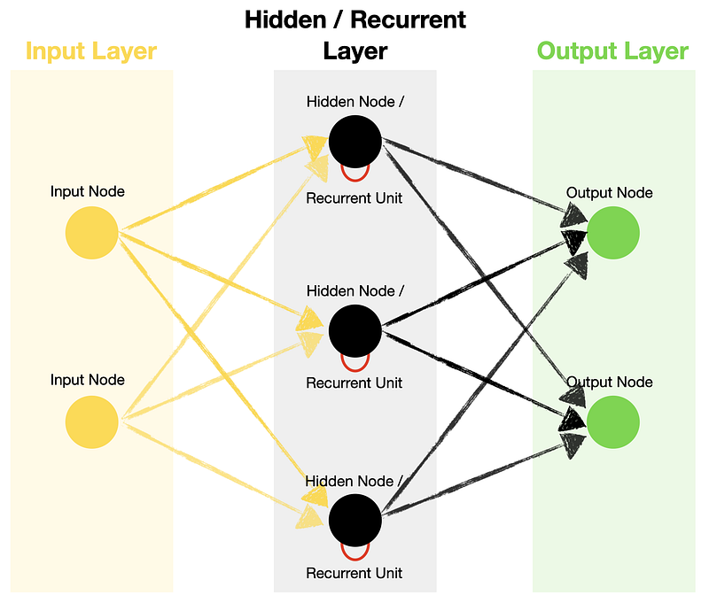

---

<style scoped>section { font-size:26px; }</style>

<!-- _footer: "" -->

### Xarxes Recurrents Tradicionals (III)

- En l'esquema es representen tres passos de temps.
- Solament tenim un node d'entrada, pero al necessitar tres passos de temps, necessitem passar tres valors d'entrada.
- Els valors a entrenar en les neurones recurrents són tres: pes de la entrada, pes de la entrada recurrent i el biaix.

## 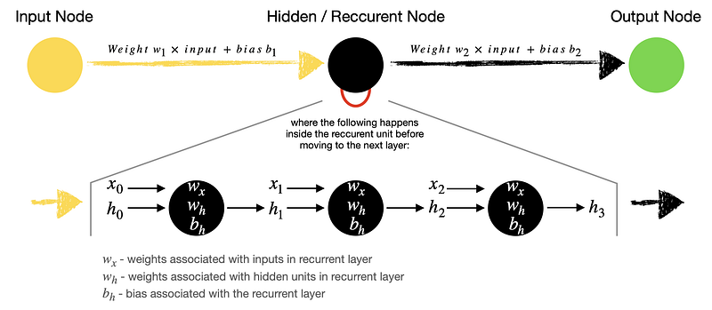

---

### LSTM (Long Short-Term Memory) (I)

- Les **LSTM** són una millora de les RNN tradicionals implementant una **memòria a llarg termini**.
- Tenen una **memòria interna** que pot ser mantinguda, **modificada** o **eliminada** segons les necessitats.
- **Millora el desvaiment** del gradient **a costa de ser més complexa i costosa** de processar.
- Cada cel·la LSTM equival a quatre capes en una RNN tradicional.

---

### LSTM (Long Short-Term Memory) (II)

- L'estat intern de la cel·la es gestiona utilitzant les **portes**.
- Les LSTM tenen tres portes:
  - **Porta d'oblit**: Si s'activa la cel·la oblidarà la informació anterior.
  - **Porta d'entrada**: Si s'activa la cel·la afegirà nova informació.
  - **Porta de sortida**: Si s'activa la cel·la generarà la sortida.
- Aquestes portes permeten a la LSTM mantenir la informació important i descartar la que no ho és.

---

### LSTM (Long Short-Term Memory) (III)

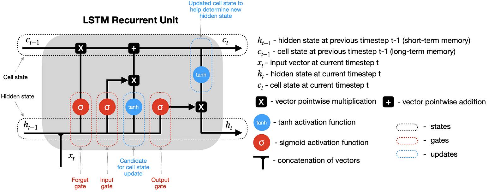

---

### GRU (Gated Recurrent Unit)

- Les GRU són una altra millora de les RNN tradicionals implementant una memòria a llarg termini.
- No tenen una memòria interna com les LSTM, però són més senzilles i més ràpides de processar.
- Hi ha dues portes: porta d'actualització i porta de reinici. En conjunt determinen la quantitat d'informació que es manté i la que es descarta.
- Millora el desvaiment del gradient sense ser tan complexa com les LSTM.

---

### GRU (Gated Recurrent Unit) (II)

- Les GRU tenen dues portes: **porta d'actualització** i **porta de reinici**.
- Si s'activa la porta de reinici la cel·la oblidarà la informació anterior.
- Si s'activa la porta d'actualització la sortida incorporarà nova informació.
  - Aquesta informació pot ser la mateixa que la anterior o una combinació de la nova i la anterior. El poder retenir la informació anterior és el que fa que les GRU no tinguin una memòria interna com les LSTM.
- L'efecte és semblant al de les LSTM, però amb menys complexitat.

---

### GRU (Gated Recurrent Unit) (III)

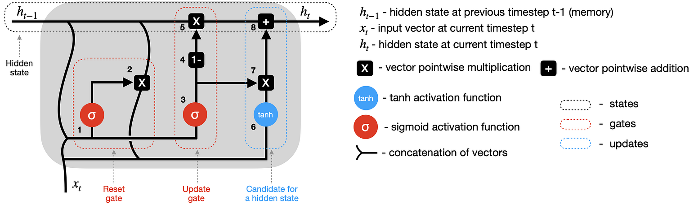

---

<!--
_class: invert lead
-->

<style scoped>
h1, h2, h3, h4, h5, h6, p {
  color: #FFFFFF;
  font-weight: 800;
  text-shadow:
    0px 0px 3px #000000;
}
</style>

## Transformers


---

### Introducció

- Com ja hem comentat anteriorment, els **transformers** són models basats en xarxes neuronals que utilitzen el mecanisme d'**atenció**.
- Són els models més utilitzats en l'actualitat en el processament del llenguatge natural.
- La seva arquitectura innovadora permet obtenir resultats molt millors que els models anteriors i aprofitar el **parallelisme** i les **GPU**.
- Per la seva complexitat anem a veurel's en més detall.

---

### Orige

- Els transformers van ser introduïts per **Vaswani et al.** en el 2017.
  - El paper original es titula "_Attention is All You Need_".
- Els transformers van ser dissenyats per a millorar el rendiment dels models de llenguatge.
- El seu primer ús va ser en la tasca de traducció automàtica.
- Va posar en primer pla el mecanisme d'atenció com a eina fonamental en el processament del llenguatge natural.

---

### Arquitectura dels transformers (I)

- Els transformers són models moderns i molt complexos.
- Per contra, si veiem les seves parts per separat, és més fàcil entendre'l's.
- Anem a veure punt per punt les seves parts principals i com funcionen.

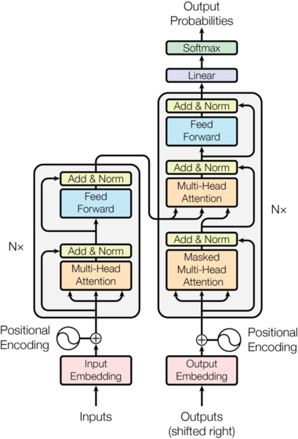

---

<style scoped>section { font-size:33px; }</style>

### Arquitectura dels transformers (II)

- En un nivell superficial, els transformers funcionen com una caixa negra.
- Reben com a entrada un text i generen com a sortida un text.
- La seva complexitat rau en la seva arquitectura interna.
- Els transformers tenen _dos_ parts principals: **encoders** i **decoders**.

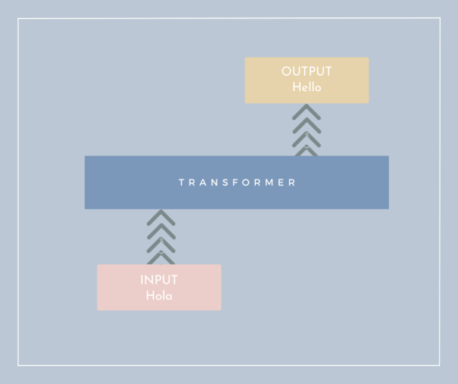

---

<style scoped>section { font-size:33px; }</style>

### Arquitectura dels transformers (III)

- L'entrada passa per una sèrie de capes d'encoders.
- A continuació, la sortida dels encoders passa per una sèrie de capes de decoders.
- En el paper original: **6 capes d'encoders i 6 capes de decoders**.
- També podem passar un "**target**" com a entrada, **per entrenar**

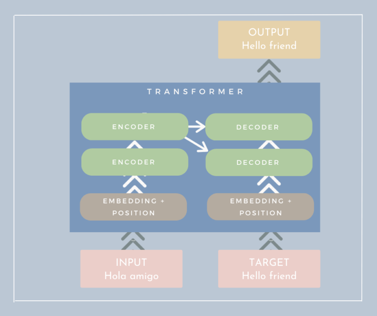

---

<style scoped>section { font-size:30px; }</style>

### Encoders i decoders

- Els **encoders** i **decoders** són les parts principals dels transformers.
- A nivell intern son semblants i comparteixen moltes característiques.
  - Tenen en l'entrada una (o més) capa d'**atenció** i com a sortida una capa **feed-forward**.
- La diferència principal és que els **encoders** solament tenen una capa d'atenció, mentre que els **decoders** tenen dues.

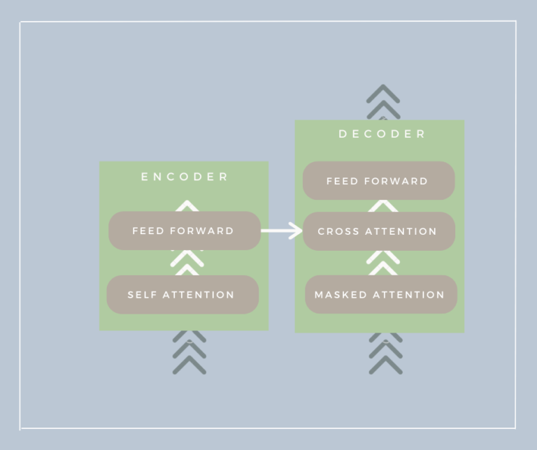

---

<style scoped>section { font-size:30px; }</style>

### Embeddings i posicions

- Els transformers utilitzen **embeddings** per a representar les paraules (de 512 dimensions en el paper original).
- A més, utilitzen el **positional encoding** per a representar la posició de les paraules en la seqüència.
  - Básicament una funció sinusoidal que varia segons la posició de la paraula, per lo que el mateix vector en diferents posicions serà un poc diferent.
  - $$PE_{(pos, 2i)} = \sin(pos / 10000^{2i/d_{model}})$$
- Aquest encoding manté la informació de la posició de les paraules en la seqüència; al mateix temps que permet **enviar tots els tokens a la xarxa al mateix temps**.

---

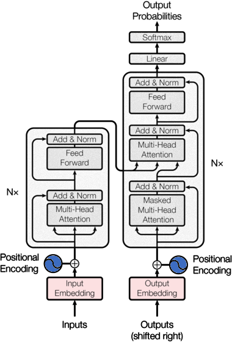

---

<style scoped>section { font-size:30px; }</style>

### Encoder

- Els **encoders** estan compostos per tres capes:
  - **Self-attention**: per a calcular la importància de cada paraula en la seqüència. A continuació veurem com funciona.
  - **Feed-forward**: per a processar la informació obtinguda de l'atenció.
  - **Normalization i conexions residuals**: per a evitar el desvaiment del gradient i facilitar el seu entrenament.


---

<style scoped>section { font-size:31px; }</style>

### Self-attention (I)

- El **self-attention** és el mecanisme clau dels transformers.
- Permet a la xarxa "centrar-se" en les parts importants de la seqüència.
  - Ex: en la frase _"El gat gris va a la casa"_ sabem que $gris$ i $gat$ estan relacionats. Com ho pot saber la xarxa?
- Els transformers creen un "**Soft dictionary**" d'atencions en les paraules de la seqüència. Així, l'atenció de $gris$ en $gat$ serà $1$ i en $casa$ serà $-1$.
- El que el diccionari siga "soft" vol dir que pot anar modificant-se.
  - En la frase "El gat va a la casa gris" l'atenció de $gris$ en $casa$ serà $1$.

---

<style scoped>section { font-size:34px; }</style>

### Self-attention (II)

- Per calcular el self-attention es generen tres matrius a partir de la seqüència d'entrada: **Q** (query), **K** (key) i **V** (value)
- **Q** i **K** són matrius que representen la seqüència d'entrada i **V** és la matriu que representa el valor de cada paraula.
- Per obtindre l'atenció multiplicarem **Q** per la transposada de **K**
  - Obtindrem la similitud entre les paraules.
- El resultat el multiplicarem pel valor de **V**.
  - Obtindrem la matriu d'atencions.

---


---

<style scoped>section { font-size:32px; }</style>

### Self-attention (III)

- Els transformers utilitzen el **multi-head attention**.
- Aquesta tècnica consisteix en calcular el self-attention amb diferents grups de dimensions.
- Els transformers utilitzen **8** caps de self-attention en el paper original.
- Dels resultats es fa un promig i el resultat, segons els estudis es molt més significatiu.
- És important ressaltar que tot el procñes d'atenció es paral·lel i accelerat per la GPU (multiplicació de matrius), per lo que es molt ràpid.

---

<style scoped>section { font-size:31px; }</style>

### Altres tipus d'atenció

- A més del **self-attention**, els transformers utilitzen altres tipus d'atenció:
  - **Cross-attention**: les entrades del decoder són les sortides de l'encoder. Això permet al encoder condicionar el decoder, donant-li informació sobre el context.
  - **Masked attention**: en el decoder, les paraules futures no poden ser utilitzades per a calcular l'atenció. Això evita que el model "mire al futur".


---

<style scoped>section { font-size:35px; }</style>

### Normalització i conexions residuals

- Les conexions residuals són una tècnica que permeten evitar el desvaiment del gradient.
  - Aquest problema es produeix quan les xarxes són molt profundes.
  - Les conexions residuals permeten que els valors d'entrada es mantinguen en les capes posteriors.
- La normalització permet que els valors d'entrada es mantinguen en un rang determinat.
  - Això facilita el seu entrenament i millora el seu rendiment.

---

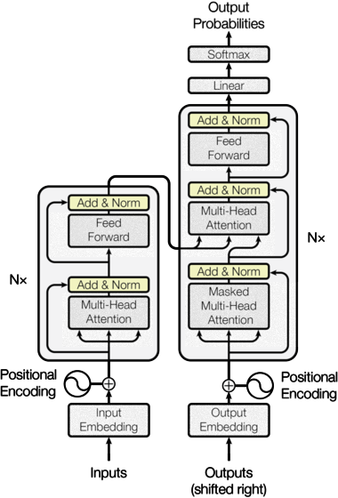

---

<style scoped>section { font-size:32px; }</style>

### Feed-forward

- La capa **feed-forward** és una capa de xarxa neuronal normal.
- La seva funció és processar la informació obtinguda de l'atenció.
- Hi haurà dues capes de _dropout_ per a evitar l'overfitting i una funció d'activació no lineal (ReLU en el paper original).


---

<style scoped>section { font-size:33px; }</style>

### Decoder

- Els **decoders** són molt semblants als **encoders**.
- En els models normals en l'entranament utilitzem la sortida esperada per validar el resultat.
- Per contra, en els models de llenguatge, el **target** es passa com a entrada per a entrenar el model.
- Això permet que el model aprenga a generar el text de sortida.


---

### Sortida final del model

- Recordem que utilitzem múltiples capes d'encoders i decoders.
- La sortida final del model és la sortida de l'última capa de decoders i passa per una capa de **softmax**.
- Aquesta sortida és un vector de longitud igual al nombre de paraules del vocabulari.
- Aquest vector representa la probabilitat de cada paraula en el vocabulari (de 0 a 1).
- La paraula amb més probabilitat serà la paraula de sortida.

---

<style scoped>section { font-size:30px; }</style>

### Aplicacions dels transformers

- Poden ser utilitzats en moltes tasques de NLP pero més enllà del NLP també s'utilitzen en altres tasques com les següents:

  - **Visió per computador**: s'està utilitzant per la classificació d'imatges i altres. _Vision Transformer (ViT)_.
  - **Series temporals**: les seqüències de paraules són molt semblants a les seqüències de fets en el temps.
  - **Generatius**: s'utilitzen per a generar textos, imatges, etc.
  - **Aprenentatge per reforç**: s'utilitzen per a entrenar agents en entorns complexos.

- Tots aquests usos els fan una eina molt potent i que poden arribar a substituir molts dels models actuals.

---

<style scoped>section { font-size:29px; }</style>

### Classificació dels LLM

- **Encoder-only**: No necessiten generar un text de sortida, processen el text d'entrada.
  - Utilitats: classificació de text, anàlisi de sentiments, etc. Ex: BERT, RoBERTa, ALBERT, ELECTRA, etc.
- **Decoder-only**: No transformen el text d'entrada, solament generen un text de sortida.
  - Utilitats: generació de text, escritura creativa, etc. Ex: GPT-X, Mixtral, Aguila...
- **Encoder + Decoder**: Processen el text d'entrada i generen un text de sortida
  - Utilitats: traducció automàtica, resum, esquematització, etc. Ex: T5, BART, etc.

---

<style scoped>section { font-size:30px; }</style>

## Utilització dels LLM

- Els transformers són models molt complexos i necessiten un entrenament previ amb un gran volum de dades.
- Normalment s'utilitzen models ja entrenats i que poden ser utilitzats per a diferents tasques.
- Per a millorar el rendiment dels models entrenats es pot utilitzar el **fine-tuning**.
  - El fine-tuning consisteix en entrenar el model amb un conjunt de dades específic per a la tasca que volem realitzar.
  - S'utilitza un conjunt de dades més petit que el corpus original.
  - En les pràctiques utilitzarem un model ja entrenat i li farem fine-tuning per a millorar el rendiment en les tasques que realitzem.

---
