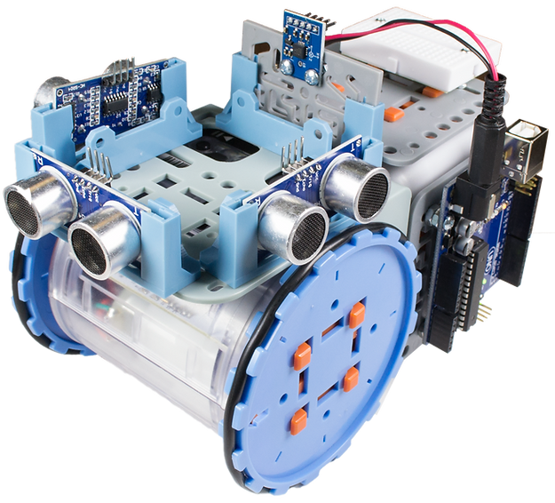
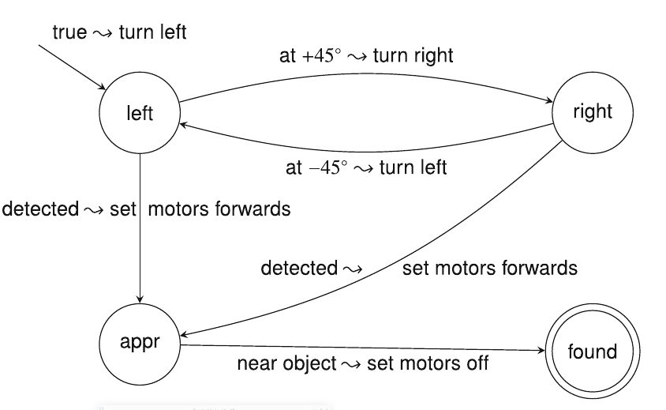
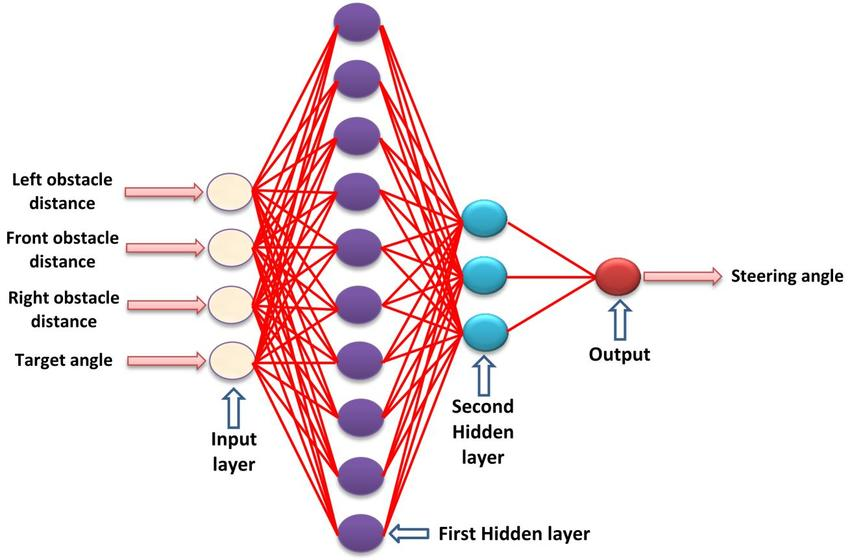

# 9. Robòtica

Models d'intel·ligència artificial

---

## Introducció

- La robòtica és una branca de la tecnologia que es dedica al disseny i construcció de robots.
- Els robots permeten als nostres models d'intel·ligència artificial interactuar amb el món real.
- La robòtica és una disciplina multidisciplinària que combina coneixements d'enginyeria, informàtica, matemàtiques, física, biologia, etc.

---

## Robots

- Un robot és un dispositiu programable que realitza tasques manipulant el seu entorn.
- Per fer-ho, els robots utilitzen actuadors per interactuar amb el món real.
- Els canvis podem ser físics (moure objectes) o digitals (enviar informació).

---

### Sensors

- Els sensors són dispositius que permeten als robots percebre el seu entorn.
- Hi ha molts tipus de sensors. Els grups més importants son:
  - **Mesurar l'estat de l'entorn**: càmeres, radars, ultrasons, etc.
  - **Mesurar l'estat del robot**: acceleròmetres, giroscopis, encoders, etc.

---

### Operacions

- Per maximizar la seva eficiència, els robots han de ser capaços de prendre **decisions**.
- Les decisions poden ser simples (moure's cap a l'objectiu) o complexes (conduir un cotxe), sempre en l'objectiu de **realitzar una tasca**.
- Ho podem reduir a un problema d'**optimització**: aplicar les forces adequades per maximitzar l'objectiu.
- **Problema**: com fer-ho de manera eficient?

---

### Entorn

- En els problemes d'optimització que hem vist **fins ara** l'entorn era **virtual, observable i determinista**.
- En el **món real**, l'entorn és **no observable, no determinista i no estàtic**.
- Aixó fa que els problemes de robòtica siguin molt més complicats que els problemes d'optimització tradicionals.
- També es **dificulta l'aprenentatge**: el temps no es pot retrocedir per provar diferents accions ni es pot accelerar

---

### Intel·ligència artificial

- Tot el discutit fins ara ens porta a que els robots **impliquen molts conceptes** dels vists durant el curs.
- Per alguns dels conceptes vistos trobarem en la robòtica una **aplicació pràctica** i real Per exemple, els robots autònoms utilitzen xarxes neuronals per processar la informació dels sensors i prendre decisions.
- Altres conceptes es veuran **ampliats**: per exemple, els algoritmes d'optimització han de ser adaptats per funcionar en entorns no deterministes.

---

## Hardware de robòtica

- Fins ara hem suposat que la forma de interactuar amb el món real era a través de la pantalla.
- Amb la robòtica, aquesta interacció es fa a través de **sensors i actuadors**.
- No podem solament programar el comportament del robot, sinó que també hem de dissenyar el **hardware** que ens permetrà interactuar amb el món real.
- La selecció dels sensors i actuadors determinarà el seu funcionament en les tasques que haurà de realitzar.

---

### Tipus de robots segons el seu hardware

- **Robots antropomòrfics**: robots que imiten la forma humana. També coneguts com a **robots humanoides**. Els més populars pero molt complexos i costosos.
- **Braços robòtics**: robots que poden moure objectes. També coneguts com a **robots manipuladors**. Són els més comuns, especialment en la indústria.
- **Robots mòbils**: robots que poden moure's pel seu entorn. Poden ser **terrestres, aquàtics o aeris**. Són els més comuns en la robòtica autònoma.

---

---

<!--
_class: invert lead
-->

## Sensors i actuadors

---

### Tipus de sensors

- **Actius**: emeten una senyal i mesuren la resposta. Es solen utilitzar per mesurar distàncies.
  - Necessiten una font d'energia. Més precisos però més cars i complexos.
  - _Radars, ultrasons_.
- **Passius**: mesuren la radiació que reben. Es solen utilitzar per mesurar la llum o el so.
  - No necessiten una font d'energia. Econòmics i fàcils d'utilitzar.
  - _Càmeres, micròfons_.

---

#### Sensors de distància

Permeten als robots mesurar la distància a objectes.

- **Ultrasons**: emeten ones sonores i mesuren el temps que triguen a rebre l'eco. Polivalents i econòmics.
- **Radars**: emeten ones electromagnètiques i mesuren el temps que triguen a rebre el reflexe. Molt utilitzats en robots aèris.
- **LIDAR**: utilitzen làser per mesurar la distància a objectes amb una gran precisió. Molt utilitzats en vehicles autònoms terrestres.

---

##### LIDAR

---

#### Sensors de localització

Permeten als robots saber on es troben en el seu entorn.

- **GPS**: permet als robots saber la seva posició en un mapa. L'equivalent Rus és el GLONASS i el xinès el Beidou. Solament funciona a l'aire lliure.
- **Beacons**: emeten una senyal que permet als robots saber la seva posició en un espai conegut. Molt utilitzats en robòtica indoor.
- **Wi-Fi**: La força de la senyal Wi-Fi permet substituir els beacons en entorns amb Wi-Fi.

---

#### Propiocepció

Es refereix a la capacitat dels robots de saber la seva posició i orientació en l'espai.

- **Sensors inercials**: acceleròmetres i giroscopis que permeten als robots saber la seva orientació.
- **Encoders**: permeten als robots saber la seva posició en un eix.
- **Odometria**: permet als robots saber la seva posició en un pla. Utilitza encoders i giroscopis.
- **SLAM**: permet als robots saber la seva posició en un entorn desconegut. Utilitza càmeres i LIDAR.

---

#### Altres

- **Sensors de temperatura, humitat, pressió, etc.**: permeten als robots mesurar variables ambientals.
- **Sensors de força**: permeten als robots mesurar la força que fan servir.
- **Sensors de color**: permeten als robots mesurar el color dels objectes.
- **Sensors de llum**: permeten als robots mesurar la llum ambiental.
- **Sensors de so**: permeten als robots mesurar el so ambiental.

---

---

### Actuadors

- Els actuadors són els components del robot que permeten moure's pel seu entorn. Els més comuns són:
  - **Servomotors**: permeten moure's en un eix. Molt utilitzats en robots manipuladors.
  - **Motors DC**: permeten moure's en un eix. Molt utilitzats en robots mòbils.
  - **Motors pas a pas**: permeten moure's en un eix amb una gran precisió.
  - **Hidràulics**: permeten moure's amb una gran força. Molt utilitzats en robots industrials.

---

---

<!--
_class: invert lead
-->

## Programació de robots

---

## Programació de robots

- La programació de robots és molt més complexa que la programació de software tradicional.
- No coneixem l'estat de l'entorn, per tant, hem de plantejar les tasques del robot com un **problema d'optimització**, on hem de trobar la millor seqüència d'accions per aconseguir un objectiu.
- Veurem com aplicar els conceptes de programació i d'intel·ligència artificial vistos fins ara a la robòtica.

---

### Percepció

- La percepció és la capacitat del robot de **percebre el seu entorn**.
  - Convertir les dades dels sensors en una representació interna.
- És un problema complex, ja que els sensors poden ser molt **ruidosos** i **inexactes**.
  - Necessitem **filtrar** i **processar** les dades dels sensors per obtenir una representació fiable de l'entorn.
  - Haurem de construïr un model **complet**, **fàcil d'actualitzar** i **eficient** de l'entorn.

---

#### Localització

- **Localització**: determinar la posició dels objectes (incloent el robot) en l'entorn.
- Inclús en entorns coneguts, la localització és un problema complex, ja que els sensors poden ser molt inexactes.
- Partint d'una posició inicial i sabent les acccions que ha fet el robot la posició final serà una **distribució de probabilitat**.
  - **Monte Carlo Localization (MCL)** vs **Extended Kalman Filter (KF)**: MCL és més precís però més lent. EKF és més ràpid però menys precís.
  - Ambdós es basen en la **teoria de la probabilitat**.

---

#### Mapatge

- **Mapatge**: construir un mapa de l'entorn a partir de les dades dels sensors.
- Problema complex: difícil localitzar-se sense un mapa, però difícil construir un mapa sense saber on estàs.
- **Simultaneous Localization and Mapping (SLAM)**: resoldre simultàniament el problema de la localització i el mapatge.
  - **SLAM visual**: utilitza càmeres per localitzar-se i construir un mapa.
  - **SLAM LIDAR**: utilitza LIDAR per localitzar-se i construir un mapa.

---

---

#### Altres tipus de percepció

- Hi ha altres tipus de percepció que són importants en robòtica com poden ser els de **temperatura, llum, olor, etc.**
- La percepció de variables ambientals és important en moltes tasques robòtiques.
- Per exemple, un robot que ha de netejar una habitació necessita percebre la brutícia.
- Aquest tipus de percepció es pot fer amb sensors especialitzats.
- Podem aplicar un enfocament similar al de la percepció visual o un enfocament reactiu.

---

### Comportament reactiu

- Els robots reactius són robots que prenen decisions basades en les dades dels sensors en temps real.
- Aquesta és una estratègia senzilla però efectiva per a moltes tasques robòtiques.
- Els robots reactius són molt ràpids i eficients, però no sempre poden resoldre tasques complexes.
- Podem combinar els robots reactius amb altres estratègies per resoldre tasques més complexes.
- L'exemple més senzill és el dels vehicles de Braitenberg.

---

#### Vehicles de Braitenberg

- Valentino Braitenberg va proposar un model senzill de vehicles autònoms que mostren comportaments sorprenents.
- Els vehicles de Braitenberg són vehicles amb sensors i actuadors que segueixen unes regles senzilles. Normalment interconecten els sensors amb els actuadors directament.
- Els vehicles mostren comportaments complexos com seguir la llum, evitar obstacles, etc.
- Son representatius de la **robòtica BEAM** (Biology, Electronics, Aesthetics, Mechanics).

---

---

#### Seguiment de línies

- El seguiment de línies és una tasca comuna en robòtica mòbil.
- Consisteix en seguir una línia en el terra utilitzant sensors d'infrarojos o càmeres.
- Els robots que segueixen línies utilitzen un algoritme senzill per determinar la direcció en la que han de moure's.
- En la forma més senzilla, el robot gira cap a la línia quan la veu i rectifica la seva trajectòria quan la perd.

---

---

#### Màquines d'estats finits

- Les **màquines d'estats finits** són una eina molt útil per programar robots.

  - Un pàs més enllà dels robots reactius en complexitat i flexibilitat.

- Model matemàtic** que descriu el comportament d'un **sistema com una sèrie d'estats i transicions\*\*, on cada estat representa una situació en la que es pot trobar
- Robots reactius: les decisions es prenen segons l'estat actual
- FSM: **En funció de les entrades actuals i de l'estat en el que es troba el robot**.

---

#### Exemple de màquina d'estats finits (I)

- Un exemple senzill del que podem fer amb una màquina d'estats finits és el de buscar un objectiu.

- En aquest cas, tenim quatre estats:
  - **Esquerra**: el robot gira a l'esquerra buscant l'objectiu.
  - **Dreta**: el robot gira a la dreta buscant l'objectiu.
  - **Endavant**: el robot va endavant.
  - **Objectiu**: el robot ha trobat l'objectiu i s'atura.

---

#### Exemple de màquina d'estats finits (II)

- Les transicions entre estats es fan en funció de les dades dels sensors:
  - Si el robot passa de +45º passa a l'estat **Dreta**.
  - Si el robot passa de -45º passa a l'estat **Esquerra**.
  - Si el robot passa detecta l'objectiu passa a l'estat **Endavant** i comença a moure's cap a l'objectiu.
  - Quan el robot arriba a l'objectiu passa a l'estat **Objectiu** i s'atura.

---

---

#### Estat de l'algorisme

- Quasi tots els algorismes de robòtica són **estatals**.
  - Necessiten guardar alguna informació de l'estat actual del robot.
- Aquesta informació pot ser molt senzilla (com en el cas de la màquina d'estats finits) o molt complexa.
- Els FSM són una eina molt útil d'introdïr l'estat en els algorismes de robòtica.
  - Per algorismes més complexos necessitarem eines més avançades.

---

### Xarxes neuronals

- Les xarxes neuronals són una eina molt potent per resoldre problemes de robòtica.
- Com les xarxes neuronals poden aproximar qualsevol funció, podem utilitzar-les per controlar un robot.
- Les XN Feedforward són les més comunes en robòtica, ja que són senzilles i eficients.
  - Serien equivalents a un sistema reactiu
- Les XN Recurrents són més complexes però més potents.
  - Serien equivalents a un sistema basat en FSM.

---

---

#### Aprenentatge (I)

- Per entrenar les xarxes neuronals podem utilitzar tècniques d'aprenentatge supervisat o no supervisat.
  - **Supervisat**: donem un conjunt de dades d'entrada i sortida i la xarxa apren a partir d'aquestes dades.
    - Replegarem dades de sensors i actuadors per entrenar la xarxa.
    - Si volem que el robot segueixi una línia, recollirem dades de sensors de línia i actuadors de moviment.
    - Una vegada entrenada la xarxa, el robot serà capaç de seguir la línia sense necessitat de programar-lo.

---

#### Aprenentatge (II)

- **Aprenentatge per reforç**: les xarxes aprenen a partir de la interacció amb l'entorn.
  - Definirem un **premi** per a les accions desitjades i un **càstig** per a les accions no desitjades. El robot provarà diferents accions i aprendrà quines són les millors a partir dels premis rebuts.
- **Neuroevolució**: utilitzar algoritmes evolutius per evolucionar les xarxes neuronals.
  - Crearem una població de xarxes neuronals i les farem competir entre elles. Les xarxes més eficients es reproduiran i evolucionaran.

---

---

## Conclusions

- La robòtica és una disciplina multidisciplinària que combina coneixements d'enginyeria, informàtica, matemàtiques, física, biologia, etc.
- Els robots permeten als nostres models d'intel·ligència artificial interactuar amb el món real.
- La robòtica és una eina molt potent per resoldre problemes complexos en entorns no deterministes.
- Hem vist com aplicar els conceptes de programació i d'intel·ligència artificial vistos fins ara a la robòtica.

---
