<style scoped>
h1, h2, h3, h4, h5, h6, p {
  color: #FFFFFF;
  font-weight: 800;
  text-shadow:
    0px 0px 3px #000000;
}
</style>

# Busqueda en espais d'estats

### Models d'intel·ligència artificial

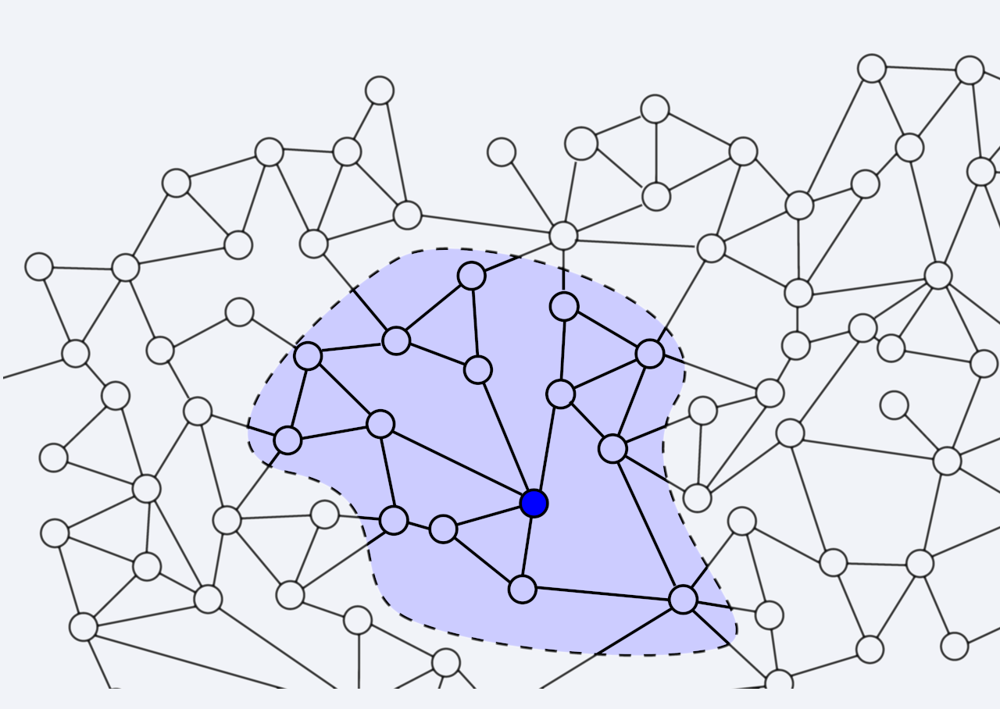

---
<style scoped>section { font-size:33px; }</style>

# Busqueda

* Fonamental en molts dominis
    * Jocs, Planificació...
* Funciona molt bé en altres tipus de problemes
    * Diagnòstic, Control, Aprenentatge, ...
* És una tècnica molt general
    * Podem aplicar-la a problemes sense solució específica
    * Molt útil per aproximar
* Les tècniques de cerca són la base de molts sistemes intel·ligents

---

## Busqueda en espais d'estats

* Els **problemes de búsqueda** tindran
    * Un estat inicial
    * Una funció de succesió
        * Defineix els estats successors d'un estat i el cost per arribar a aquests estats
    * Un estat final

* Una **solució** és una seqüència d'estats (un plà) que ens porten de l'estat inicial a l'estat final

---

## Exemple: Viatjar per Romania

<style scoped>section { font-size:32px; }</style>

* **Espai d'estats**: Ciutats
* **Funcio de succesió**: Carreteres. Cost: Distància
* **Estat inicial**: Arad
* **Comprovar si un estat és final**: Estat = Bucharest
* **Solució**: Seqüència de ciutats que ens porten d'Arad a Bucharest

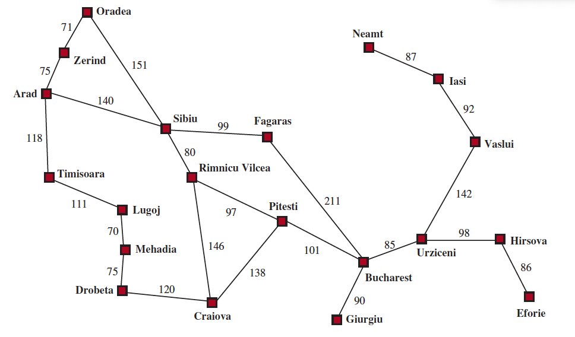

---

<style scoped>section { font-size:32px; }</style>

## Exemple: Botelles d'aigua (I)

> Tenim dues botelles d'aigua, una de 4 litres i una altra de 3 litres. Volem obtenir 2 litres d'aigua.
> Podem omplir les botelles, buidar-les o trasvasar l'aigua d'una a l'altra.

* **Espai d'estats**: Estat de les botelles
* **Funcio de succesió**: Operacions de buidar, omplir i trasvasar
* **Estat inicial**: (0,0)
* **Comprovar si un estat és final**: Estat = (2,0)
* **Solució**: Seqüència d'operacions que ens porten de (0,0) a (2,0)

---

## Exemple: Botelles d'aigua (II)

### Observacions

* Tal com està formulat el problema, no poden haver-hi estats no enters.
* Alguns estats són impossibles d'aconseguir. Ex: (1, 2)
* Algunes accions no produeixen canvis.
    * Ex: `(0,0) + buidar(4) = (0,0)`

---

<style scoped>section { font-size:32px; }</style>

## Exemple: Puzzle 8 (I)

> Tenim un tauler de 3x3 amb 8 peces numerades del 1 al 8 i un espai buit.
> Volem moure les peces per aconseguir l'estat final.

* **Espai d'estats**: -
* **Funcio de succesió**: -
* **Estat inicial**: -
* **Comprovar si un estat és final**: -
* **Solució**: -

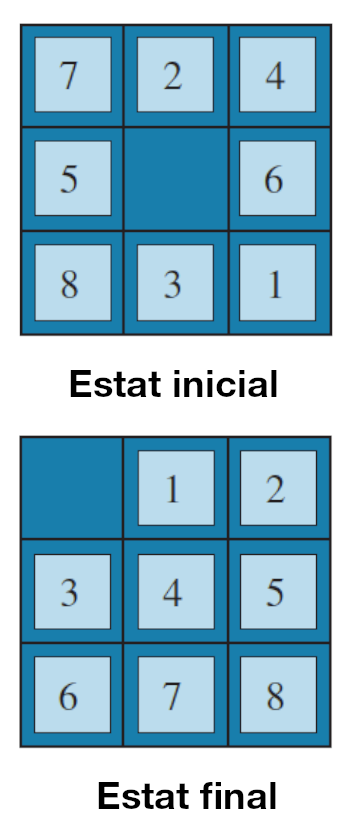

---

<style scoped>section { font-size:32px; }</style>

## Exemple: Puzzle 8 (II)

* **Espai d'estats**: Les diferents posicions de les peces. _Quantes?_
* **Funcio de succesió**: Podem moure la peça buida en les 4 direccions. _Podem sempre fer els 4?_
* **Estat inicial**: P.e. el de la figura anterior
* **Comprovar si un estat és final**: Verificar que les peces estan a la posició correcta.
* **Solució**: Seqüència de moviments que ens porten a l'estat final


---

## Exemple: Puzzle 8 (III)

### Observacions

* El nombre d'estats és molt gran: $9! = 362.880$ estats
* Solament quan la peça buida està al centre del tauler podem fer els 4 moviments
* No tots els estats tenen solució
* Hi ha moltes solucions
    * Quina és la millor?

---
<style scoped>section { font-size:34px; }</style>


## Situacions més complicades

* En els exemples anteriors, de cada estat coneixíem
    * Els estats successors
    * El cost de cada estat successor
* En altres problemes els resultat de cada acció és incert
* Veurem técniques per tractar algunes d'aquestes situacions
    * _Métodes probabilístics_: assignar probabilitats als estats successors
    * _Métodes de cerca adversarial_: els estats successors són determinats per un oponent

--- 

## Representació dels problemes de cerca

### Arbres de cerca

* Els problemes de cerca es poden representar com un arbre
* Els nodes són els estats
* Les arestes són les accions
* Els costos són els pesos de les arestes
* Podem aplicar algorismes de cerca de camins mínims
* L'espai de cerca ha de ser finit

---

### Exemple: Viatjar per Romania


* Els nodes ja visitats es mostren en gris
* Els oberts en blanc i els encara per visitar en linees discontínues.

---

<!--
_class: lead
-->


# Algorismes de cerca

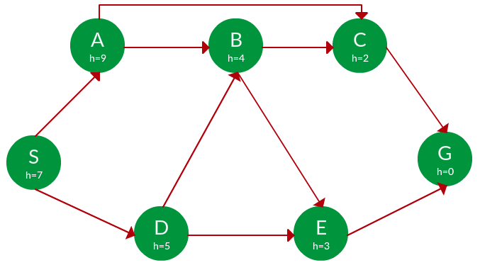

---

<style scoped>section { font-size:34px; }</style>

## Definició

* Els algorismes de cerca són algorismes de propòsit general
    * Poden ser aplicats a qualsevol problema de cerca
    * Els problemes de cerca són un cas particular dels problemes de camins mínims

* Sortida:
    * Una serie d'accions que ens porten de l'estat inicial a l'estat final
    * El resultat pot ser una solució òptima en cost, óptima en temps o no tindre cap tipus de garantia d'optimalitat.

---

<style scoped>section { font-size:32px; }</style>

## Funcionament general

* Tindrem una llista d'estats coneguts pero per visitar anomenada **frontera**. Inicialment la frontera conté l'estat inicial.
* En cada iteració, agafarem un estat de la frontera, aplicarem la funció de succesió i afegirem els nous estats a la frontera.
    * Si l'estat és final, hem acabat.
    * Si la frontera està buida, no hi ha solució.
    * Per cada estat anotarem el seu pare, per poder reconstruir la solució.
* En cada iteració, podem aplicar una estratègia per decidir quin estat de la frontera agafem.

---

<style scoped>section { font-size:30px; }</style>

### Exemple de funcionament (Alternativa I)


* Frontera: {**Arad**}. Objectiu: **Bucharest**

2. Obrim **Arad**: {Z\<A>, T\<A>, **S\<A>**},
3. Obrim **Sibiu**: {Z\<A>, T\<A>, A\<S,A>, O\<S,A>, **F\<S,A>**, R\<S,A>}
4. Obrim **Fagaras**: {Z\<A>, T\<A>, A\<S,A>, O\<S,A>, R\<S,A>, S\<F,S,A>, **B\<F,S,A>}**

5. Tenim la solució en la frontera. Cost: 140+99+211 = **450**

---

<style scoped><style scoped>section { font-size:26px; }</style>
 { font-size:26px; }</style>

### Exemple de funcionament (Alternativa II)


1. Frontera: **{Arad}**. Objectiu: **Bucharest**
2. Obrim **Arad**: {Z\<A>, T\<A>, **S\<A>**},
3. Obrim **Sibiu**: {Z\<A>, T\<A>, A\<S,A>, O\<S,A>, **F\<S,A>**, R\<S,A>}
4. Obrim **R.V**: {Z\<A>, T\<A>, A\<S,A>, O\<S,A>, R\<S,A>, S\<R,S,A>, **P\<R,S,A>**, C\<R,S,A>}
5. Obrim **Pitesti**: {Z\<A>, T\<A>, A\<S,A>, O\<S,A>, R\<S,A>, S\<R,S,A>, P\<R,S,A>, C\<R,S,A>, R\<P,R,S,A>, C\<P,R,S,A>, **B\<P,R,S,A>}**
5. Tenim la solució en la frontera. Cost: **140+80+97+101 = 418**

---

<style <style scoped>section { font-size:32px; }</style>
<style scoped>section { font-size:32px; }</style>
>section { font-size:32px; }</style>

### Exemple de funcionament

#### Observacions

* En aquest exemple, els estats són les ciutats
* Problemes:
    * Poden apareixer estats repetits en la frontera
    * També es poden produir cicles
* L'ordre de les ciutats en la frontera determinarà:
    * Si trobem o no la solució
    * El cost de la solució
    * El temps d'execució i l'espai de memòria necessari

---

## Propietats dels algorismes de cerca

* **Criteris** per comparar algorismes de cerca
    * **Completitud**: Garantia de trobar una solució si existeix
    * **Optimalitat**: Garantia de trobar la solució òptima
    * **Complexitat temporal**: Temps d'execució
    * **Complexitat espacial**: Memòria necessària

---
<!--
_class: invert lead
-->

## Búsqueda no informada

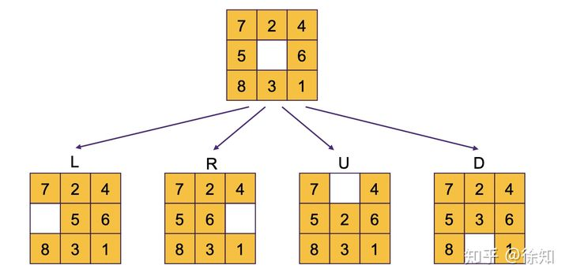

---

<style scoped>section { font-size:33px; }</style>

### Búsqueda no informada

#### Característiques

* No utilitza cap informació sobre el problema
* Aplica una estratègia de cerca fins que troba la solució
* Aquesta estratègia determina l'ordre en què s'exploraran els estats
* L'estrategia serà fixa, no pot canviar en funció del problema
* Alguns algorismes de cerca no informada:
    * **Amplitud**, **Profunditat**, **Cost uniforme**, **Profunditat limitada**, **Profunditat iterativa**

---
<style scoped>section { font-size:30px; }</style>


#### Búsqueda en amplitud    

* Estrategia utilitzable quan totes les accions tenen el mateix cost
* Explora tots els estats a una profunditat $p$ abans d'explorar els estats a profunditat $p+1$
* Garanteix trobar la solució òptima
* Definim la **frontera** com una **cua** (FIFO)
* Els estats ja visitats es guarden en una llista o conjunt (per evitar cicles)


---

<!--
_footer: ""
-->

##### Implementació

```python
def cerca_amplada(estat_inicial):
    """Cerca en amplada en un problema."""
    frontera = collections.deque([estat_inicial])
    visitats = set()

    while frontera:
        estat = frontera.popleft()
        visitats.add(estat)

        if es_solucio(estat):
            return estat

        for succesor in succesors(estat):
            if succesor not in visitats:
                frontera.append(succesor)
```

---

<style scoped>section { font-size:32px; }</style>

##### Exemple: Botelles d'aigua (I)

* **Estat inicial**: `(0,0)` - **Estat final**: `(2,*)` o `(*, 2)`
* **Funcio de succesió**: Operacions de buidar, omplir i trasvasar

1. Frontera = {**<(0,0)>**}
2. Frontera = {**<(0,0),(3,0)>**, **<(0,0),(0,4)>**}
3. Frontera = {<(0,0),(0,4)>, **<(0,0),(3,0),(0,0)>**, **<(0,0) ,(3,0),(3,4)>**,
   **<(0,0),(3,0),(0,3)>**}
4. Frontera = {<(0,0),(3,0),(0,0)>, <(0,0),(3,0),(3,4)>, <(0,0),(3,0),(0,3)>,
   **<(0,0),(0,4),(0,0)>**, **<(0,0),(0,4),(3,4)>**, **<(0,0),(0,4),(3,1)>**}
5. ...

---

<style scoped>section { font-size:34px; }</style>

##### Exemple: Botelles d'aigua (II)

* Representació de l'arbre de cerca
    * Cada node és un parell de valors (a,b) que representen l'estat de les botelles
    * La busca en amplitud explora l'arbre per nivells
    * Podem observar que solament s'explora un nombre molt reduït de tots els possibles estats

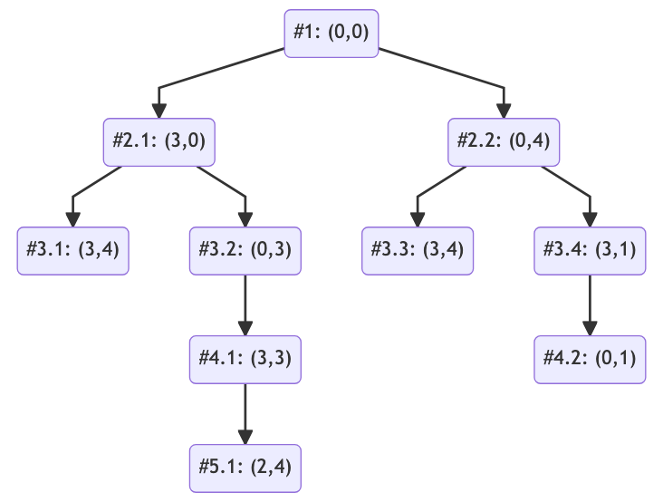

---
<style scoped>section { font-size:33px; }</style>

##### Propietats

| Propietat | Valor |Comentaris |
|:----------|-------|-----------|
|Completitud|Sí     |Si l'espai de cerca és  de memòria, la solució es trobarà en algun moment.|
|Optimalitat|Sí     |Si totes les accions tenen el mateix cost, la primera solució trobada serà òptima.s |
|Complexitat temporal| $O(b^d)$ |On $b$ és el factor de ramificació i $d$ és la profunditat de la solució|
|Complexitat espacial|$O(b^d)$ | On $b$ és el factor de ramificació i $d$ és la profunditat de la solució|

---

##### Problemes

* La complexitat espacial és un problema real.
    * Per exemple, suposem que cada estat ocupa **1KB** i que el **factor de ramificació és 10**.
    * Si la solució es troba a una profunditat de **10**, necessitarem **10GB** de memòria.
    * Si es troba a una profunditat de **100**, necessitarem **10TB**.
    * Si es troba a una profunditat de **1000**, necessitarem **10PB**.
* Típicament, _ens quedarem sense espai abans de quedar-nos sense temps_.

--- 

#### Búsqueda en profunditat

* L'estratègia de cerca en profunditat és similar a la de cerca en amplitud
* Utilitza una **pila** (LIFO) en lloc d'una cua
* Aquesta estratègia **no** garanteix trobar la solució òptima
* L'algorisme arriva fins a una profunditat màxima $m$ i després retrocedeix fins a trobar un camí alternatiu


---

##### Implementació

```python
def cerca_profunditat(estat_inicial):
    """Cerca en profunditat en un problema."""
    frontera = collections.deque([estat_inicial])

    while frontera:
        estat = frontera.pop()

        if es_solucio(estat):
            return estat

        for succesor in succesors(estat):
            if not cicle(problema, succesor):
                frontera.append(succesor)

```
    
---

<style scoped>section { font-size:32px; }</style>

##### Exemple: Botelles d'aigua (I)

* **Estat inicial**: `(0,0)` - **Estat final**: `(2,*)` o `(*, 2)`
* **Funcio de succesió**: Operacions de buidar, omplir i trasvasar

1. Frontera = {**<(0,0)>**}
2. Frontera = {**<(0,0), (3,0)>, <(0,0), (0,4)>**}
3. Frontera = {**<(0,0),(3,0),(0,0)>**, **<(0,0),(3,0),(3,4)>**, **<(0,0),(3,0),(0,3)>**,
   <(0,0),(0,4)>}
4. Frontera = {**<(0,0),(3,0),(0,0),(3,0)>**, **<(0,0),(3,0),(0,0),(0,4)>**
   <(0,0), (3,0), (3,4)>, <(0,0),(3,0),(0,3)>, <(0,0),(0,4)>}
5. ...

---


##### Exemple: Botelles d'aigua (II)

* Representació de l'arbre de cerca
    * Cada node és un parell de valors (a,b) que representen l'estat de les botelles
    * La busca en profunditat explora l'arbre fins a trobar una solució
    * Si no troba una solució, torna enrere fins a trobar un camí alternatiu
    * Si les solucions son infinites, l'algorisme pot no acabar mai

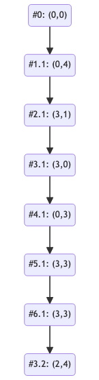

---

<!--
_footer: ""
-->

<style scoped>section { font-size:29px; }</style>

##### Propietats

| Propietat | Valor |Comentaris |
|:----------|-------|-----------|
|Completitud|No     |Si l'espai de cerca és finit, la solució es trobarà en algun moment|
|Optimalitat|No     |La primera solució trobada no té perquè ser òptima|
|Complexitat temporal|$O(b^m)$| On $b$ és el factor de ramificació i $m$ és la profunditat màxima de l'arbre. En valors d'$m$ molt grans, pot ser molt alta |
|Complexitat espacial|$O(bm)$| On $b$ és el factor de ramificació i $m$ és la profunditat màxima de l'arbre. És molt millor que la de la cerca en amplitud si no hi ha cicles; si hi ha cicles, és la mateixa que la de la cerca en amplitud |
---

##### Quan utilitzar-la?

* En la pràctica, la cerca en profunditat és molt més ràpida que la cerca en amplitud
* La cerca en profunditat no necessita tant espai com la cerca en amplitud
* La cerca en profunditat és molt útil quan:
    * El factor de ramificació és molt gran
    * La solució es troba a una profunditat molt baixa
    * No ens importa trobar la solució òptima
    * Verifiquem que no es creen cicles

---
<style scoped>section { font-size:34px; }</style>

#### Búsqueda en profundidad limitada

* La cerca en profunditat limitada és una variant de la cerca en profunditat
* En aquest cas, la cerca s'atura quan s'arriba a una profunditat màxima $l$
* Si la solució es troba a una profunditat $d > l$, no es trobarà
* La cerca en profunditat limitada és completa si $l$ és suficientment gran
* Ens permet evitar el problema de la cerca en profunditat quan les solucions son infinites

---

##### Implementació

```python
def cerca_profunditat_limitada(estat_inicial, l):
    """Cerca en profunditat limitada en un problema."""
    frontera = collections.deque([estat_inicial])

    while frontera:
        estat = frontera.pop()

        if es_solucio(estat):
            return estat

        for succesor in succesors(estat):
            if not cicle(problema, succesor) and profunditat(succesor) < l:
                frontera.append(succesor)
```

---
<style scoped>section { font-size:33px; }</style>

#### Búsqueda en profundidad iterativa

* Solució al problema de la cerca en amplitud y la cerca en profunditat utilitzant una única estratègia
* La cerca en profunditat iterativa és una cerca en profunditat limitada amb $l$ creixent
* Comença amb $l=0$ i va incrementant $l$ fins a trobar la solució


---

##### Traçat de l'algorisme (I)


---

##### Traçat de l'algorisme (II)


---

##### Traçat de l'algorisme (III)


---

##### Implementació

```python
def cerca_profunditat_iterativa(estat_inicial):
    """Cerca en profunditat iterativa en un problema."""
    l = 0
    while True:
        solucio = cerca_profunditat_limitada(estat_inicial, l)
        if solucio is not None:
            return solucio
        l += 1
```

---

##### Propietats

<style scoped>section { font-size:34px; }</style>

| Propietat | Valor |Comentaris |
|:----------|-------|-----------|
|Completitud|Sí     |Si l'espai de cerca és finit, la solució es trobarà en algun moment|
|Optimalitat|Sí     |La primera solució trobada serà òptima
|Complexitat temporal i espacial|Com la de la cerca en profunditat|(com a màxim)|

---
<style scoped>section { font-size:31px; }</style>

#### Búsqueda de cost uniforme

* La cerca de cost uniforme és una variant de la cerca en amplitud
* En aquest cas, la frontera s'ordena segons el cost del camí a cada estat (**cua de prioritat**)
* Estats visitats: de manera iterativa, es van visitant tots els que tenen un cost menor que l'actual
* Sí totes les accions tenen el mateix cost, la cerca de cost uniforme és equivalent a la cerca en amplitud


---

<style scoped>section { font-size:31px; }</style>

##### Exemple: Viatjar per Romania (I)

* **Estat inicial**: Arad
* **Funcio de succesió**: Carreteres.
* **Cost**: Distància entre ciutats (en Km)
* **Comprovar si un estat és final**: Estat = Bucharest
* **Solució**: Seqüència de ciutats que ens porten d'Arad a Bucharest


---

<style scoped>section { font-size:34px; }</style>

##### Exemple: Viatjar per Romania (II)

* Representació de l'arbre de cerca
    * Cada node és un parell de valors (a,b) que representen l'estat de les botelles
    * La busca en amplitud explora l'arbre per nivells
    * Podem observar que solament s'explora un nombre molt reduït de tots els possibles estats

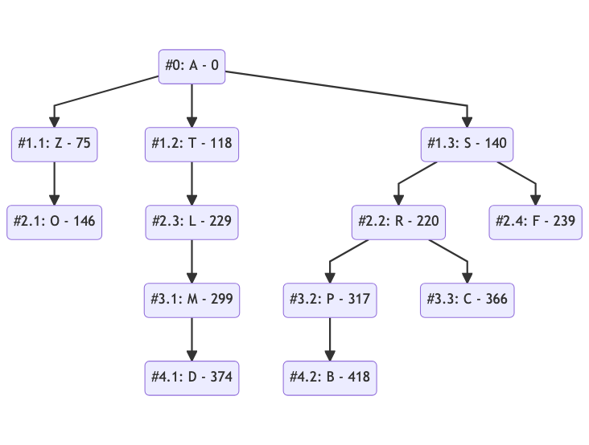

---

<!--
_footer: ""
-->

##### Implementació

```python
def cerca_cost_uniforme(estat_inicial):
    """Cerca de cost uniforme en un problema."""
    frontera = priority_queue([(0, estat_inicial)])
    visitats = set()

    while frontera:
        cost_actual, estat = frontera.pop()
        visitats.add(estat)

        if es_solucio(estat):
            return estat

        for cost, succesor in succesors(estat):
            if succesor not in visitats:
                frontera.append(cost + cost_actual, succesor)
```

---

##### Propietats

| Propietat | Valor |Comentaris |
|:----------|-------|-----------|
|Completitud|Sí     |Si l'espai de cerca és finit, la solució es trobarà en algun moment|
|Optimalitat|Sí     |La primera solució trobada serà òptima|
|Complexitat temporal i espacial|$O(b^{1+C/\epsilon})$|On $b$ és el factor de ramificació i $C$ és el cost de la solució òptima|

---

<style scoped>section { font-size:30px; }</style>

### Gestió de fronteres

* La gestió de **fronteres** és un problema important en els algorismes de cerca
* Els algorismes que hem vist son tots molt semblants, la diferència està en com gestionen la frontera
    * Conceptualment sempre es tracta d'una **cua amb prioritat**
    * En la pràctica, per a les busquedes en profunditat i amplada **podem utilitzar una cua o una pila**
        * Per estalviar-nos el *sobrecost* d'$O(log(n))$ de la cua de prioritat
    * Podriem, fins i tot, programar una implementació on pugam **variar l'objecte frontera**.

---

<!--
_class: invert lead
-->


## Búsqueda informada


---

### Definició

* L'algorisme de búsqueda de cost uniforme és un algoritme molt eficient, té, però alguns problemes
    * Busca en totes les direccions, sense tenir en compte la direcció cap a la solució
    * Per tant, analitza més estats dels que seria estrictament necessari
* En aquesta part de la unitat veurem técniques per solucionar aquestos problemes

---

<style scoped>section { font-size:32px; }</style>

### Heurístiques

* Una **heurística** és:
    * Una funció que ens permet _estimar_ el cost d'arribar a la solució des d'un estat
    * Dissenyada per un problema concret
* Heurístiques per rutes:
    * Distància en línia recta (euclidiana)
    * Distància manhattan


---

#### Exemple: Viatjar per Romania

* **Heurística**: Distància en línia recta (euclidiana)

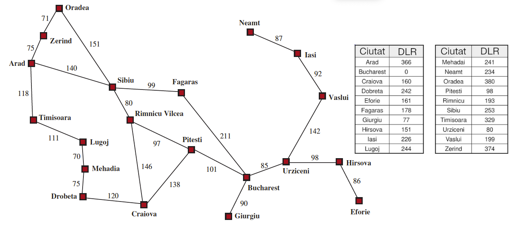

---

<style scoped>section { font-size:33px; }</style>

### Búsqueda voraç

* Si solament utilitzem la heurística per decidir quin estat de la frontera seguim:
    * **Búsqueda voraç**
    * Més eficient que la búsqueda de cost uniforme
    * No garanteix trobar la solució òptima
 height:330px


---

<style scoped>section { font-size:30px; }</style>

### Búsqueda voraç

* En verd la ruta correcta i en roig la nostra
* Que podem fer perqué el nostre algorisme trobi la solució correcta?

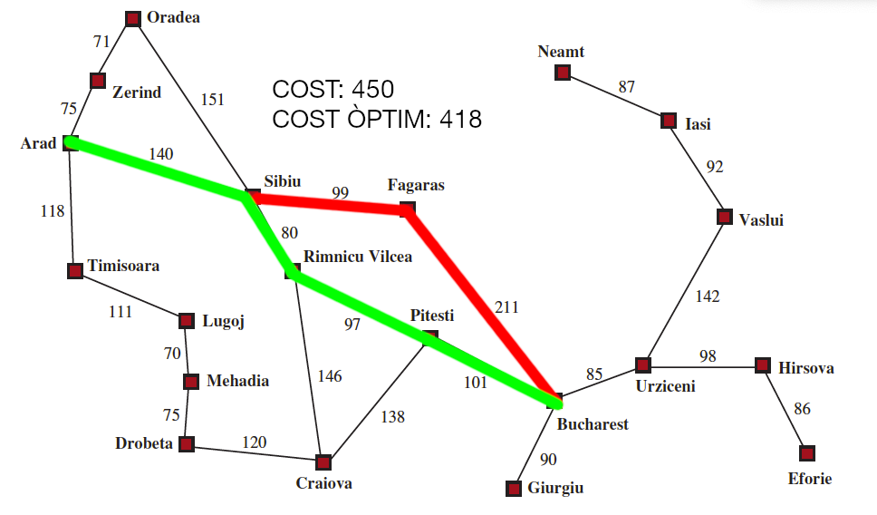

---

<!--
_footer: ""
-->

#### Implementació

```python
def cerca_voraç(estat_inicial):
    """Cerca voraç en un problema."""
    frontera = priority_queue([(0, estat_inicial)])
    visitats = set()

    while frontera:
        cost_actual, estat = frontera.pop()
        visitats.add(estat)

        if es_solucio(estat):
            return estat

        for cost, succesor in succesors(estat):
            if succesor not in visitats:
                frontera.append(heuristica(succesor), succesor)
```

---

#### Propietats

| Propietat | Valor |Comentaris |
|:----------|-------|-----------|
|Completitud|Sí     | Si l'espai de cerca és finit, trobarà una solució en algun moment|
|Optimalitat|No     | La primera solució trobada no té perquè ser òptima|
|Complexitat temporal i espacial|$O(bm)$| On $b$ és el factor de ramificació i $m$ és la profunditat màxima de l'arbre|

---

### A*

* L'algorisme **A*** és una combinació de la búsqueda de cost uniforme i la búsqueda voraç
    * La búsqueda de cost uniforme ordena pel cost del camí o _cost cap enrere_: **$g(n)$**
    * La búsqueda voraç ordena pel cost de la heurística o _cost endavant_: **$h(n)$**
    * L'algorisme **A*** ordena per la suma dels dos: **$f(n) = g(n) + h(n)$**
> **Garanteix trobar la solució òptima _(si $h(n)$ és admissible)_**

---


#### Exemple: Viatjar per Romania (I)


---

#### Exemple: Viatjar per Romania (II)

<!---->


---

#### Exemple: Viatjar per Romania (III)


---

<!--
_footer: ""
-->

#### Implementació

```python
def cerca_a_estrella(estat_inicial):
    """Cerca A* en un problema."""
    frontera = priority_queue([(0, estat_inicial)])
    visitats = set()

    while frontera:
        cost_actual, estat = frontera.pop()
        visitats.add(estat)

        if es_solucio(estat):
            return estat
<style scoped>section { font-size:30px; }</style>
<style scoped>section { font-size:30px; }</style>

        for cost, succesor in succesors(estat):
            if succesor not in visitats:
                frontera.append(cost + cost_actual, succesor)
```

---

#### Propietats

| Propietat | Valor |Comentaris |
|:----------|-------|-----------|
|Completitud|Sí     |           |
|Optimalitat|Sí
|Complexitat temporal i espacial| $O(b^d)$| On $b$ és el factor de ramificació i $d$ és la profunditat de la solució|   

> **Condició**: Aquestes propietats es compleixen si la heurística és **_admissible_**

---

#### Heurístiques admissibles (I)

* Una heurística és **admissible** si:
    * No sobreestima el cost de la solució
    * És a dir, si el cost real de la solució és $C$, la heurística és admissible si $h(n) \leq C$
* Si la heurística **NO** és admissible:
    * L'algorisme **A*** és equivalent a la **búsqueda voraç**
* Trobar una heurística admissible és un problema difícil.

---


##### Exemple: Puzzle 8 (I)

* Técnica útil redüir el problema a un problema més senzill
* **Relaxació de les regles del joc**
    1. Permetre que les peces s'intercanviïn entre elles
    2. Permetre que les peces es moguin a qualsevol posició, si està buida
    3. Permetre que les peces es moguin a qualsevol posició, sense restriccions (1+2)


---

<style scoped>section { font-size:30px; }</style>

##### Exemple: Puzzle 8 (II)

* La primera opció ens porta la heurística **distància manhattan**
    * Equival a un problema on hem de lliscar les peces fins a la seva posició.
    * Suma de les distàncies horitzontals i verticals de cada peça a la seva posició final
    * És admissible perquè no sobreestima el cost de la solució
* La tercera opció ens porta la heurística **nombre de peces fora de lloc**
    * Equival a un problema on hem de deixar directament en la seva posició.
    * Suma de les peces que no estan a la seva posició final
    * És admissible perquè no sobreestima el cost de la solució

---
<style scoped>section { font-size:28px; }</style>

<!--
_footer: ""
-->

### Propietat Óptima de les heurístiques admissibles (I)

* Si $\textbf{n}$ és una ruta óptima fins a $n_d$ amb cost $g(n_d)$.
    * $n'_g$ serà una ruta subòptima fins a $n_d$ amb cost $g(n'_d)$, sent $g(n'_d)$ > $g(n_d)$.
    * $n''$ serà una subpart de la ruta òptima desde la frontera
* Es possible que agafem $n'_g$ abans d'$n_d$?.
    * **No**, perquè $f(n'_g)$ > $f(n_d)$ i $f(n'_g)$ > $f(n'')$, perquè la heurística és admissible
    * Així, $f(n'_g)$ > $f(n'')$ > $f(n_d)$
* Les subrutes en la ruta òptima sempre seran més barates que en la ruta subòptima

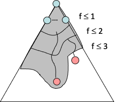

---

<style scoped>section { font-size:28px; }</style>

### Propietat Óptima de les heurístiques admissibles (II)

* A* explora els nodes en ordre creixent de $f(n)$
* Va agregant, de forma gradual, corves de nivell de grau $f$
* Cada corba de nivell representa un conjunt de nodes amb un valor d'$f(n)$ inferior a un valor concret


---

<style scoped>section { font-size:36px; }</style>

### Propietat Óptima de les heurístiques admissibles (III)

* Si tenim dues heurístiques admissibles $h_1$ i $h_2$, amb $h_1(n) \leq h_2(n)$ per a tots els estats $n$
* Llavors, $h_2$ és més informativa que $h_1$
* Per tant, $h_2$ serà més eficient que $h_1$
* Es per això que, preferirem l'heurística Manhattan a l'heurística de peces fora de lloc


---

<style scoped>section { font-size:30px; }</style>

### Limitacions de l'algorisme A*

* L'algorisme **A*** és òptim i una millora respecte a la búsqueda de cost uniforme
* Però, l'algorisme **A*** té dues limitacions:
    * **Espai de memòria**: L'espai de memòria necessari pot ser molt gran
    * **Temps d'execució**: El temps d'execució pot ser molt gran
* Per això, s'han desenvolupat variants de l'algorisme **A*** que intenten millorar aquestes limitacions
* En aquesta unitat veurem dues:
  * **A*** de profunditat iterativa 
  * **A*** ponderat

---

### A* de profunditat iterativa

* L'algorisme **A*** de profunditat iterativa és una variant de l'algorisme **A***
* Molt semblant a l'algorisme de profunditat iterativa
  * Utilitza la funció $f(n)$ per tallar, en compte de la profunditat
* Ens permet reduir l'espai de memòria necessari
  * A costa de tindre que visitar alguns nodes més d'una vegada

---

#### Implementació (I)

<!--
footer: ""
-->

```python
def cerca_a_limitada(estat_inicial, l):
    """Cerca A* limitada en un problema."""
    frontera = priority_queue([(0, estat_inicial)])
    visitats = set()

    while frontera:
        cost_actual, estat = frontera.pop()
        visitats.add(estat)

        if es_solucio(estat):
            return estat

        for cost, succesor in succesors(estat):
            if succesor not in visitats and cost_actual + cost < l:
                frontera.append(cost_actual + cost, succesor)
```

---

#### Implementació (II)

```python 
def cerca_a_iterativa(estat_inicial):
    """Cerca A* iterativa en un problema."""
    l = 0
    while True:
        solucio = cerca_a_limitada(estat_inicial, l)
        if solucio is not None:
            return solucio
        l += 1
```

---

### A* Ponderat

#### Definició

* L'algorisme **A*** ponderat és una variant de l'algorisme **A***
* Es defineix un factor de ponderació $\epsilon$ que determina el pes de la heurística
* L'algorisme **A*** ponderat ordena per $f(n) = g(n) + \epsilon h(n)$
* Si $\epsilon = 1$, l'algorisme **A*** ponderat és equivalent a l'algorisme **A***
* Si $\epsilon > 1$, l'algorisme **A*** ponderat és s'apropa a la búsqueda voraç

---
<style scoped>section { font-size:31px; }</style>
#### Utilitat

* L'algorisme **A*** ponderat és útil per:
    * Reduir el cost de l'espai de memòria
    * Reduir el cost de l'espai de temps
    * A costa d'una solució no tan òptima
* En l'exemple de la dreta en una $W = 2$ (la b)
    * S'estudien 7 vegades menys estats
    * Per una solució un $5\%$ menys eficient


---

#### Implementació

```python
def cerca_a_ponderat(estat_inicial, epsilon):
    """Cerca A* ponderat en un problema."""
    frontera = priority_queue([(0, estat_inicial)])
    visitats = set()

    while frontera:
        cost_actual, estat = frontera.pop()
        visitats.add(estat)

        if es_solucio(estat):
            return estat

        for cost, succesor in succesors(estat):
            if succesor not in visitats:
                frontera.append(cost_actual + epsilon * cost, succesor)
```

---

### Anytime A*

* Podem aprofitar l'algorisme **A*** ponderat per construir un algorisme **Anytime A***
    * Busquem el camí òptim amb un $\epsilon$ gran
    * Anem reduint $\epsilon$ fins a que $\epsilon = 1$
    * Així, obtenim una bona solució en un temps raonable
        * Si tenim temps, podem seguir buscant una solució millor, fins arribar a la solució òptima


---

#### Implementació

```python
def cerca_anytime_a(estat_inicial):
    """Cerca Anytime A* en un problema."""
    epsilon = 100
    while epsilon > 1:
        solucio = cerca_a_ponderat(estat_inicial, epsilon)
        yield solucio       
        epsilon /= 2
```

---
### Demostració de búsquedes

#### Pac-Man

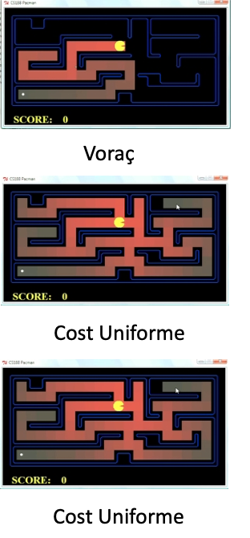

[https://www.youtube.com/watch?v=2XjzjAfGWzY](https://www.youtube.com/watch?v=2XjzjAfGWzY)

