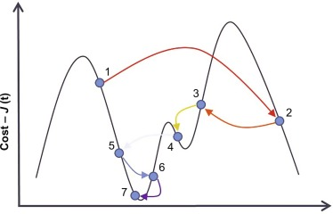

<style scoped>
h1, h2, h3, h4, h5, h6, p {
  color: #FFFFFF;
  font-weight: 800;
  text-shadow:
    0px 0px 3px #000000;
}
</style>

# 4. Búsqueda local i satisfacció de restriccions

Models d'intel·ligència artificial


---

<!--
_class: invert lead
-->

<style scoped>
h1, h2, h3, h4, h5, h6, p {
  color: #FFFFFF;
  text-shadow:
    0px 0px 3px #000000;
}
</style>

# Optimització


---

<style scoped>section { font-size:32px; }</style>

## Definició

- Fins ara hem plantejat els problemes com a la **cerca d'un camí en un espai d'estats**.
- A vegades aquesta cerca no és possible, o no és el que volem.
  - Podem voler trobar un estat que satisfaci unes **restriccions** o que **maximitzi** o **minimitzi** una funció
  - **Pot no ser possible representar el camí** en l'espai d'estats.
  - O que no ens interessi el camí, sinó **només l'estat final**.
- En aquests casos, pot ser fàcil **trobar una solució**, encara que no sigui la millor.
- Aquesta solució es pot **refinar amb tècniques de cerca local**.

---

<style scoped>section { font-size:33px; }</style>

## Usos reals

- Els algorismes d'optimització són molt utilitzats en problemes reals.
- Alguns exemples:
  - Optimització de xarxes neuronals
  - Optimització de circuits electrònics
  - Optimització de problemes de planificació
  - Optimització de problemes de logística
  - Optimització de problemes de disseny
  - Optimització de problemes de fabricació

---

## Problemes NP-complets

- Els problemes que no es poden resoldre amb una **complexitat polinòmica** s'anomenen **problemes NP-complets**.
- Aquests problemes són **intractables**, ja que no es coneix cap algorisme que els resolga en un temps raonable.
- Frequentment, els problemes d'optimització són problemes NP-complets, perquè cal **explorar tot l'espai d'estats** per a trobar la solució òptima.
- Aixó fa que **no siga possible** trobar la solució òptima en un temps raonable.

---

<!--
_class: invert lead
-->

<style scoped>
h1, h2, h3, h4, h5, h6, p {
  color: #FFFFFF;
  text-shadow:
    0px 0px 3px #000000;
}
</style>

# Búsqueda local


---

<style scoped>section { font-size:35px; }</style>

## Característiques (I)

- La **búsqueda local** **no** manté una **estructura de dades** que representi l'espai d'estats.
  - En lloc d'això, **genera un estat inicial** i **genera estats successors** a partir d'aquest.
  - Aquests estats successors es generen **modificant l'estat actual**.
  - Les técniques de búsqueda local també s'anomenen metaheurístiques.

---

## Característiques (II)

  - Utilitzarem una **funció d'avaluació** que **maximitzirà** un valor. Representa la **qualitat** de l'estat, no el cost. Podem ponderar els valors de les variables segons les característiques de l'estat que volem potenciar.
- Avantatges:
  - Utilitza **poca memòria** i **poca CPU**.
  - Permeten trobar solucions **raonables** en espais d'estats **molt grans**.

---

## Definició del problema

```python
class ProblemaBusquedaLocal(object):
  def __init__(self, inicial=None, **kwds):
    self.__dict__.update(inicial=inicial, **kwds)

  def estats_successors(self, estat):    raise NotImplementedError

  def es_solucio(self, estat):           raise NotImplementedError

  def funcio_avaluacio(self, state):     return NotImplementedError

  def __repr__(self):
    return '{}({!r})'.format(
      type(self).__name__, self.inicial)
```

---

<style scoped>section { font-size:30px; }</style>

## Definició del problema

### Exemple: Viajant de comerç (I)

- Tenim un **mapa** amb **ciutats** i volem trobar el **camí més curt** que passi per **totes les ciutats**, per tornar a la **ciutat inicial**.
- Les **variables** són les **ciutats** i els **dominis** són les **posicions**.
- Les **restriccions** són que **no hi pugui haver dues ciutats en la mateixa posició**.
- Les **solucions** són les **permutacions de les ciutats** que satisfan les restriccions.

---


---

<style scoped>section { font-size:30px; }</style>


## Definició del problema

### Exemple: Viajant de comerç (II)

- El **nombre d'estats** que cal **explorar** és **molt gran**.
  - Per a 10 ciutats, el nombre d'estats és de $$10! = 3.628.800$$.
- El plantejarem com a búsqueda local.
- No ens cal una **estructura de dades** que representi l'espai d'estats.
- Solament ens cal un **estat inicial** i una **funció d'avaluació**.
- Anirem modificant l'estat inicial fins que no puguem millorar més.
- Utilitzarem una **funció d'avaluació** que **millorá quan menor siga el valor** del camí.
- A continuació podem veure una possible implementació.

---

<style scoped>section { font-size:34px; }</style>

### Exemple: Viajant de comerç - Implementació (I)

```python
class TSP(ProblemaBusquedaLocal):
  def estats_successors(self, estat):
    successors = []
    for i in range(len(estat)):
      for j in range(i + 1, len(estat)):
        successor = estat.copy()
        successor[i], successor[j] = successor[j], successor[i]
        successors.append(successor)
    return successors

  def distancia(self, ciutat1, ciutat2):
    # Formula de la distancia euclidiana
    return math.sqrt((ciutat1[0] - ciutat2[0]) ** 2 + (ciutat1[1] - ciutat2[1]) ** 2)

```

---

<style scoped>section { font-size:33px; }</style>

### Exemple: Viajant de comerç - Implementació (II)

```python
  def funcio_avaluacio(self, estat):
    distancia = 0
    for i in range(len(estat)):
      distancia += self.distancia(estat[i], estat[(i + 1) % len(estat)])
    return 1/distancia

  @classmethod
  def genera_estat_inicial(cls, ciutats):
    return random.sample(ciutats, len(ciutats))

ciutats = [
  (random.randint(0, 1000), random.randint(0, 1000)) for _ in range(100)
]
tsp = TSP(inicial=TSP.genera_estat_inicial(ciutats), ciutats=ciutats)
```

---

## Tornada enrere

- La **tècnica de tornada enrere** o **backtracking** és una tècnica de cerca local.
- Es basa en **explorar l'espai d'estats** fins a trobar una solució.
- Si no es troba una solució, es **torna enrere** i es **modifica l'últim estat**.
- Aquesta tècnica garanteix trobar la **solució òptima** però pot ser **molt lenta**.

---

<!--
_footer:  ""
-->

<style scoped>section { font-size:34px; }</style>

### Implementació

```python
def backtracking(problema):
  cua = [problema.inicial]
  visitats = set()
  millor_estat, millor_fitness = None, float('inf')
  while cua:
    estat = cua.pop(0)
    if problema.es_solucio(estat) and problema.funcio_avaluacio(estat) > millor_fitness:
        millor_estat = estat
        millor_fitness = problema.funcio_avaluacio(estat)
    if str(estat) not in visitats:
      visitats.add(str(estat))
      successors = problema.estats_successors(estat)
      for successor in successors:
        if es_compleixen_restriccions(successor):
            cua.append(successor)

  return millor_estat
```

---

<!--
_footer:  ""
-->


<style scoped>section { font-size:34px; }</style>

### Execució

```python
ciutats = [
  (random.randint(0, 1000),
    random.randint(0, 1000))
  for _ in range(7)
]
tsp = TSP(
  inicial=TSP.genera_estat_inicial(ciutats),
  ciutats=ciutats
)
solucio = backtracking(tsp)

Millor fitness: 4030.1303415460707
...
Millor fitness: 2718.3988057871697

3min 52s ± 24.7 s per loop
(mean ± std. dev. of 7 runs, 1 loop each)

```

---

<style scoped>section { font-size:34px; }</style>

## Algorisme d'Escalada

- L'algorisme d'escalada o **Hill Climbing** és l'algorisme de cerca local més senzill.
- Si plantegem els estats com a **punts en un espai**,
  - Sent l'alçada de cada punt el valor de la funció a optimitzar,
  - l'algorisme consisteix a **moure'ns** cap a **punts més alts**.
  - Si deixem de pujar entendrem que hem arribat al **màxim global** i hem trobat la solució.

---


---

<!--
_footer:  ""
-->

### Implementació

```python
def hill_climbing(problema, iteracions=10000):
  estat = problema.inicial
  fitness = problema.funcio_avaluacio(estat)

  for _ in range(iteracions):
    successors = problema.estats_successors(estat)
    if not successors:
      break
    successor = min(successors, key=problema.funcio_avaluacio)
    fitness_succ = problema.funcio_avaluacio(successor)
    if fitness_succ > fitness:
      print(f"{fitness_succ} > {fitness}")
      estat = successor
      fitness = fitness_succ
    else:
      break
  return estat
```

---

<!--
_footer:  ""
-->


### Execució

```python
ciutats = [
  (random.randint(0, 1000),
    random.randint(0, 1000))
  for _ in range(100)
]
tsp = TSP(
  inicial=TSP.genera_estat_inicial(ciutats),
  ciutats=ciutats
)
solucio = hill_climbing(tsp)

51442.77444568607 > 54092.0949691196
...

41.1 s ± 6.22 s per loop
(mean ± std. dev. of 7 runs, 1 loop each)

Inline:
2.13 s ± 922 ms per loop
(mean ± std. dev. of 7 runs, 1 loop each)
```


---

### Consum de memòria

- Un dels problemes que tenen els algorismes de búsqueda local que s'utilitza molta **memòria**.
  - Cal **mantenir una estructura de dades** que representi els espais successors
  - Podem **millorar** l'eficiència del algorisme de recuit simulat **eliminant** aquesta estructura de dades.
  - Per això, **no** generarem **estats successors** nous.
  - En lloc d'això, **modificarem l'estat actual** (`inline`) per generar el successor i, si no millora, **desfarem els canvis**.

---

<!--
_footer:  ""
-->

### Implementació `inline`

```python
def hill_climbing_inline(problema, iteracions=10000):
    estat = problema.inicial
    fitness = problema.funcio_avaluacio(estat)

    for _ in range(iteracions):
        millorat_iter = False
        for i in range(len(estat)):
            for j in range(len(estat)):
                if i != j:
                    estat[i], estat[j] = estat[j], estat[i]
                    fitness_succ = problema.funcio_avaluacio(estat)
                    if fitness_succ > fitness:
                        print(f"{fitness} > {fitness_succ}")
                        fitness = fitness_succ
                        millorat_iter = True
                    else:
                        estat[i], estat[j] = estat[j], estat[i]
        if not millorat_iter:
            break
    return estat
```

---

### Problemes

- L'algorisme d'escalada **no** garanteix trobar el **màxim global**.
- Pot quedar atrapat en un **màxim local**.
  - Pic més alt que els seus veïns, però no el màxim global.
  - Dependrà **molt** de l'**estat inicial**.
- Per evitar-ho s'han desenvolupat diverses variants:
  - Escalada de primer millor
  - Escalada amb reinici aleatori
  - Escalada estocàstica

---

## Escalada de primer millor

- L'algorisme d'escalada de primer millor **no** tria el **millor successor**.
  - En lloc d'això, tria el **primer successor** que **millora** l'estat actual.
  - Si no hi ha cap successor que millori l'estat actual, l'algorisme s'atura.
  - Pot també parar quan s'arribe a un nombre màxim d'iteracions.
- Pot ser molt útil quan el nombre de successors és molt gran.

---

### Implementació

```python
def first_choice_hill_climbing(espai_estats, funcio, max_iteracions):
  estat_actual = espai_estats.estat_inicial()
  for _ in range(max_iteracions):
    successor = espai_estats.genera_successor(estat_actual)
    if not successor:
      return estat_actual
    if funcio(successor) >= funcio(estat_actual):
      estat_actual = successor

  return estat_actual
```

---
<!--
_footer:  ""
-->

### Implementació `inline`

```python
def first_choice_hill_climbing_inline(problema, iteracions=10000):
    estat = problema.inicial
    fitness = problema.funcio_avaluacio(estat)

    for _ in range(iteracions):
        millorat_iter = False
        for i in range(len(estat)):
            if not millorat_iter:
                for j in range(len(estat)):
                    if i != j:
                        estat[i], estat[j] = estat[j], estat[i]
                        fitness_succ = problema.funcio_avaluacio(estat)
                        if fitness_succ > fitness:
                            print(f"{fitness} > {fitness_succ}")
                            fitness = fitness_succ
                            millorat_iter = True
                            break
                        else:
                            estat[i], estat[j] = estat[j], estat[i]
    return estat
```

---

## Escalada amb reinici aleatori

- L'algorisme d'escalada amb reinici aleatori **reinicia l'algorisme** cada cert temps.
- Això permet **escapar dels màxims locals**.
- **No garanteix** trobar el **màxim global**, però **augmenta les possibilitats**.
- Aquest algorisme es pot **combinar amb altres tècniques** de cerca local.

---

### Implementació

```python
def random_restart_hill_climbing(problema, ciutats, iteracions=1000, restarts=10):
  millor_estat = None
  millor_fitness = float('inf')
  for _ in range(restarts):
    inicial = TSP.genera_estat_inicial(ciutats)
    problema.inicial = inicial
    estat = hill_climbing(problema, iteracions=iteracions)
    fitness = problema.funcio_avaluacio(estat)
    if fitness > millor_fitness:
      millor_estat = estat
      millor_fitness = fitness
      print(f"Millor fitness: {millor_fitness}")
  return millor_estat
```

---

### Execució

```python
solucio = random_restart_hill_climbing(
  tsp, ciutats, 1000, 10
)
```

```bash
Millor fitness: 12936.962711620448
Millor fitness: 12887.286272582816
Millor fitness: 12798.50074780205
```


---

## Algorisme de recuit simulat

- L'algorisme de recuit simulat o **simulated annealing** es basa en el procés de **recuit** de la metal·lúrgia.
  - Un metall es calenta fins a una temperatura molt alta.
  - Després es deixa refredar lentament.
  - Això permet que les molècules es **reorganicin** i **minimitzin l'energia**.
  - Permet acceptar estats que empitjoren l'actual, en certes condicions.
  - Incopora l'aleatorietat a l'algorisme d'escalada.


---



---

### Probabilitat d'acceptació

- La probabilitat d'acceptar un estat empitjorant depèn de la **temperatura**.
  - A mesura que l'algorisme avança, la temperatura **disminueix** i fa que sigui **menys probable** acceptar un estat empitjorant.
  - La probabilitat d'acceptar un estat empitjorant es calcula amb la següent fórmula:
    - $P = e^{-\frac{\Delta E}{T}}$, on $\Delta E$$ és la diferència entre el valor de l'estat actual i el valor de l'estat successor.

---

### Propietats

- L'algorisme de recuit simulat **pot trobar el màxim global**.
  - **No** ho garanteix, però la probabilitat de trobar-lo augmenta amb el nombre d'iteracions.
- Es un dels algorismes de cerca local més utilitzats.
- Usos reals:
  - Optimització de xarxes neuronals
  - Optimització de circuits electrònics
  - Optimització de problemes de planificació


---


---

<!--
_footer:  ""
-->

### Implementació

```python
def simulated_annealing(espai_estats, funcio, temperatura=100, refredament=0.9):
    estat_actual = espai_estats.estat_inicial()
    while True:
        successors = espai_estats.estats_successors(estat_actual)
        successors_ordenats = sorted(successors, key=funcio)

        if funcio(successors_ordenats[0]) <= funcio(estat_actual):
            estat_actual = successors_ordenats[0]
        else:
            delta = funcio(successors_ordenats[0]) - funcio(estat_actual)
            probabilitat = math.exp(-delta / temperatura)
            if random.random() < probabilitat:
                estat_actual = successors_ordenats[0]

        temperatura *= refredament
        if temperatura < 0.00001:
            return estat_actual
```

---

<!--
_footer:  ""
-->

### Execució

```python

solucio = hill_climbing(tsp)
plot_tsp(tsp, solucio)

Cost:        50976.93306917217
Cost:        51376.91701004807
...
Cost:        11354.397010378212
Cost:        11350.41254307539
Cost final:  11350.41254307539
```


---

### Implementació `inline` (I)

```python

def simulated_annealing(problema, temp=100000, refredament=0.9999, iteracions=10000):
    estat = problema.inicial
    cost = problema.funcio_avaluacio(estat)

    while temp > 0.1:
        i = random.randint(1, len(estat) - 1)
        j = random.randint(1,len(estat) - 1)

        while i == j:
            j = random.randint(1, len(estat) - 1)

        estat[i], estat[j] = estat[j], estat[i]
        cost_nou = problema.funcio_avaluacio(estat)
        ...
```

---


<!--
_footer:  ""
-->

### Implementació `inline` (II)

```python
        ...
        delta = cost_nou - cost
        if delta < 0 or math.exp(-delta / temp) > random.uniform(0, 1):
            cost = cost_nou
            print("Cost: ", cost)
        else:
            estat[i], estat[j] = estat[j], estat[i]

        temp = temp * refredament

    print("Cost final: ", cost)
    print("Estat final: ", estat)

    return estat

```

---

<!--
_class: invert lead
-->

<style scoped>
h1, h2, h3, h4, h5, h6, p {
  color: #FFFFFF;
  text-shadow:
    0px 0px 3px #000000;
}
</style>

# Algorismes genètics


---

# Algorismes genètics

- Els **algorismes genètics** són una tècnica d'optimització inspirada en la **evolució biològica**.
  - Es pot veure com una **tècnica de cerca local en paral·lel**.
  - Cada **individu** de la població representa un **estat**.
  - Cada **gen** de l'individu representa una **variable** de l'estat.
  - Els **valors** dels gens representen els **valors** de les **variables**.
  - Els **individus** evolucionen **generant nous individus**.

---


---

### Procediment

- L'algorisme **genera una població inicial** d'estats.
- Després, **genera una nova població** a partir de la població actual.
- Aquesta nova població **hereta** els **gens** de la població actual.
- A més, **muta** alguns dels seus gens.
- L'algorisme **selecciona els millors** de la nova població i **descarta la resta**.
- L'algorisme **s'atura** quan s'arriba a un **nombre màxim d'iteracions**.

---

### Definició del problema

- El primer pas és definir el problema com a un **espai d'estats**.
- Els **estats** són **individus**.
- Els **gens** són les **variables**.
- Els **valors dels gens** són els **valors de les variables**.
- Per simplificar, **representarem els gens com a enters**.
  - _Viatjant de comerç_: Seqüència de nombres que representen les ciutats en ordre
  - _Motxilla_: Série de 0/1 que indica si un objecte està o no a la motxilla.

---


---

### Funció d'avaluació

- Haurem de definir una **funció d'avaluació**.
- Aquesta funció **assigna un valor** a cada **individu**.
- Aquest valor **representa la qualitat** de l'individu.
- Haurem de ponderar els valors de les variables, segons les característiques de l'inidividu que vullguem potenciar.

---

<style scoped>section { font-size:31px; }</style>

### Creació de la població inicial

- El tercer pas és **crear una població inicial**.
- Aquesta població **s'ha de crear aleatòriament**, dins dels **dominis** de les variables.
- El nombre d'individus de la població inicial **ha de ser suficientment gran i divers**, sense fer-lo massa gran.
- Opcionalment, ordenarem els individus segons la seva funció d'avaluació.


---
<style scoped>section { font-size:33px; }</style>

### Selecció

- Per evolucionar la població s'han de **seleccionar els millors individus** i serán els que **passaran els seus gens a la següent generació**.
- Hi ha diverses tècniques de selecció:
  - **Per torneig**: Es trien **$k$ individus aleatoris** i es **selecciona el millor**.
  - **Per ruleta**: S'**assigna una probabilitat** a cada individu, proporcional a la seva funció d'avaluació.
  - **Per rang**: La **probabilitat** serà proporcional a la seva posició.

---


---

<style scoped>section { font-size:30px; }</style>

### Creuament

- El **creuament** és el procés pel qual es **genera un nou individu** (en certa probabilitat) a partir de dos individus.
- Els **fills** hereten els **gens** dels seus pares, barrejats.
- Hi ha diverses tècniques de creuament:
  - **Creuament per un punt**: Es tria un **punt aleatori** i es **barregen** els gens a partir d'aquest punt.
  - **Creuament per dos punts**: Es trien **dos punts aleatoris** i es **barregen** els gens entre aquests punts.
  - **Creuament uniforme**: Es tria **aleatòriament** per a cada gen si es **hereta del pare o de la mare**.
  - **Altres tècniques**: recombinació ordenada, màscara, etc.

---


---
<style scoped>section { font-size:32.8px; }</style>

### Mutació

- La **mutació** és el procés pel qual es **modifica un gen** d'un individu.
- La mutació **pot ser necessària** per a **evitar que l'algorisme quede atrapat en un màxim local**.
- Al igual que en la selecció, la mutació **s'aplica amb una certa probabilitat** (normalment molt baixa).
- Hi ha diverses tècniques de mutació:
  - **Mutació aleatòria**: Es tria un **gen aleatori** i es **modifica**.
  - **Mutació dirigida**: Es tria un **gen aleatori** i es **modifica** en una **direcció concreta**.

---


---

<!--
_footer:  ""
-->


### Implementació (I)

```python
def genetic_algorithm(espai_estats, funcio, num_individus=100, num_iteracions=100):
    poblacio = [espai_estats.estat_inicial() for _ in range(num_individus)]
    for _ in range(num_iteracions):
        seleccionats = sorted(poblacio, key=funcio)[:num_individus]
        nova_poblacio = []
        for i in range(num_individus):
            pare = random.choice(seleccionats)
            mare = random.choice(seleccionats)
            fill = creuament(pare, mare)
            if random.random() < 0.1:
                fill = espai_estats.mutacio(fill)
            poblacio.append(fill)

        poblacio = nova_poblacio

    return poblacio[0]
```

---

### Implementació (II)

```python
def creuament(pare, mare):
    punt = random.randint(0, len(pare))
    fill = pare[:punt] + mare[punt:]
    return fill


def mutacio(individu):
    punt = random.randint(0, len(individu))
    nou_valor = random.randint(0, 100)
    individu[punt] = nou_valor
    return individu
```

---

### Conclusions i problemes

- Els algorismes genètics poden ser difícils de **representar**.
- Funcionen millor amb els problemes que es poden representar com a un conjunt de **variables binàries**.
- Solen ser més lents que altres tècniques de cerca local.
- Per molts problemes els operadors de creuament i mutació són difícils de definir.
- La seva capacitat d'entrenar xarxes neuronals els fa molt útils en aquest camp.

---

<!--
_class: invert lead
-->

<style scoped>
h1, h2, h3, h4, h5, h6, p {
  color: #FFFFFF;
  text-shadow:
    0px 0px 3px #000000;
}
</style>


# Satisfacció de restriccions


---

<style scoped>section { font-size:30px; }</style>

## Definicions (I)

- Alguns problemes es poden modelar millor com a problemes de satisfacció de restriccions **CSP** (**Constraint Satisfaction Problems**)
  - Tipus específic de problemes de búsqueda, pero difícils de tractar pel seu tamany.
- Alguns d'aquestos problemes podem solucionar-los amb les técniques de **cerca local** que ja hem vist.
  - El resultat, però, pot no ser una solució **optima**.
  - Per això, s'han desenvolupat tècniques específiques per a aquests problemes.
  - Veurem també com podem **millorar** els resultats de les tècniques de cerca local.

---

## Definicions (II)

- En aquests problemes, l'**estat** és un **conjunt de variables**.
- Cada variable té un **domini** de valors possibles.
- Les **restriccions** són les **relacions** entre les variables.
- Els **estats** que satisfan les **restriccions** són les **solucions**.
- Els **estats** que no satisfan les **restriccions** són **incompatibles**.
- Els **estats** que no són ni solucions ni incompatibles són **parcials**.

---

<style scoped>section { font-size:31px; }</style>

## Exemple: Mapa de colors (I)

- Tenim un mapa amb **països**.
- Volem **pintar** cada país amb un **color**.
  - No volem que dos països **adjacents** tinguin el **mateix color**.
  - Les **variables** són els **països**.
  - Els **dominis** són els **colors**.
  - Les **restriccions** són que **dos països adjacents no poden tenir el mateix color**.
  - Els **estats** són les **combinacions de colors** per a cada país.
  - Les **solucions** són les **combinacions de colors que satisfan les restriccions**.

---

<style scoped>section { font-size:33px; }</style>

## Exemple: Mapa de colors (II)

- Els algorismes que veurem es basen en representar les restriccions com a **grafs**.
  - Grafs de restriccions o **constraint graphs**.
- Els nodes del graf són les **variables**.
- Les **arestes** del graf són les **restriccions**.
- Les **solucions** són els **nodes del graf** que **no tenen cap aresta que els connecte**.


---

<style scoped>section { font-size:31px; }</style>

## Força bruta

- Una forma de solucionar aquest problema és **provar totes les combinacions**.
- Aquesta solució és **poc eficient**.
  - El nombre de combinacions és **molt gran**.
  - Si tenim 10 països i 4 colors, el nombre de combinacions és de $4^{10} = 1.048.576$.
- Aquesta solució **no** és **tractable**.
  - El nombre de combinacions creix **exponencialment** amb el nombre de variables.
  - Aquest problema és **NP-complet**.

---

<!--
_class: invert lead
-->

<style scoped>
h1, h2, h3, h4, h5, h6, p {
  color: #FFFFFF;
  text-shadow:
    0px 0px 3px #000000;
}
</style>


## Búsqueda en tornada (backtracking)


---

<style scoped>section { font-size:31.9px; }</style>

### Descripció

- L'algorisme de **búsqueda en tornada** o **backtracking** és un algorisme de búsqueda no informada.
- Partint d'una serie de variables
  - L'algorisme **assigna un valor** a una **variable**.
  - Després, **comprova** si aquesta assignació **viola alguna restricció**.
  - Si no la viola, **assigna un valor** a la **següent variable**.
  - Si la viola, **desfà l'assignació** i **cambia el valor** de la **variable anterior**.
  - L'algorisme **s'atura** quan ha **assignat un valor a totes les variables**.

---

<!--
_footer:  ""
-->


### Implementació

```python
def backtrack():
  return _backtrack([], 0)

def _backtrack(estat, posicio):
  if posicio==len_solucio and es_solucio(estat):
    return estat

  for i in range(len_solucio):
    estat.append(i)
    if es_valid(estat) == 0:
      solu = _backtrack(estat, posicio + 1)
      if solu is not None:
        return solu
    estat.pop()

  return None
```

---

### Problemes

- L'algorisme de búsqueda en tornada **garanteix** trobar la **solució**.
- El seu **cost** és molt **alt**.
- El **nombre d'estats** que cal **explorar** és molt **gran**.
  - Serà menor que el nombre d'estats de l'espai d'estats, però pot ser no molt menor.
- Veurem algunes de les optimitzacions que podem aplicar

---

<style scoped>section { font-size:30px; }</style>

### Ordenació de variables

- L'**ordre** de selecció les variables afecta al **nombre d'estats** que cal **explorar**.
- Algunes estrategies d'ordenació:
  - **Variable més restringida (MRV)**: La variable amb menys valors possibles.
    - Pot **detectar incompatibilitats** abans.
  - **Variable menys restringida (LRV)**: La variable amb més valors possibles.
    - Pot donar més **flexibilitat** al principi.
  - **Grau (degree)**: La variable amb més restriccions.
    - Pot **resoldre incompatibilitats crítiques** abans.

---

<style scoped>section { font-size:30px; }</style>

### Ordenació de valors

- L'**ordre** de selecció els valors també determina el **nombre d'estats** que cal **explorar**.
- Algunes estrategies d'ordenació:
  - **Menys restriccions (LCV)**: El valor que deixa més opcions a les variables restants.
    - Intenta minimitzar els conflictes futurs.
  - **Més restriccions (MCV)**: El valor que deixa menys opcions a les variables restants.
    - Pot permetre accelerar cap a solucions viables.
  - **Aleatori**: El valor es tria aleatòriament.
    - Pot **donar més flexibilitat** al principi.

---

### Implementació de les optimitzacions (I)

```python
def backtrack():
  estat = [-1]*len_solucio
  variables = list(range(len_solucio))

  return _backtrack(estat, variables)
```

---

### Implementació de les optimitzacions (II)

```python
def _backtrack(estat, variables):
  if es_solucio(estat):
    return estat
  var = selecciona_variable(variables)
  for i in ordena_valors(var):
      estat[var] = i
      if es_valid(estat) == 0:
        variables.remove(var)
      solu = _backtrack(estat, variables)
      if solu is not None:
          return solu
      variables.append(var)
      estat[var] = -1
```

---

<!--
_class: invert lead
-->

<style scoped>
h1, h2, h3, h4, h5, h6, p {
  color: #FFFFFF;
  text-shadow:
    0px 0px 3px #000000;
}
</style>

## Algorisme de mínims conflictes


---

<style scoped>section { font-size:33px; }</style>

### Descripció

- L'algorisme de mínims conflictes o **minimum conflicts** és un algorisme de búsqueda local **específic per a CSP**.
- Tria una variable aleatoriament i li assigna un valor que **minimitzi el nombre de restriccions violades**.
- Repeteix aquest procés fins que **totes les restriccions estiguin satisfetes**
  - o s'arriba a un **nombre màxim d'iteracions**.
- Molt eficient si l'**assignació inicial** és bona.
  - Pot ser recomanable utilitzar un **algorisme voraç** per a trobar una bona assignació inicial.

---

### Exemple: N Reines (I)

- Tenim un tauler d'escacs de **N x N**.
- Volem **col·locar N reines** en el tauler.
- No volem que **cap reina pugui matar a una altra**.
- Les **variables** són les **files**.
- Els **dominis** són les **columnes**.
- Les **restriccions** són que **no hi pugui haver dues reines en posició d'atac**.


---
<style scoped>section { font-size:33px; }</style>

### Exemple: N Reines (II)

- Per al problema de les $N$ reines i una $N = 8$, tindrem fins a $8^8 = 16.777.216$ estats.
- L'algorisme de mínims conflictes **no** genera **estats successors**, **modifica l'estat actual**.
- **No** necessitem una **estructura de dades** que representi l'espai d'estats.
  - Aixó fa qué l'algorisme de mínims conflictes siga **més eficient que la búsqueda en tornada**.
- L'algorisme de mínims conflictes **no** garanteix trobar la **solució** però **en la gran majoria dels casos** la troba.

---

<!--
_footer:  ""
-->

### Exemple: N Reines (III) - Implementació

```python
def minims_conflictes(espai_estats, funcio, max_iteracions):
    inicial = espai_estats.estat_inicial()

    actual = inicial
    for _ in range(max_iteracions):
        if espai_estats.es_solucio(actual):
            return actual

        i = random.randint(0, len(actual.tauler) - 1)
        act_conflicts = funcio(actual)

        for j in range(len(actual.tauler)):
            if j != i:
                actual[i], actual[j] = actual[j], actual[i]
                new_conflicts = funcio(actual)
                if new_conflicts <= act_conflicts:
                    act_conflicts = new_conflicts
                else:
                    actual[i], actual[j] = actual[j], actual[i]
    return actual
```

---
