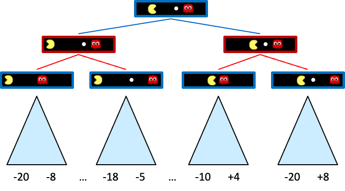

<style scoped>
h1, h2, h3, h4, h5, h6, p {
  color: #FFFFFF;
  font-weight: 800;
  text-shadow:
    0px 0px 3px #000000;
}
</style>

# Búsqueda amb adversaris

### Jocs

Models d'intel·ligència artificial


---

<style scoped>section { font-size:32px; }</style>

## Jocs

- Fins ara en els nostres problemes de cerca, l'entorn era **determinista** i **totalment observable**.
  - Solament calia **planificar** una seqüència d'accions per arribar a l'estat objectiu.
- En els jocs hi ha **adversaris**: Cada jugador té un **objectiu** diferent.
  - Els jugadors modifiquen l'estat de l'entorn en benefici propi.
  - La cooperació pot ocórrer, però solament si és beneficiosa per a tots els jugadors.
- Els jocs són un **domini** molt important en la intel·ligència artificial.
  - Són un **domini** molt **comú**, **complexe** i útil per a la **investigació**.

---

### Propietats

Tindrem en compte les següents propietats:

- **Dos jugadors**: Un pot ser la màquina i l'altre un humà.
- **Finit**: nombre finit d'estats. Si el nombre d'estats és molt gran es poden utilitzar aproximacions.
- **Suma zero**: el guany d'un jugador és la pèrdua de l'altre.
- **Determinista**: no hi ha aleatorietat.
- Informació **perfecta**: els jugadors coneixen l'estat del joc en tot moment. (Escacs, Go, etc.)

---

#### Dos jugadors i suma zero

- Dos jugadors: $MAX$ i $MIN$.
- Un conjunt de **posicions** $P$ (estats)
- Una posició inicial $p_0 \in P$
- Un conjunt de **posicions terminals** $T \subseteq P$
- Un conjunt d'eixos dirigits $E_{Max}$ i $E_{Min}$ entre les posicions.
  - Representaran els moviments possibles de cada jugador.
- Una **funció d'utilitat** $u: T \rightarrow \mathbb{R}$ que
  - el valor de cada posició terminal per a $MAX$.

---



---

<style scoped>section { font-size:31px; }</style>

## Arbre de joc (I)

Característiques:

- **Arbre de joc**: **capes** d'estats **alternant** entre els jugadors.
- **Arrel**: Estat **inicial**.
- **Estat del joc**: **posició** i **jugador** a moure.
- **Final del joc**: Quan un jugador arriba a una **posició terminal**.
- **Funció d'utilitat**: Junt als terminals substitueix els objectius
  - Cada node **terminal** $t$ s'etiqueta segons la seva **utilitat** $U(t)$.
  - Per a $MAX$ serà $U(t)$, per a $MIN$ $-U(t)$.
  - En la majoria de jocs que veurem, $U(t) \in \{-1, 0, 1\}$.

---

## Arbre de joc (II) - Exemple


---

<style scoped>section { font-size:33px; }</style>

## Estratègies

- $MAX$ vol **maximitzar** la seva utilitat.
- $MIN$ vol **minimitzar** la utilitat de $MAX$.
- $MAX$ no decideix sol a quin estat terminal arribarà.
  - Quan $MAX$ mou, $MIN$ decideix a quin estat subseqüent es mourà.
- $MAX$ ha de tindre una **estratègia**:
  - Ha de decidir que fer **per a cada possible** **moviment** de $MIN$.
  - No hi ha prou en una seqüència d'accions predefinida, **dependrà de les accions** de $MIN$.

---

<!--
_class: invert lead
-->

<style scoped>
h1, h2, h3, h4, h5, h6, p {
  color: #FFFFFF;
  font-weight: 800;
  text-shadow:
    0px 0px 3px #000000;
}
</style>

### MiniMax


---

<style scoped>section { font-size:33px; }</style>

### MiniMax

- Estratègia recursiva.
- Assumint que $MIN$ juga sempre **el seu millor moviment**,
  - quin moviment s'ha de fer per minimitzar la utilitat de $MIN$?.
- Cada node tindrà una **puntuació** **minimax**.
  - Serà la **utilitat mínima** que $\mathbf{MAX}$ pot obtenir **si $\mathbf{MIN}$ juga òptimament**.

**Minimitzant el guany de $\mathbf{MIN}$ estem maximitzant el nostre guany.**

---

<style scoped>section { font-size:29px; }</style>

#### Exemple

- En l'exemple de la dreta els nodes $\triangle$ són $MAX$ i els $\triangledown$ $MIN$.
- Els nodes terminals mostren la **utilitat** per a $MAX$.
- La resta de nodes mostren la seva puntuació **minimax**
- En l'arrel la millor opció per a $MAX$ és $a_1$, ja que porta al node en millor puntuació minimax
- En el segon nivell la millor opció per a $MIN$ és $b_1$ per dur al node en menos puntuació


---

#### Algorisme

- **Entrada**: Un arbre de joc $A$, un node $n$, un jugador $j$.
- **Sortida**: La puntuació minimax del node $n$.
- **Algorisme**: Algorisme recursiu.
  - Si $n$ és un node terminal, retornar la seva utilitat.
  - Si $j$ és $MAX$: Retornar el màxim de les puntuacions dels fills.
  - Si $j$ és $MIN$: Retornar el mínim de les puntuacions dels fills.

---

#### Implementació (I)

```python
def cerca_minimax(joc, estat):
    jugador = estat.a_moure
    return valor_maxim(joc, jugador, estat)

def valor_maxim(joc, jugador, estat):
    if joc.es_terminal(estat):
        return joc.utilitat(estat, jugador), None
    v, moviment = float('-inf'), None
    for a in joc.accions(estat):
        v2, _ = valor_minim(joc, jugador, joc.resultat(estat, a))
        if v2 > v:
            v, moviment = v2, a
    return v, moviment
```

---

#### Implementació (II)

```python
def valor_minim(joc, jugador, estat):
    if joc.es_terminal(estat):
        return joc.utilitat(estat, jugador), None
    v, moviment = float('inf'), None
    for a in joc.accions(estat):
        v2, _ = valor_maxim(joc, jugador, joc.resultat(estat, a))
        if v2 < v:
            v, moviment = v2, a
    return v, moviment
```

---

<style scoped>section { font-size:35px; }</style>

#### Problemes

- **Complexitat**: $O(b^m)$
  - sent $b$ el nombre de branques per node i $m$ la profunditat de l'arbre.
- La complexitat pot ser **massiva**.
  - En el joc d'escacs, $b \approx 35$ i $m \approx 100$. $Nodes \approx 10^{54}$
  - En el joc del Go, $b \approx 250$ i $m \approx 150$. $Nodes \approx 10^{360}$
- Això fa que sigui **impossible** explorar tot l'arbre de joc en jocs complexos.
  - Veurem técniques que poden ajudar-nos.

---

<!--
_class: invert lead
-->

<style scoped>
h1, h2, h3, h4, h5, h6, p {
  color: #FFFFFF;
  font-weight: 800;
  text-shadow:
    0px 0px 3px #000000;
}
</style>

## Poda alfa-beta


---

### Introducció

- **Poda alfa-beta**: **técnica** per reduir el nombre de nodes a explorar en l'arbre de joc.
- **Poda**: **eliminar** nodes de l'arbre de joc sense explorar-los.
- **Alfa**: **valor** mínim que $MAX$ està **assegurat** de poder obtenir.
- **Beta**: **valor** màxim que $MIN$ està **assegurat** de poder obtenir.
- **Nodes a podar**: Nodes que, indepentment del seu valor, no modificarán el nivell superior.

---

<style scoped>section { font-size:29px; }</style>

### Exemple (I)

- La primera fulla baix $B$ té valor $3$. Per tant $B$ (node $MIN$) té un valor màxim de $3$.
- La segona fulla baix $B$ té valor $12$.
  - $MIN$ evitaria aquest moviment, per lo que $B$ encara té un valor màxim de $3$.
- La tercera fulla baix $B$ té valor $8$. El valor de final de $B$ és $3$.
  - Podem deduir llavors que el valor mínim d'$A$ és $3$, al tindre un node terminal amb valor $3$.


---

<style scoped>section { font-size:29px; }</style>

### Exemple (II)

- La primera fulla baix $C$ té valor $2$. Per tant $C$, que es un node $MIN$, té un valor màxim de $2$.
  - Sabem que $B$ té un valor de $3$, per lo que $MAX$ mai escollirà $C$
    - Així sabem que no cal explorar els altres nodes fills de $C$,
  - Aquesta és la **poda alfa-beta**.
- Al acabar l'exploració sabem els valors de cada node necessari.


---

<style scoped>section { font-size:33px; }</style>

### Regles

- La poda alfa-beta **no** afecta al resultat de l'algorisme.
- Es pot aplicar a qualsevol profunditat de l'arbre.
  - Moltes vegades es poden, fins i tot, podar arbres sencers.
- Principi general, per un node $n$:
  - Si hi ha una opció millor al mateix nivell $($m'$)$ o superior $($m$)$, $n$ no es visitarà.


---

<!--
_footer: ""
-->

### Implementació (I)

```python
def busqueda_alfa_beta(joc, estat):
    jugador = estat.a_moure
    return valor_maxim_ab(joc, jugador, estat, float('-inf'), float('inf'))

def valor_maxim_ab(joc, jugador, estat, alfa, beta):
    if joc.es_terminal(estat):
        return joc.utilitat(estat, jugador), None
    v, moviment = float('-inf'), None
    for a in joc.accions(estat):
        v2, _ = valor_minim_ab(joc, jugador, joc.resultat(estat, a), alfa, beta)
        if v2 > v:
            v, moviment = v2, a
        if v >= beta:
            return v, moviment
        alfa = max(alfa, v)
    return v, moviment
```

---

### Implementació (II)

```python
def valor_minim_ab(joc, jugador, estat, alfa, beta):
    if joc.es_terminal(estat):
        return joc.utilitat(estat, jugador), None
    v, moviment = float('inf'), None
    for a in joc.accions(estat):
        v2, _ = valor_maxim_ab(
          joc, jugador, joc.resultat(estat, a), alfa, beta
        )
        if v2 < v:
            v, moviment = v2, a
        if v <= alfa:
            return v, moviment
        beta = min(beta, v)
    return v, moviment
```

---

<style scoped>section { font-size:31px; }</style>

### Millores

- **Ordenació de nodes**: Ordenar els nodes fills corréctament permet podar més.
  - Una bona ordenació pot permetre passar d'examinar de $O(b^{3d/4})$ a $O(b^{d/2})$
    - En un joc d'escacs, els moviments que mengen peces són més probables de ser bons.
- Per no explorar estates repetits, es pot utilitzar una **taula de transposició** semblant al conjunt de visitats, però amb els valors de cada node.
- Aplicar **heurístiques** per tallar l'avaluació: aplicar una funció d'avaluació a les posicions no terminals per fer-les terminals

---

## Funcions d'avaluació

### Introducció

- En jocs complexos, no es pot explorar tot l'arbre de joc.
- En lloc d'això, es pot utilitzar una **funció d'avaluació** per estimar la utilitat d'un estat.
- La funció d'avaluació **no** ha de ser perfecta.
  - Ha de ser **rápida** de calcular.
  - Ha de ser **consistent** amb la utilitat real.

---

## Funcions d'avaluació

### Exemple: Tic-Tac-Toe

- En el joc del tres en ratlla, podem utilitzar la següent funció d'avaluació:
  - $u(s) = \sum_{i=1}^3 \sum_{j=1}^3 \begin{cases}
    1 & \text{si } s_{i,j} = \text{MAX} \\
    -1 & \text{si } s_{i,j} = \text{MIN} \\
    0 & \text{altrament}
  \end{cases}$
  - Explicació: Sumem 1 per cada fitxa de $MAX$ i restem 1 per cada fitxa de $MIN$.

---

## Funcions d'avaluació

### Implementació

```python
def avalua_tres_en_ratlla(joc, estat):
    jugador = estat.a_moure
    utilitat = 0
    for i in range(3):
        for j in range(3):
            if estat.tauler[i][j] == jugador:
                utilitat += 1
            elif estat.tauler[i][j] == joc.jugador_contrari(jugador):
                utilitat -= 1
    return utilitat
```
---