<style scoped>
h1, p {
  color: #FFFFFF;
  font-weight: bold;0
  text-shadow:
    0px 0px 3px #00000;
}
</style>

# 7. Processament del llenguatge natural

Models d'intel·ligència artificial

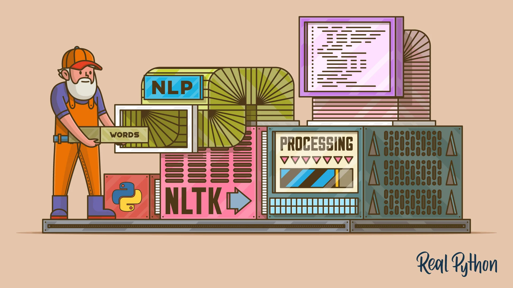

---

<style scoped>section { font-size:33px; }</style>

## Processament del llenguatge natural

- **Definició:** camp de la IA que tracta de la interacció entre els ordinadors i el llenguatge humà.
- Se centra en la **comprensió** i **generació** de llenguatge humà.
- Un dels camps més actius i complexos de la IA.

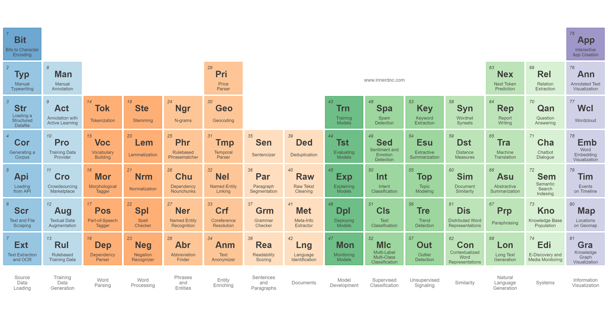

---

## Aplicacions

- Traducció automàtica.
- Reconeixement de veu.
- Síntesi de veu.
- Generació i resum de text.
- Anàlisi de sentiments.
- Classificació de text.

---

## Introducció (I)

- Camp multidisciplinari que combina:
    - Lingüística.
    - Intel·ligència artificial.
    - Ciències cognitives.
    - Informàtica.
    - etc.

---

## Introducció (II)

- És un problema **difícil** perquè:
    - El llenguatge humà és **ambigu**.
    - El llenguatge humà és **ric**.
    - El llenguatge humà és **contextual**.
    - El llenguatge humà és **cultural**.
- Aquestes característiques fan que el llenguatge humà no sigui **formal** i, per tant, no es puga tractar amb les tècniques de la IA tradicional.

---

<!-- 
_class: invert lead
-->

<style scoped>
h1, p {
  color: #FFFFFF;
  font-weight: bold;
  text-shadow:
    0px 0px 3px #000000;
}
</style>


# El text com a dada


---

## Introducció

- El text és una font de dades **molt important**.
- Els humans **generem** i **consumim** text de forma **massiva**
- El saber com tractar el text és **crític** per a moltes aplicacions.

> Anomenem **text** a una seqüència coherent de símbols que pot ser interpretada com a un conjunt de paraules, utilitzant les regles gramaticals i sintàctiques d'una llengua.

---

## Significat

- Qué entenem per **significat**?:
    - el significat d'una paraula és el concepte que representa.
    - el significat d'una frase és el concepte que representa la combinació de les paraules que la formen.
    - el significat d'un text és el concepte que representa la combinació de les frases que el formen.

$$\text{significant}(\text{simbol}) \Leftrightarrow \text{significat}(\text{idea})$$
$$\text{arbre} \Leftrightarrow \text{\{🌲, 🌳, 🌴, } \dots \}$$

---
<style scoped>section { font-size:32px; }</style>

## Significat en els ordinadors

- Com poden coneixer els ordinadors el significat de les paraules, frases i textos?.
- Técniques classiques: bases de dades de sinónims i hyperònims.
    - `WordNet`: base de dades lèxica que relaciona paraules entre si.
    - Els sinónims permeten relacionar paraules amb el mateix significat.
        - Ex: `roïn` és un sinònim de `dolent`, `malparit`, `miserable`, etc.
    - Els hyperònims permeten relacionar paraules amb significats més generals.
        - Exemple: `carnivor`, `vertebrat` serien hyperònims de `gat`.

---
<style scoped>section { font-size:32px; }</style>

## Problemes de WordNet i semblants

- Molt útil però sense matís semàntic.
    - Ex: `gat` i `felí` són sinònims, però no tenen el mateix significat.
- Tots els sínonims no seran útils en tots els contextos.
    - Ex: `cabró` és un sinònim de `roïn`, però no sempre es poden intercanviar.
- Actualitzar la base de dades és un procés **manual**, **costós** i subjectiu.
    - Ex: `the shit` és un sinònim de `the best` en anglès que no apareix en WordNet.
- Les solucions modernes es basen en les representacions del text.

---
<style scoped>section { font-size:32px; }</style>

## Representacions del text (I)

* Els ordinadors necessiten representar el text com a dades numèriques.
* Necessitarem un **vocabulari** que relacioni les unitats de text amb els números.
* Quina unitat de text triem per a representar el text i com ho fem?.
* Aquestes decisions determinaran la **complexitat** del model, el tamany del **vocabulari** i la **precisió** del model.
* Els models de representació del text són **molt importants** en el processament del llenguatge natural.
* A continuació veurem algunes de les tècniques més utilitzades.

---

<style scoped>section { font-size:31.6px; }</style>

## Representació de caràcters

* Cada caràcter es representa per un número.
    * El diccionari serà molt petit (en el cas de l'ASCII, 128 caràcters).
    * El model ha de ser molt complex, ja que ha d'aprendre a combinar els caràcters per a formar paraules.
    * Exemple: "AND" es pot representar com a $[65, 78, 68]$

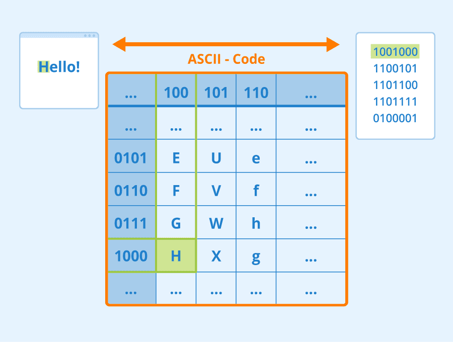

---

## Representació de paraules

* Cada paraula és representada per un número.
    * El diccionari serà molt gran, ja que cada paraula serà una entrada en el diccionari.
    * El model serà més senzill, ja que les paraules són unitats semàntiques.
    * Exemple: Si el nostre vocabulari és `["gat", "gos", "cavall", "ocell", "peix"]`, llavors "gat" es pot representar com a $1$ i "cavall" com a $3$.

---

## Representació de subparaules

* Cada subparaula és representada per un número.
    * El diccionari serà més petit que el de paraules, ja que les subparaules són unitats semàntiques.
    * El model serà més senzill, ja que les subparaules són unitats semàntiques.
        * Permet representar paraules rares i que no estan en el vocabulari.
        * Útil per a llengües amb moltes paraules compostes i derivades.

---

<style scoped>section { font-size:31.5px; }</style>

## Tokens i tokenització (I)

* Indepententment de l'enfocament, el text s'ha de **dividir** en **tokens**.
    * Ex: "New York in winter" $\rightarrow$ `["New", "York", "in", "winter"]`
* **Token**: unitat mínima de text que pot ser considerada com a una unitat semàntica.
    * Una paraula, subparaula, signe de puntuació, número, etc; qualsevol unitat que es triï com a unitat mínima.
* **Tokenització**: procés de dividir un text en tokens i que facilita el tractament i comprensió del text.
    * És un procés **no trivial**. Depèn de la llengua i del domini.
        * Exemple: "New York" és un token o dos?

---

<style scoped>section { font-size:35px; }</style>

## Tokens i tokenització (II)

* Qüestions a tindre en compte:
    * **Puntuació**: es considera un token o no?. Pot variar la interpretació del text.
    * **Majuscules/Minúscules**: es consideren tokens diferents o no?.
    * **Stopwords**: paraules que no aporten informació al text (articles, preposicions, etc.).
    * **Idioma i domini**: el procés de tokenització depèn de l'idioma i del domini del text.

---
<style scoped>section { font-size:32.5px; }</style>

## Tokens i tokenització (III)

* N-grams: seqüències de n tokens consecutius.
* Algunes paraules tenen significat propi, però la seva combinació amb altres paraules també té un significat. Ex: "New York".
* Els n-grams permeten representar aquestes combinacions de paraules, augmentant el vocabulari amb les combinacions d'n-tokens que triem.
* Bigrams: seqüències de dos tokens consecutius, trigrams: seqüències de tres tokens consecutius, etc.
* Problema: augmenta molt el vocabulari i la complexitat del model.

---
<style scoped>section { font-size:34px; }</style>

## Vectorització (I)

* Encara que els tokens son molt útils, presenten alguns problemes:
    * No són fàcils de manipular per a les màquines.
    * No són fàcils de comparar.
    * No permeten calcular la similitud entre paraules i textos.
* La **vectorització** és el procés de convertir un text en un vector numèric.
* Els vectors són més fàcils de manipular per a les màquines i de comparar.

---

## Vectorització (II)

* Algunes técniques de vectorització (embeddings):
    * **NNLM**: model basat en xarxes neuronals. El nombre de dimensions és fixe.
    * **Word2Vec**: cada paraula és un vector en un espai semàntic. El nombre de dimensions és fixe.
    * **FastText**: creat per Facebook. Similar a Word2Vec, però permet representar paraules rares i que no estan en el vocabulari.
    * **GloVe**: model basat en NNLM i Word2Vec.

---
<style scoped>section { font-size:30px; }</style>

## Word2Vec

* Es basa en la idea que les paraules amb significats similars apareixen en contextos similars.
    * "You shall know a word by the company it keeps" (J.R. Firth, 1957).
* Quan una paraula **p** apareix en un text, les paraules properes a `p` són el seu **context**.
* Els diferents contextos de `p` defineixen el significat de `p`.


---
<style scoped>section { font-size:30.6px; }</style>


## Word2Vec (II)

* Per cada paraula obtenim un vector **dens** i de **longitud fixa**.
* Cada dimensió del vector representa un **aspecte semàntic** de la paraula.
* Representen la seva **posició** en un espai semàntic n-dimensional.
* Els vectors de paraules amb contextos semblants estaran propers en l'espai semàntic.

> Facilita calcular la similitud entre paraules.

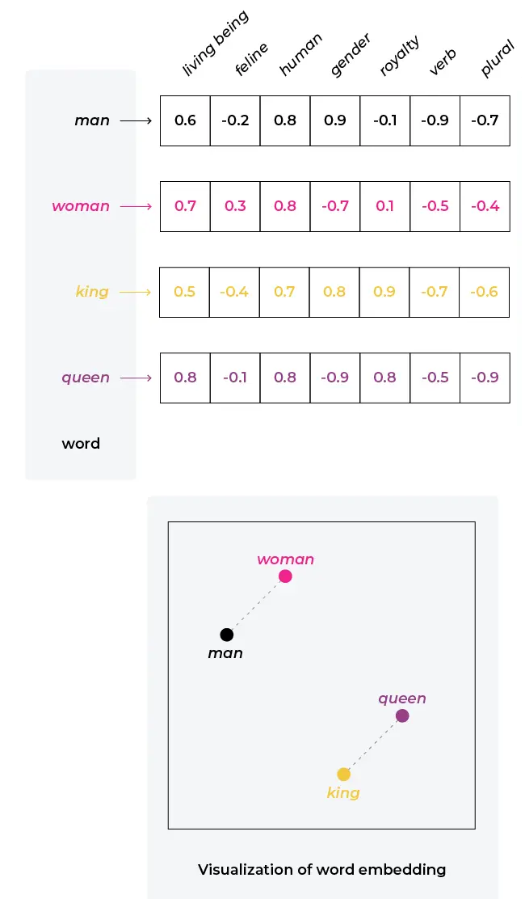

---

<style scoped>section { font-size:31.4px; }</style>

## Word2Vec (III)

* Els vectors de parales també s'anomenen **embeddings** o **representacions de xarxa**.
* **FastText** és una variant de **Word2Vec** que utilitza subparaules.
    * Permet representar paraules rares i que no estan en el vocabulari.
    * Útil per a llengües amb moltes paraules compostes i derivades.
* Els _embeddings_ generats poden ser utilitzats en una gran varietat de tasques, com pot ser la classificació de textos, anàlisi de sentiments, etc.
* Són models que necessiten un entrenament previ amb totes les paraules del vocabulari. A continuació veurem un exemple.

---

<!-- 
_class: invert lead
-->


<style scoped>
h1, p {
  color: #FFFFFF;
  font-weight: bold;
  text-shadow:
    0px 0px 3px #000000;
}
</style>


# Representació de textos


---

<style scoped>section { font-size:30.8px; }</style>

## Representació de textos

* Fins ara hem vist com representar paraules, veurem com representar textos, per poder veure les relacions entre les paraules que el formen.
* Algunes de les tècniques utilitzades són:
    * **One-hot encoding**: cada token $\rightarrow$ una dimensió; valor $\rightarrow$ 1 si el token està i 0 si no.
    * **Bag of Words**: model basat en freqüències. El valor de cada cel·la son les aparicions del token en el document. Simple i molt utilitzat.
    * **TF-IDF**: model basat en freqüències i inversa de freqüències
    * **Word Embeddings**. Vectorització de paraules amb _Word2Vec_, _FastText_, etc

---

<style scoped>section { font-size:30px; }</style>

### One-hot encoding

* El model **one-hot encoding** és un model basat en tokens.
* Els vectors generats són **dispersos** i **grans**, ja que cada token és una dimensió.
* Cada token és una dimensió i el valor de cada cel·la és 1 si el token està i 0 si no.
* Els vectors generats són **independents** de la semàntica.
* No facilita calcular la similitud entre paraules i textos.

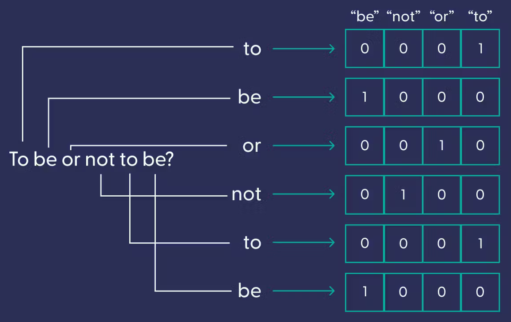

---

<style scoped>section { font-size:31.8px; }</style>

### Bag of Words (BoW)

* El model **BoW** és un model basat en freqüències.
* Es pot entendre com una suma dels vectors one-hot.
* Els vectors generats són **independents** de la semàntica.
* El nombre del token es pot entendre com a **ordre** i en molts casos no és així. Aquesta discrepància pot afectar a la qualitat del model.

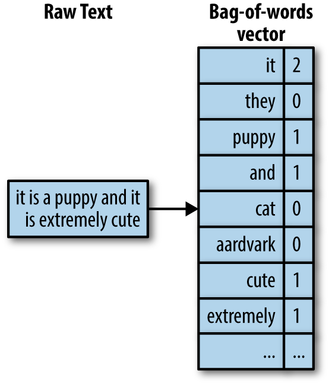

---

<style scoped>section { font-size:33px; }</style>

### TF-IDF

* El model **TF-IDF** és un model basat en freqüències i inversa de freqüències.
* Semblant al model **BoW**, però té en compte la freqüència del token en el document i en el conjunt de documents.
* El valor de cada cel·la és el producte de la freqüència del token en el document i la inversa de la freqüència del token en el conjunt de documents.
* Dona més importància als tokens que apareixen en pocs documents. Raó: els tokens que apareixen en molts documents no solen aportar informació rellevant.

---

### Word Embeddings

* Els _embeddings_ generats per Word2Vec són vectors de _n_ dimensions.
* Els vectors generats són **densos**, de **longitud fixa** i amb **sentit semàntic**.
* Per a representar un **text** pot utilitzar-se la mitjana dels _embeddings_ de les paraules que el formen, el màxim, la suma, etc.

---

#### Generació de _embeddings_ amb Word2Vec i la llibreria Gensim

```python
from gensim.models import Word2Vec

sentences = [
    ["Gavi", "company", "Pedri"],
    ["Xavi", "entrena", "Barça"],
    ["Gavi", "juga", "Barça"],
    ["Gavi", "chuta"],
    ["Kepa", "para"],
    ["Xavi", "entrena"],
]
model = Word2Vec(sentences, min_count=1)
```

---

#### Visualització dels _embeddings_

```python
gavi = model.wv["Gavi"]
print(gavi)
```

```python
[
    -0.00536227  0.00236431  0.0510335   0.09009273
                                         - 0.0930295 - 0.07116809 0.06458873  0.08972988
                                         - 0.05015428 - 0.03763372
]
```

---

#### Busquem paraules similars

```python
model.wv.most_similar("Gavi")
```

```python
[('Barça', 0.5436005592346191),
 ('Pedri', 0.3792896568775177),
 ('entrena', 0.3004249036312103),
 ('Xavi', 0.10494352877140045),
 ('juga', -0.1311161071062088),
 ('chuta', -0.1897382140159607),
 ('para', -0.22418655455112457),
 ('Kepa', -0.2726020812988281),
 ('company', -0.7287455797195435)]
```

---

<style scoped>section { font-size:32px; }</style>

#### Similitud del cosinus

* Els _embeddings_ generats per Word2Vec són vectors de _n_ dimensions.
* Per a calcular la similitud entre dos vectors s'utilitza la **similitud del cosinus**.
* El resultat és un valor entre -1 i 1.
    * -1: vectors oposats.
    * 0: vectors ortogonals.
    * 1: vectors iguals.
* Aquesta mesura és molt utilitzada en el processament del llenguatge natural.

---

<!-- 
_class: invert lead
-->


<style scoped>
h1, p {
  color: #FFFFFF;
  font-weight: bold;
  text-shadow:
    0px 0px 3px #000000;
}
</style>


# Conversió de text a veu i veu a text


---

<style scoped>section { font-size:32px; }</style>

## Reconeixement de veu i transcripció automàtica

* La **síntesi de veu** i la **transcripció automàtica** són tasques de **processament del llenguatge natural**.
    * La síntesi de veu és el procés de **convertir un arxiu de text en un arxiu d'àudio**.
    * La transcripció automàtica és el procés de **convertir un arxiu d'àudio en un arxiu de text**.
* Ambdues són unes tècniques molt importants en el processament del llenguatge natural; encara que no solen estar en primer pla.
* En aquest apartat veurem com funcionen aquestes tècniques.

---

<style scoped>section { font-size:31px; }</style>

## Síntesi de veu

* La **síntesi de veu** és el procés de **convertir un arxiu de text en un arxiu d'àudio**.
* Aquesta tecnologia ha millorat molt en els últims anys, gràcies als models de llenguatge i a les xarxes neuronals.
* Hi ha diversos enfocaments, a continuació veurem els més importants.

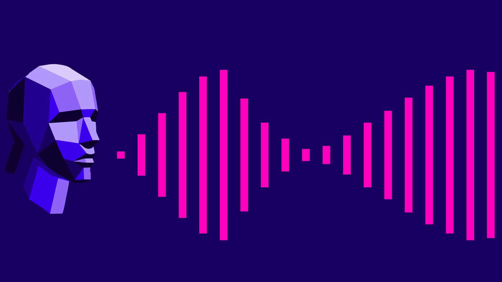

---

### Síntesi de veu: concatenació de sons

* Es basa en la grabació de **sons** i la seva **concatenació** per a formar paraules i frases.
* Es busquen els sons més adaptats al context i es combinen de manera que soni el més natural possible.
* Requereix una gran quantitat de dades i dificulata adapatar-se a contextos nous.

---

### Síntesi de veu: síntesi basada en formants

* Els **formants** són les **frequencies** de les cordes vocàliques.
* S'ajusten els formants per representar els diferents sons i es combinen per a formar paraules i frases.
* La síntesi de formants permet obtindre veus clares i precises.
* Requereixen menys dades que la síntesi per concatenació de sons, tenen, però menys naturalitat i expressivitat.

---

### Síntesi de veu: síntesi basada en unitats

* Es basa en la **síntesi d'unitats** més petites que les paraules, com ara **fonemes** o **diftongs**.
    * Aquestes unitats s'enmagatzemen en una base de dades i es combinen de forma dinàmica segons el text.
    * La síntesi de unitats permet obtenir veus més naturals i expressives.
    * Requereixen menys dades que la síntesi per concatenació de sons.

---

<style scoped>section { font-size:32px; }</style>

### Síntesi de veu: síntesi basada en xarxes neuronals (I)

* Les xarxes neuronals són capaces de sintetitzar veus a partir de text.
* Aquestes xarxes s'entrenen amb grans quantitats de dades de veu i text i són capaces de sintetitzar veus molt naturals.
* S'utiltzen Xarxes Neural Recurrents (RNN) específiques, com ara les xarxes LSTM o GRU o models més moderns com ara les xarxes Transformer.
* Aquestes xarxes són capaces de sintetitzar veus molt naturals i expressives, sempre que tinguin suficientes dades d'entrenament i suficient capacitat de procés.

---

<style scoped>section { font-size:31.5px; }</style>

### Síntesi de veu: síntesi basada en xarxes neuronals (II)

* Aquests models es basen en els espectrogrames de les veus (representació de la veu en funció del temps i la freqüència).

* Funcionen en quatre etapes:
    * **Etapa de seqüència a seqüència**: el text es converteix en una seqüència de vectors.
    * **Etapa de seqüència a espectrograma**: els vectors es converteixen en espectrogrames.
    * **Etapa de síntesi**: els espectrogrames es converteixen en veu.
    * **Etapa de postprocessament**: es millora la qualitat de la veu.

---

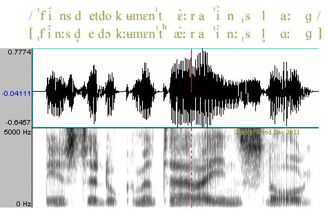

---

## Transcripció automàtica

* En l'actualitat el **reconeixement de veu** és una tasca **molt madura**.
* Els assistents virtuals com **Siri**, **Alexa** o **Google Assistant** són capaços de reconèixer veu amb una gran precisió.
* Si volem implementar un sistema de reconeixement de veu, podem utilitzar eines com **Google Cloud Speech-to-Text** o **IBM Watson Speech to Text**.
* Aquestes eines es basen en les matèixes tècniques que hem vist per a la síntesi de veu.

---

<style scoped>section { font-size:31px; }</style>

### Models de reconeixement de veu i transcripció automàtica

* Els models de reconeixement de veu i transcripció automàtica són models de **seqüència a seqüència**.
* Aquests models són capaços de convertir una seqüència d'entrada en una seqüència de sortida.
* Alguns dels models més importants són:
    * **Whisper**: model de reconeixement de veu de **OpenAI**.
    * **DeepSpeech**: model de reconeixement de veu de **Mozilla**.
    * **Hugging Face Speech2Text**: model de reconeixement de veu.
    * **Bark**: Model de generació de veu de **Suno Labs**.

---

<!-- 
_class: invert lead
-->

<style scoped>
h1, p {
  color: #FFFFFF;
  font-weight: bold;
  text-shadow:
    0px 0px 3px #000000;
}
</style>


# Similitud entre textos


---

## Similitud entre textos

* La similitud entre textos és una mesura que indica com de semblants són dos textos.
* És una de les funcions més obvies del processament del llenguatge natural.
* El càlcul de la similitud entre textos, però, és una tasca **difícil**.
* Anem a veure algunes tècniques de les més utilitzades.

---

<style scoped>section { font-size:32px; }</style>

### Técniques per a calcular la similitud entre textos (I)

* **Basades en regles**: Es basen en regles predefinides; fàcils d'implementar i útils per a casos senzills.
    * **Distància de Levenshtein**: És el nombre mínim d'operacions per a transformar una cadena en una altra.
    * **Distància de Hamming**: És el nombre de posicions en les quals dues cadenes de la mateixa longitud difereixen.
    * **Recompte de paraules**: És el nombre comú de paraules entre dos textos.
    * **Distància de Jaccard**: És el nombre de paraules comunes entre dos textos dividit pel nombre total de paraules dels dos textos.

---

<style scoped>section { font-size:31px; }</style>

### Técniques per a calcular la similitud entre textos (II)

* **Basades en característiques sintàctiques**: Es basen en les característiques sintàctiques i gramaticals dels textos. Impliquen un procés de **parsejat** dels textos per analitzar la seva
  estructura sintàctica.
* **Basades en característiques semàntiques**: Es basen en les característiques semàntiques dels textos. Aquí models com Word2Vec són molt útils, al permetre representar el significat contextual de les paraules.
    * **Word Mover's Distance**: Mesura la distància entre dos textos com la distància entre els vectors de les paraules dels dos textos.
    * **Similitud del cosinus**: Utilitza el cosinus de l'angle entre ells.

---
<style scoped>section { font-size:33px; }</style>

### Técniques per a calcular la similitud entre textos (II)

* **Basades en l'aprenentatge automàtic**: Es basen en l'aprenentatge automàtic per a calcular la similitud entre textos.
    * **BERT i GPT**: Models de llenguatge basats en xarxes neuronals que pot ser utilitzat per a calcular la similitud entre textos.
    * **Universal Sentence Encoder**: Model específicament entrenat per al _transfer learning_ (aprenentatge per a la transferència; utilitzar un model entrenat per a una tasca per a una altra).

---

### Utilitats de la similitud entre textos

* **Correcció ortogràfica**: Per a corregir una paraula es busca la paraula més semblant.
* **Classificació de textos**: Per a classificar un text es busca el text més semblant.
* **Agrupació de textos**: Útil per a agrupar textos similars en clusters.
* **Búsqueda de resposte**: Per a trobar la resposta a una pregunta es busquen texts semblants a la pregunta.

---

<style scoped>section { font-size:30.5px; }</style>

### Word Embeddings

* Les técniques clàssiques d'NLP es basen en representacions no semàntiques com BoW o TF-IDF.
* Les modernes es basen en LLMs (Language Models) i Word Embeddings.
* Com ja hem vist, els _embeddings_ generats per Word2Vec són vectors de _n_ dimensions.
* Per a representar un text pot utilitzar-se la mitjana dels _embeddings_ de les paraules que el formen.
* Els vectors generats són **densos**, de **longitud fixa** i amb **sentit semàntic**.
* Facilita calcular la similitud entre paraules i textos.

---

### LLMS (Language Models)

* Els **LLMs** són models complexos basats en xarxes neuronals recurrents i l'arquitectura **Transformer**.
* Poden aprendre la semàntica del text i generar els seus propis _embeddings_ utilitzant el mecansime d'**atenció**.
* Demostren un gran rendiment en moltes tasques, com pot ser el càlcul de la similitud entre textos.
* Són complexos i necessiten un entrenament previ amb un gran volum de dades.

---

<!-- 
_class: invert lead
-->


<style scoped>
h1, p {
  color: #FFFFFF;
  font-weight: bold;
  text-shadow:
    0px 0px 3px #000000;
}
</style>


# Classificació de textos i anàlisi de sentiments

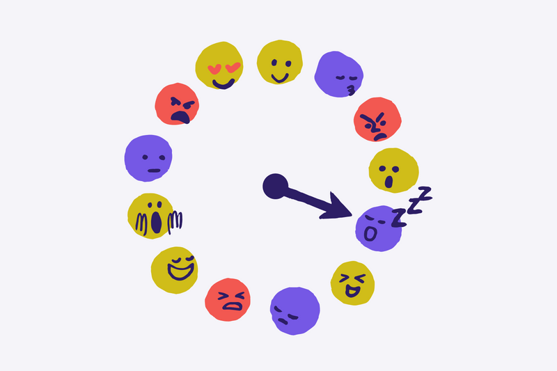

---

## Anàlisi de sentiments

* L'anàlisi de sentiments és un tipus de classificació i una de les tasques més utilitzades en el processament del llenguatge natural.
* L'objectiu és determinar l'actitud d'un autor respecte a un tema o producte.
* Es basa en la **polaritat** del text, que pot ser **positiva**, **negativa** o **neutra**.
* També poden buscar-se emocions concretes, com pot ser **alegria**, **tristesa**, **ira**, etc.

---

<style scoped>section { font-size:34px; }</style>

## Anàlisi subjectiva i objectiva

* L'anàlisi de sentiments pot ser **subjectiva** o **objectiva**.
* L'anàlisi subjectiva busca les **emocions i sentiments** de l'autor.
* L'anàlisi objectiva es basa en **fets i dades concretes**.
* Els dos tipus d'anàlisi són **complementaris** i poden utilitzar-se conjuntament.
* Ex: "_La pel·lícula té grans moments, però el final és molt trist_".
    * Anàlisi subjectiva: "_La pel·lícula és bona_".
    * Anàlisi objectiva: "_El final és trist_".

---

<style scoped>section { font-size:30.5px; }</style>

## Preprocessament del text

* El **tractament** de textos facilita obtenir bons resultats en NLP.
* Permet reduïr la **dimensionalitat** dels textos, eliminar el soroll i capturar la semàntica.
* Algunes de les tècniques més utilitzades són:
    * **Tokenització**: vist anteriorment.
    * **Normalització**: convertir el text a un format estàndard.
    * **Eliminació de stopwords**: eliminar paraules que no aporten informació.
    * **Stemming** i **lematització**: convertir les paraules a forma base.
    * **Gestió de negacions i modalitats**: convertir a un format estàndard.

---

### Preprocessament: tokenització

* Com ja hem vist, la tokenització és el procés de dividir un text en tokens.
* Els tokens poden ser paraules, subparaules, signes de puntuació, etc.
* Facilita una anàlisi més profund del text i extreure característiques rellevants.
* Ex: "El Barça està en crisi" $$\rightarrow$$ `["El", "Barça", "està", "en", "crisi"]`.

---

<style scoped>section { font-size:34px; }</style>

### Preprocessament: normalització

* La **normalització** implica el·liminar els elements que no aporten informació.
    * Nombres, signes de puntuació, etc.
* També implica convertir el text a un format estàndard, passant a minúscules i llevant espais innecessaris, per exemple.
    * Ex: "El Barça està en crisi! 😡" $$\rightarrow$$ "el Barça està en crisi".
* La normalització facilita la comparació entre textos i la detecció de paraules clau.

---

### Preprocessament: eliminació d'stopwords

* Les **stopwords** són paraules que no aporten informació al text.
* Són paraules molt comunes en un idioma, com pot ser articles, preposicions, etc.
* Els textos després de processar-se amb stopwords són més fàcils de tractar i més ràpids de processar.
* Ex: "El Barça està en crisi" $\rightarrow$ `["Barça", "crisi"]`.

---

<style scoped>section { font-size:34px; }</style>

### Preprocessament: stemming i lematització

* El **stemming** i la **lematització** són tècniques per a convertir les paraules a la seva forma base i facilitar l'agrupació de paraules relacionades.
* L'**stemming** és un procés heurístic basat en regles, mentre que la **lematització** és un procés basat en coneixements lingüístics.
    * Ex d'stemming: "jugar", "jugaré", "jugarà"  $\rightarrow$ "jug".
    * Ex de lematització: "jugar", "jugaré", "jugarà" $\rightarrow$ "jugar".
* El stemming és més ràpid, però la lematització és més precisa.

---

### Preprocessament: negacions i modalitats

* Les **negacions** i **modalitats** poden canviar el significat d'una frase.
* Ex: _"El Barça no està en crisi"_, _"El Barça pot estar en crisi"_, _"Deuries anar a l'estadi"_.
* Els models de NLP no poden interpretar aquestes frases sense un tractament previ.
* Necessitem técniques específiques, com la detecció de **dobles negacions** i la **reassignació de polaritat**.

---

## Enfocaments per a l'anàlisi de sentiments

* Com en totes les tasques de NLP, l'anàlisi de sentiments pot ser abordada amb diferents enfocaments.
* Els enfocaments més utilitzats són:
    * Basats en **regles**
    * Basats en l'**aprenentatge automàtic supervisat**
    * Basats en l'**aprenentatge automàtic no supervisat**

---

### Enfocament basat en regles

* Els enfocaments basats en regles són els més senzills i ràpids.
* També s'anomenen **lexicon-based**.
* Es basen llistes de paraules per a determinar la polaritat del text.
* De cada paraula es busca la seva polaritat en el llistat i es fa una suma..
    * _"El Barça està en crisi"_. _"crisi"_ $\rightarrow$ **-1** $\rightarrow$ **negatiu**.
    * _"Me fa il·lusió anar a l'estadi"_. _"il·lusió"_  $\rightarrow$ **1**  $\rightarrow$ **positiu**.
    * _"El partit va acabar en empat"_. _"empat"_  $\rightarrow$ **0** $\rightarrow$ **neutre**.

---

### Enfocament basat en l'AA supervisat

* Els enfocaments basats en l'aprenentatge automàtic supervisat són alguns dels més utilitzats.
* Consisteixen en entrenar un model amb un conjunt de dades etiquetades amb la polaritat del text.
* El model identifica els patrons en el text que determinen la polaritat.
* Alguns dels models més utilitzats són: **Naive Bayes**, **Support Vector Machines**, **Random Forest**, **Xarxes neuronals**

---

<style scoped>section { font-size:34px; }</style>

### Enfocament basat en l'AA no supervisat

* Els enfocaments basats en l'aprenentatge es basen en identificar patrons en el text sense necessitar etiquetes predefinides.
* Es poden utilitzar tècniques com la **clusterització** per a agrupar els textos en clusters segons la seva polaritat.
* Una vegada agrupats els textos, es poden etiquetar manualment els clusters.
* Aquestes tècniques són útils per a detectar patrons en el text i per a agrupar textos semblants (segons la distància entre textos).

---

<style scoped>section { font-size:33px; }</style>

## Models per a l'anàlisi de sentiments

Alguns dels models més utilitzats per a l'anàlisi de sentiments són:
* **BOW** + clasificador: model basat en BoW i un classificador.
* **Embeddings** + clasificador: Word2Vec, FastText, etc.
* **VADER**: model basat en regles, molt utilitzat en anglès.
* **Transformers**: com ja hem vist, els transformers són models específics per a NLP molt potents. Un dels models més utilitzats és **BERT**, de qüal utilitzarem una implementació en la segona
  pràctica.

---

## Xarxes neuronals per a l'anàlisi de sentiments

* Les xarxes neuronals són un dels models més utilitzats per a l'anàlisi de sentiments.
* Les xarxes neuronals són capaces d'aprendre els patrons en el text i de generar els seus propis _embeddings_.

---

<!-- 
_class: invert lead
-->


<style scoped>
h1, p {
  color: #FFFFFF;
  font-weight: bold;
  text-shadow:
    0px 0px 3px #000000;
}
</style>


# Models de llenguatge


---

## Models de llenguatge

* Fins ara hem vist com representar el text i com acomplir tasques com l'anàlisi de sentiments.
* Hem comentat que els models de llenguatge són eines molt potentes que poden ser utilitzades en moltes tasques.
* En aquesta secció veurem què són els models de llenguatge i com funcionen.
* També veurem alguns dels més utilitzats i les seves aplicacions.

---

<style scoped>section { font-size:31px; }</style>

## Aplicacions dels models de llenguatge

* Són dels camps més actius i complexos de la IA.
* Són la base de moltes aplicacions de NLP, com pot ser:
    * **Traducció automàtica**: traduir un text d'un idioma a un altre.
    * **Reconeixement de veu**: transcriure un text a partir d'un arxiu d'àudio.
    * **Síntesi de veu**: generar un arxiu d'àudio a partir d'un text.
    * **Generació i resum de text**: generar textos a partir d'un context.
    * **Anàlisi de sentiments**: determinar la polaritat d'un text.
    * **Classificació de text**: classificar un text en una categoria.
    * **Generació de textos**: generar textos a partir d'un tema o un estil.

---

<style scoped>section { font-size:30px; }</style>

### Definició

* Un **model de llenguatge** assigna una probabilitat a una seqüència de paraules.
    * Per tant, permet predir la següent paraula d'una seqüència.
    * Ex: "El barça està en ___" $$\rightarrow$$ `[{crisi: 0.8}, {forma: 0.1}, {casa: 0.1}]`
* Es basen en la idea que les paraules d'una seqüència no són independents, sinó que depenen de les paraules anteriors.
* Permeten calcular la "**validesa**" d'una seqüència de paraules.
    * No és el mateix que la **correcció** d'una seqüència de paraules.
    * Intentem modelar el llenguatge humà, amb els seus **matissos i ambigüitats**.

---

## Història: Models basats en regles

* Els models de llenguatge són un dels camps més antics del processament del llenguatge natural.
* Es basen en regles gramaticals i lingüístiques per definir les característiques del llenguatge.
* Les regles estan definides per experts i són difícils de modificar.
* No són flexibles i no poden adaptar-se a nous contextos.
* Ex: Gramàtica de Chomsky, Gramàtica de Montague, etc.

---

<style scoped>section { font-size:30.6px; }</style>

## Història: Models estocàstics

* Els models basats en regles van ser substituïts pels basats en **estadístiques**, més flexibles i que modelen millor el llenguatge. Els models de Markov van ser els primers en tindre resultats acceptables.
* Es basen en la idea que les paraules d'una seqüència no són independents, sinó que depenen de les paraules anteriors. Exemples:
    * **N-gram**: modela cada paraula en funció de les n paraules anteriors. (uni, bi, tri, etc).
    * **Skip-gram**: modela cada paraula en funció de les n paraules anteriors i posteriors.
    * **Syntax-based**: es basen en l'estructura sintàctica de les frases i no en la seva seqüència.

---

<style scoped>section { font-size:30px; }</style>

## Història: RNN

* Els models basats en estadístiques van ser substituïts per models basats en **xarxes neuronals**.
* Els primers models d'aquest tipus van ser els **RNN** (xarxes neuronals recurrents).
    * A diferència de les xarxes neuronals tradicionals, les RNN tenen **memòria**.
    * L'entrada d'una neurona pot anar determinada per la sortida d'ella mateixa.
    * Permeten processar seqüències de longitud variable.
    * Els models de llenguatge basats en RNN van ser els primers en obtenir resultats acceptables.

---

<style scoped>section { font-size:30px; }</style>

## Història: LLM

* Els models basats en RNN van ser substituïts per models basats en **transformers**.
* Els transformers són models basats en xarxes neuronals que utilitzen el mecanisme d'**atenció**.
    * Són més potents que les RNN i permeten obtenir resultats molt millors.
    * Són els models més utilitzats en l'actualitat.
    * Necessiten un entrenament previ amb un **gran** volum de dades (_corpus_)
    * Mostren la capacitat d'entendre el context, la semàntica i la sintàxis del text.

---

## Història: LLM (II)

* El mecanisme d'atenció és un mecanisme que permet a les xarxes neuronals aprendre a **centrar-se** en les parts importants de les seves entrades.
* És un mecanisme que imita el comportament humà.
* Podem entendre'l com una **capa** que s'afegeix a una xarxa neuronal.
* Els transformers són models basats en xarxes neuronals que utilitzen una variant del mecanisme d'atenció anomenada **self-attention**.

---

## Entrenament de models de llenguatge

* Els models de llenguatge necessiten un entrenament previ amb un **gran** volum de dades.
* Aquestes dades s'anomenen **corpus**.
* Els corpus són **molt grans** i difícils de generar.
* Poden ser **generats manualment** o **automàticament**.
* Varien en contingut: notícies, llibres, xats, etc.
* Poden incloure **etiquetes** per a entrenar models supervisats.

---

## Parts d'un LLM

* Els models de llenguatge basats en transformers són models molt complexos.
* Tenen dues parts principals:
    * **Encoder**: codifica el text d'entrada en un vector.
    * **Decoder**: decodifica el vector en un text de sortida.
    * Segons quines parts estiguen presents o no podran ser **bidireccionals** o **unidireccionals**.
    * Aixó determinarà també les tasques que poden realitzar.

---

## Parts d'un LLM (II)

* Encoder: codifica el text d'entrada en un vector.
* Els models `encoder-only` són **unidireccionals** i s'especialitzen en "entendre" el text d'entrada i, per tant, són útils per a tasques com la classificació de text.
* Solament necessiten el **encoder** per a realitzar la tasca perqué no necessiten generar un text de sortida.
* Utilitats: classificació de text, anàlisi de sentiments, etc.
* Ex: **BERT**, RoBERTa, ALBERT, ELECTRA, etc.

---

## Parts d'un LLM (III)

* Decoder: decodifica el vector en un text de sortida.
* Els models `Decoder-only` solament poden accedir a les paraules anteriors i, per tant, són útils per a tasques com la generació de text.
* Utilitats: generació de text, escritura creativa, etc.
* Ex: **GPT**, GPT-2, GPT-3, Mixtral, etc.

---

## Parts d'un LLM (IV)

* Encoder + Decoder: codifica el text d'entrada en un vector i decodifica el vector en un text de sortida.
* Els models `Encoder-Decoder` poden accedir a les paraules anteriors i posteriors i, per tant, són útils per a tasques com la traducció automàtica.
* Utilitats: traducció automàtica, resum de text, esquematització de text, etc.
* Ex: **T5**, BART, etc.

---

<style scoped>section { font-size:30px; }</style>

## Utilització dels LLM

* Els transformers són models molt complexos i necessiten un entrenament previ amb un gran volum de dades.
* Normalment s'utilitzen models ja entrenats i que poden ser utilitzats per a diferents tasques.
* Per a millorar el rendiment dels models entrenats es pot utilitzar el **fine-tuning**.
    * El fine-tuning consisteix en entrenar el model amb un conjunt de dades específic per a la tasca que volem realitzar.
    * S'utilitza un conjunt de dades més petit que el corpus original.
    * En les pràctiques utilitzarem un model ja entrenat i li farem fine-tuning per a millorar el rendiment en les tasques que realitzem.

---

<!-- 
_class: invert lead
-->

<style scoped>
h1, p {
  color: #FFFFFF;
  font-weight: bold;
  text-shadow:
    0px 0px 3px #000000;
}
</style>

# Arquitectures per a NLP

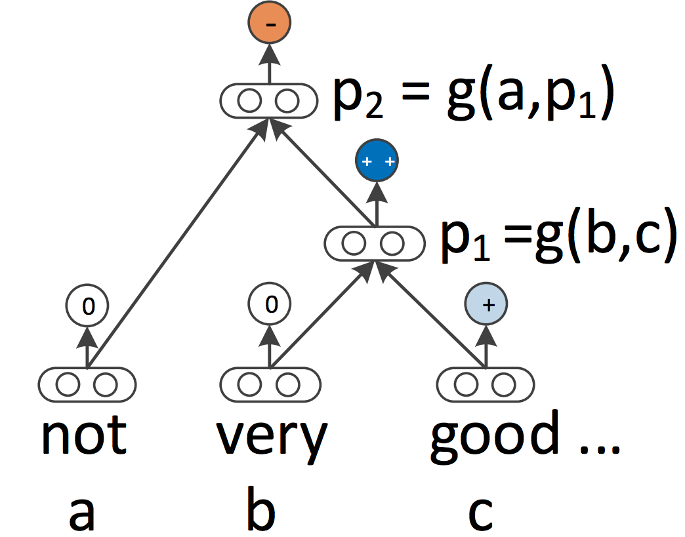

---

<style scoped>section { font-size:30px; }</style>

## Cadenes de Markov


- Els models ocults de Markov (HMM) són models estocàstics que permeten modelar seqüències de paraules.

- Es basen en la idea que les paraules d’una seqüència no són independents, sinó que depenen de les paraules anteriors.

- Els HMM són capaços de modelar la probabilitat de transició entre paraules.

- El seu principal desavantatge és que no poden modelar dependències a llarg termini.

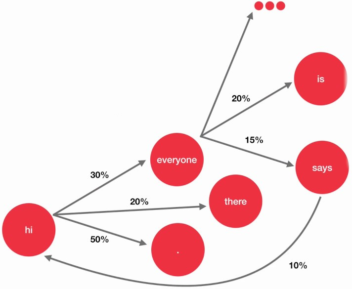

---

<!-- 
_class: invert lead
-->


<style scoped>
h1, p {
  color: #FFFFFF;
  font-weight: bold;
  text-shadow:
    0px 0px 3px #000000;
}
</style>


## Transformers


---

### Introducció

* Com ja hem comentat anteriorment, els **transformers** són models basats en xarxes neuronals que utilitzen el mecanisme d'**atenció**.
* Són els models més utilitzats en l'actualitat en el processament del llenguatge natural.
* La seva arquitectura innovadora permet obtenir resultats molt millors que els models anteriors i aprofitar el **parallelisme** i les **GPU**.
* Per la seva complexitat anem a veurel's en més detall.

---

### Orige

* Els transformers van ser introduïts per **Vaswani et al.** en el 2017.
    * El paper original es titula "_Attention is All You Need_".
* Els transformers van ser dissenyats per a millorar el rendiment dels models de llenguatge.
* El seu primer ús va ser en la tasca de traducció automàtica.
* Va posar en primer pla el mecanisme d'atenció com a eina fonamental en el processament del llenguatge natural.

---

### Arquitectura dels transformers (I)

* Els transformers són models moderns i molt complexos.
* Per contra, si veiem les seves parts per separat, és més fàcil entendre'l's.
* Anem a veure punt per punt les seves parts principals i com funcionen.


---

<style scoped>section { font-size:33px; }</style>

### Arquitectura dels transformers (II)

* En un nivell superficial, els transformers funcionen com una caixa negra.
* Reben com a entrada un text i generen com a sortida un text.
* La seva complexitat rau en la seva arquitectura interna.
* Els transformers tenen *dos* parts principals: **encoders** i **decoders**.

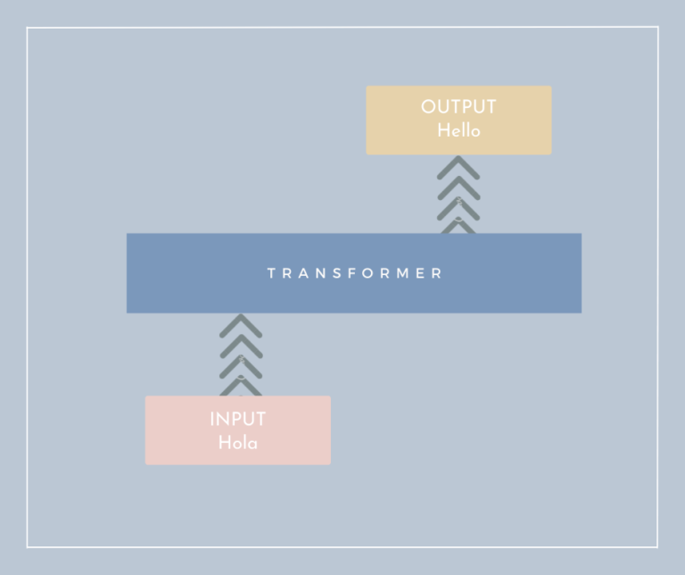

---

<style scoped>section { font-size:33px; }</style>

### Arquitectura dels transformers (III)

* L'entrada passa per una sèrie de capes d'encoders.
* A continuació, la sortida dels encoders passa per una sèrie de capes de decoders.
* En el paper original: **6 capes d'encoders i 6 capes de decoders**.
* També podem passar un "**target**" com a entrada, **per entrenar**

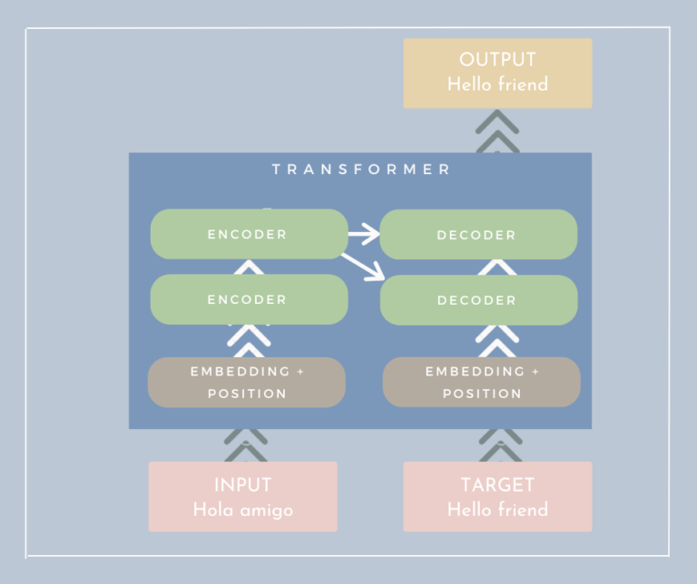

---

<style scoped>section { font-size:30px; }</style>

### Encoders i decoders

* Els **encoders** i **decoders** són les parts principals dels transformers.
* A nivell intern son semblants i comparteixen moltes característiques.
    * Tenen en l'entrada una (o més) capa d'**atenció** i com a sortida una capa **feed-forward**.
* La diferència principal és que els **encoders** solament tenen una capa d'atenció, mentre que els **decoders** tenen dues.

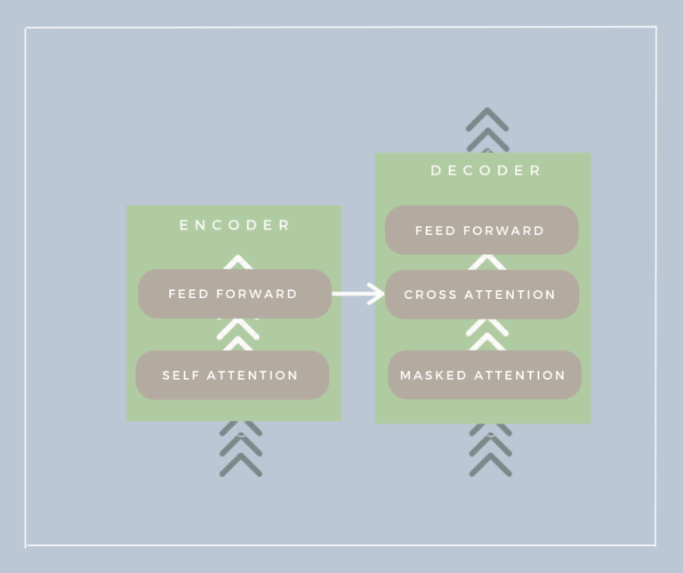

---

<style scoped>section { font-size:30px; }</style>

### Embeddings i posicions

* Els transformers utilitzen **embeddings** per a representar les paraules (de 512 dimensions en el paper original).
* A més, utilitzen el **positional encoding** per a representar la posició de les paraules en la seqüència.
    * Básicament una funció sinusoidal que varia segons la posició de la paraula, per lo que el mateix vector en diferents posicions serà un poc diferent.
    * $$PE_{(pos, 2i)} = \sin(pos / 10000^{2i/d_{model}})$$
* Aquest encoding manté la informació de la posició de les paraules en la seqüència; al mateix temps que permet **enviar tots els tokens a la xarxa al mateix temps**.

---

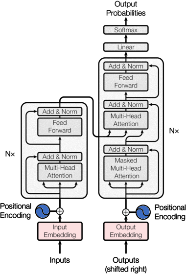

---

### Encoder

* Els **encoders** estan compostos per tres capes:
    * **Self-attention**: per a calcular la importància de cada paraula en la seqüència. A continuació veurem com funciona.
    * **Feed-forward**: per a processar la informació obtinguda de l'atenció.
    * **Normalization i conexions residuals**: per a evitar el desvaiment del gradient i facilitar el seu entrenament.

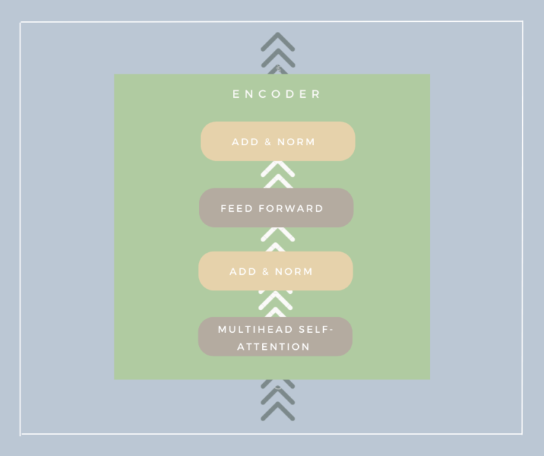

---

<style scoped>section { font-size:31px; }</style>

### Self-attention (I)

* El **self-attention** és el mecanisme clau dels transformers.
* Permet a la xarxa "centrar-se" en les parts importants de la seqüència.
    * Ex: en la frase _"El gat gris va a la casa"_ sabem que $gris$ i $gat$ estan relacionats. Com ho pot saber la xarxa?
* Els transformers creen un "**Soft dictionary**" d'atencions en les paraules de la seqüència. Així, l'atenció de $gris$ en $gat$ serà $1$ i en $casa$ serà $-1$.
* El que el diccionari siga "soft" vol dir que pot anar modificant-se.
    * En la frase "El gat va a la casa gris" l'atenció de $gris$ en $casa$ serà $1$.

---

<style scoped>section { font-size:34px; }</style>

### Self-attention (II)

* Per calcular el self-attention es generen tres matrius a partir de la seqüència d'entrada: **Q** (query), **K** (key) i **V** (value)
* **Q** i **K** són matrius que representen la seqüència d'entrada i **V** és la matriu que representa el valor de cada paraula.
* Per obtindre l'atenció multiplicarem **Q** per la transposada de **K**
    * Obtindrem la similitud entre les paraules.
* El resultat el multiplicarem pel valor de **V**.
    * Obtindrem la matriu d'atencions.

---

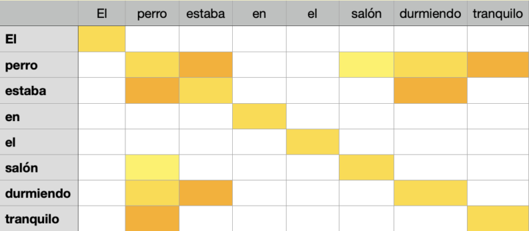

---
<style scoped>section { font-size:32px; }</style>

### Self-attention (III)

* Els transformers utilitzen el **multi-head attention**.
* Aquesta tècnica consisteix en calcular el self-attention amb diferents grups de dimensions.
* Els transformers utilitzen **8** caps de self-attention en el paper original.
* Dels resultats es fa un promig i el resultat, segons els estudis es molt més significatiu.
* És important ressaltar que tot el procñes d'atenció es paral·lel i accelerat per la GPU (multiplicació de matrius), per lo que es molt ràpid.

---

<style scoped>section { font-size:31px; }</style>

### Altres tipus d'atenció

* A més del **self-attention**, els transformers utilitzen altres tipus d'atenció:
    * **Cross-attention**: les entrades del decoder són les sortides de l'encoder. Això permet al encoder condicionar el decoder, donant-li informació sobre el context.
    * **Masked attention**: en el decoder, les paraules futures no poden ser utilitzades per a calcular l'atenció. Això evita que el model "mire al futur".

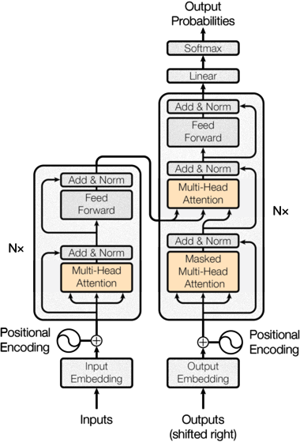

---

<style scoped>section { font-size:35px; }</style>

### Normalització i conexions residuals

* Les conexions residuals són una tècnica que permeten evitar el desvaiment del gradient.
    * Aquest problema es produeix quan les xarxes són molt profundes.
    * Les conexions residuals permeten que els valors d'entrada es mantinguen en les capes posteriors.
* La normalització permet que els valors d'entrada es mantinguen en un rang determinat.
    * Això facilita el seu entrenament i millora el seu rendiment.

---

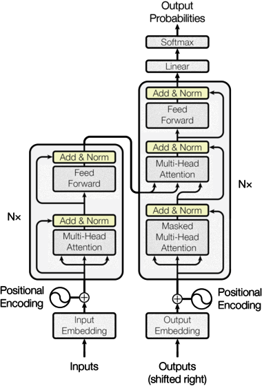

---

<style scoped>section { font-size:32px; }</style>

### Feed-forward

* La capa **feed-forward** és una capa de xarxa neuronal normal.
* La seva funció és processar la informació obtinguda de l'atenció.
* Hi haurà dues capes de _dropout_ per a evitar l'overfitting i una funció d'activació no lineal (ReLU en el paper original).

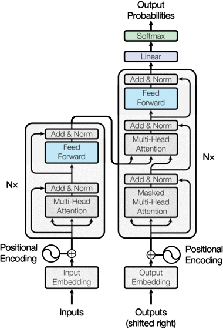

---

<style scoped>section { font-size:33px; }</style>

### Decoder

* Els **decoders** són molt semblants als **encoders**.
* En els models normals en l'entranament utilitzem la sortida esperada per validar el resultat.
* Per contra, en els models de llenguatge, el **target** es passa com a entrada per a entrenar el model.
* Això permet que el model aprenga a generar el text de sortida.

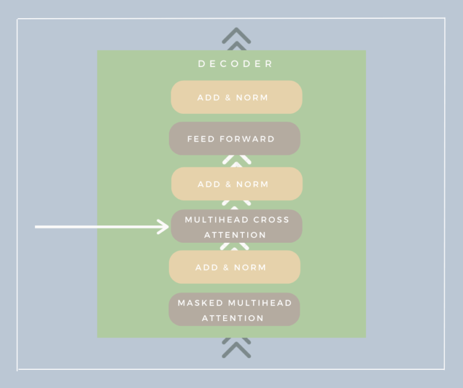

---

### Sortida final del model

* Recordem que utilitzem múltiples capes d'encoders i decoders.
* La sortida final del model és la sortida de l'última capa de decoders i passa per una capa de **softmax**.
* Aquesta sortida és un vector de longitud igual al nombre de paraules del vocabulari.
* Aquest vector representa la probabilitat de cada paraula en el vocabulari (de 0 a 1).
* La paraula amb més probabilitat serà la paraula de sortida.

---

<style scoped>section { font-size:30px; }</style>

### Aplicacions dels transformers

* Poden ser utilitzats en moltes tasques de NLP pero més enllà del NLP també s'utilitzen en altres tasques com les següents:
    * **Visió per computador**: s'està utilitzant per la classificació d'imatges i altres. _Vision Transformer (ViT)_.
    * **Series temporals**: les seqüències de paraules són molt semblants a les seqüències de fets en el temps.
    * **Generatius**: s'utilitzen per a generar textos, imatges, etc.
    * **Aprenentatge per reforç**: s'utilitzen per a entrenar agents en entorns complexos.

* Tots aquests usos els fan una eina molt potent i que poden arribar a substituir molts dels models actuals.