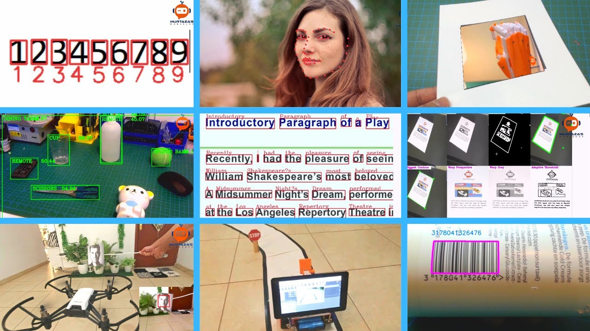
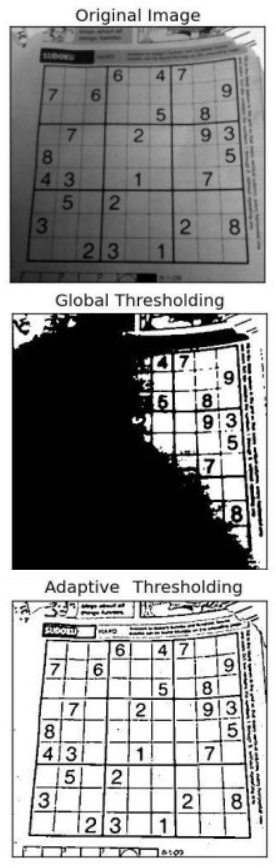
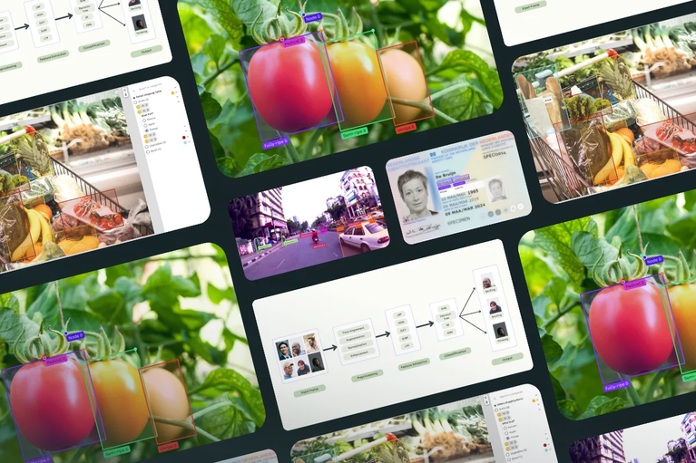

# 8. Visió artificial

Models d'intel·ligència artificial

---

# Introducció

- La visió artificial és una de les àrees més antigues de la intel·ligència artificial.
- Els primers sistemes de visió artificial van ser desenvolupats a la dècada dels 60.
- Els sistemes de visió artificial són capaços d'analitzar imatges i vídeos per tal d'extreure'n informació.
- Veurem quins són els conceptes bàsics de la visió artificial i com s'apliquen en la pràctica.

---

# Visió

- Procés de **percepció**, on el sistema visual és capaç de construir una representació (_imatge_) a partir de la informació captada per la retina.
- Aquest procés pot ser **actiu** (quan l'observador mou els ulls) o **passiu** (quan l'observador no mou els ulls).
- La visió artificial pura és un procés **passiu**, molts conceptes, però, com la **localització** o la **reconstrucció 3D** requereixen un procés **actiu**.

---

## Enfocaments

- Hi ha dos enfocaments principals per a la visió artificial:
  - **Extracció de característiques**:
    - S'apliquen una serie de **transformacions** a la imatge per tal d'extreure característiques rellevants (_vores_, _textura_, _fluix òptic_, _segments_, entre d'altres).
  - **Basat en models**:
    - S'utilitzen models matemàtics (_geomètrics_ o _estadístics_) per tal de representar la imatge.
- En la pràctica, sovint es combinen ambdós enfocaments.

---

## El color (I)

- Propietat de la llum que depèn de la seva longitud d'ona.
- Els humans el percebem el a partir d'unes cèl·lules receptores de la retina: els **cons**.
  - Hi ha tres tipus de cons:
    - **L** (longitud d'ona llarga)
    - **M** (longitud d'ona mitjana)
    - **S** (longitud d'ona curta)
  - Cada tipus de cons és sensible a un rang de longituds d'ona i, per tant, a un rang de colors.

---

## El color (II)

- **Principi de tricromia**: qualsevol color es pot representar com una combinació de tres colors primaris.
- **Colors primaris** 
  - Aquells que no es poden descompondre en altres colors.
  - **blau**, **verd** i **vermell**.
- Espais de color: RGB, HSV, YUV, ...
- El més utilitzat en visió artificial és el **RGB** (**R**ed, **G**reen, **B**lue).

---

<!-- 
_class: invert lead
-->

# Característiques de les imatges

---

## Definició

- En una imatge hi ha molta informació que no és rellevant.
- Per les tasques de visió artificial es solen utilitzar **característiques** de les imatges.
- Les característiques són aquelles parts de la imatge que són rellevants per a la tasca que es vol realitzar.
- Ens centrarem en quatre característiques de les imatges quasi sempre rellevants.
  - _Vores_, _textura_, _fluix òptic_ i _segmentació_.

---

## Vores

- **Línees que separen regions de diferent intensitat**.
- Permeten **identificar objectes**.
- Simplifiquen la imatge i permeten **reduir la quantitat d'informació**.
- Passem d'una imatge molt gran a una **matriu de vores**

---

### Detecció de vores

- Tasca de visió artificial que consisteix en detectar les vores d'una imatge.
- Hi ha molts algoritmes per detectar vores, però el més utilitzat és l'algoritme de **Canny**, per John F. Canny, que el va publicar el 1986.
- Objectius:
  - **Bona detecció**: detectar totes les vores.
  - **Bona localització**: les vores han de ser el més pròximes possible a les vores reals.
  - **Minimitzar les respostes falses**

---

### Algoritme de Canny

- Consisteix en quatre passos principals:
  1. Es redueix el soroll: **filtre de Gauss**.
  2. Calcula el gradient de la imatge: **filtre de Sobel**.
  3. Es detecten les vores: **mètode de supressió de no-màxims**.
  4. Es decideixen quines vores són vàlides: **mètode de la histèresi**.

---

## Textura

- En visió artificial entenem com a textura un **patró de píxels** que es observable en una imatge.
  - Ex: Finestres en un edifici, taques en una vaca, etc.
- Ajuden, al igual que les vores, a **identificar objectes**.

---

### Característiques de la textura

- La textura pot ser més o menys regular, per lo que es freqüent utilitzar un model de **tesel·les** per descriure-la. Vejam algunes característiques:
  
  - **Tesel·la**: patró que es repeteix en una imatge.
  - **Tesel·lació**: procés de cobrir una superfície amb tesel·les.
  - **Tipus**:
    - **Regulars**: es repeteixen sempre de la mateixa manera.
    - **Irregulars**: no hi ha un patró clar de repetició.
  - **Escala**: la textura pot ser més o menys gran.

---

### Utilitats de la textura

  - **Identificació**: permet identificar objectes. Ex: un cavall té una textura diferent a la d'una zebra.
  - **Correspondència**: permet trobar zones corresponents en diferents imatges. Important en la reconstrucció 3D.
  - **Segmentació**: permet separar la imatge en diferents regions.
  - **Reconstrucció**: permet reconstruir la imatge a partir de les tesel·les.
  - **Classificació**: permet classificar objectes.

---

## Fluix òptic

- El **fluix òptic** és la **velocitat aparent** amb la que es mouen els objectes entre dues imatges.
- Els algoritmes de visió artificial són capaços de calcular el fluix òptic a partir de diferents imatges.
- Important per moltes tasques: **reconstrucció 3D**, la **compensació de moviment**, **compressió**...

---

## Segments

- Anomenen **segments** a les **regions** de la imatge que tenen alguna propietat comuna (color, textura, forma, etc.).
- Per definit els segments hi ha dós enfocaments principals:
  - **Basat en límits**: es busquen els límits de les regions. Es pot entendre com un problema de *classificació* on cada pixel pertany o no a un segment i es soluciona amb tècniques de machine learning i models preentrenats.
  - **Basat en regions**: s'agrupen els pixels en regions segons alguna propietat comuna. Es pot entendre com un problema de *clustering* i s'utilitzen tècniques com _k-means_.

---

---

<!-- 
_class: invert lead
-->

# Tasques de visió artificial

---

## Tasques

- Les tasques de visió artificial són aquelles que es poden realitzar a partir d'imatges.
- Hi ha moltes tasques de visió artificial, però totes tenen en comú que es basen en l'**anàlisi** de les imatges.
- Veurem algunes de les més importants:
  - **Processament d'imatges**
  - **Classificació d'imatges**
  - **Reconeixement d'objectes**
  - **Segmentació**

---

## Processament d'imatges

- El **processament** d'imatges és el conjunt de tècniques que s'apliquen a les imatges per tal de millorar-ne la qualitat o per tal d'extreure'n informació.
- Històricament, el processament d'imatges era la única forma de obtidre resultats en visió artifical, amb l'aparició de les xarxes neuronals, però, aquesta tasca ha perdut importància.
- Tot i això, segueix sent una tasca important en visió artificial, especialment en tasques de visió artificial més tradicionals o **quan no hi ha GPUs disponibles**.
- Veurem algunes de les tècniques més comunes.

---

### Histogrames

- El **histograma** d'una imatge és la representació gràfica de la distribució dels píxels en funció de la seva intensitat.
- Els histogrames són molt útils per entendre la distribució dels píxels en una imatge.
- Son molt utilitzats en el preprocessament d'imatges per tal de normalitzar-les.
- Els histogrames es poden calcular per cada canal de color (R, G, B) o per la imatge en escala de grisos.
- S'utilitzen molt en la **normalització** d'imatges.

---

---

### Equalització de l'histograma

- L'**equalització de l'histograma** és una tècnica que es fa servir per tal de millorar el contrast d'una imatge.
- L'objectiu és que la distribució dels píxels sigui més uniforme.
- Es divideix l'histograma en _bins_ i es redistribueixen els píxels de manera que la distribució sigui més uniforme.
- El resultat poden no ser realistes, però si útils per a tasques de visió artificial.

---

### Filtratge

- El **filtratge** és una tècnica que es fa servir per tal de millorar la qualitat de la imatge.
- Hi ha molts tipus de filtres, però els més comuns són els filtres de **suavitzat** i els filtres de **realçament**.
- Els filtres de suavitzat són útils per tal de reduir el soroll de la imatge.
- Els filtres de realçament són útils per tal de millorar el contrast de la imatge.
- Els filtres es poden aplicar a tota la imatge o a una regió concreta.

---

#### Filtres de suavitzat

- El soroll és un problema comú en les imatges.
- Podem reduir el soroll de la imatge aplicant filtres de suavitzat. Els més comuns són el **filtre de mitjana** i el **de Gauss**.
- Filtre de mitjana: substitueix cada píxel per la mitjana dels píxels del seu entorn.
- Filtre de Gauss: substitueix cada píxel per la mitjana ponderada dels píxels del seu entorn.
  - Els píxels tenen un pes més gran com més propers estan al píxel central.

----

#### Filtres de realçament

- Els filtres de realçament són útils per tal de millorar el contrast de la imatge. Molt utilitzats enla detecció de vores.
- Els filtres més comuns són:
  - **Filtre de Sobel**: 
    - Calcula el gradient de la imatge, és a dir, la intensitat de canvi de la imatge.
  - **Filtre de Laplace**:
    - calcula el laplacià de la imatge, és a dir, la segona derivada de la imatge.

---

### Thresholding

- El **thresholding** és una tècnica que es fa servir per tal de binaritzar una imatge.
- Apliquem un **llindar** a la imatge; els píxels que tenen una intensitat superior al llindar es converteixen en blancs i els que tenen una intensitat inferior es converteixen en negres.
- És una forma simple de **segmentació**: es vol separar la imatge en *objecte* i *fons*.
- Per binaritzar, sol ser millor opció que ajustar la lluminositat i el contrast.

---

### Transformacions

- Les **transformacions** són tècniques que es fan servir per tal de canviar la forma de la imatge.
- Les transformacions més comunes són:, **rotació**, **escala**, **desplaçament** i **canvis de perspectiva**.
- Es divideixen en **lineals** i **no lineals**: segons si canvien la forma de la imatge.

---

### Extracció del fluix óptic (_optical flow_)

- L'**extracció del fluix òptic** és pot fer amb diferents tècniques, però es poden dividir en dos grans grups:
  - **Discrets**: es calcula el fluix òptic per punts concrets de la imatge. Rápids, però poc precisos.
    - L'algorisme més comú és el de **Horn-Schunck**.
  - **Densos**: es calcula el fluix òptic per cada píxel de la imatge. Més costós computacionalment, al comptar en més punts.
    - Els algorismes més comú son el de **Lucas-Kanade** i el de **Farnebäck**.

---

### Extracció del fluix óptic (_optical flow_)

---

### Llibreries

- Hi ha moltes llibreries que es poden fer servir per tal de fer el preprocessament d'imatges.
- Les més comunes són:
  - **OpenCV**: llibreria de visió artificial i machine learning.
    - Per visió artificial, és la més utilitzada.
  - **Pillow**: llibreria de processament d'imatges.
  - **Scikit-image**: llibreria de processament d'imatges.
  - **Mahotas**: llibreria de processament d'imatges.
  - **SimpleCV**: llibreria de visió artificial.

---

## Classificació d'imatges i reconeixement d'objectes

- Aquestes tasques consisteixen en **identificar** els objectes que hi ha a la imatge.
- La **classificació d'imatges** consisteix en **identificar** l'objecte que hi ha a la imatge.
- El **reconeixement d'objectes** consisteix en **identificar** els objectes que hi ha a la imatge i **localitzar-los**.
- Ambdues tasques són molt importants en visió artificial i són la base de moltes aplicacions.

---

### Classificació d'imatges

- La majoria de sistemes actuals de classificació d'imatges es basen en l'**aparença** (textura, color, forma, etc.) de l'objecte; però, hi ha sistemes que també fan servir la geometria.
- Dues dificultats principals:
  - **Variabilitat de l'objecte**: els objectes poden tenir moltes aparences diferents (dos gossos poden ser molt diferents).
  - **Variabilitat de la imatge**: la mateixa imatge pot tenir moltes aparences diferents (llum, ombra, etc.).
- Les xarxes neuronals convolucionals són les més utilitzades per aquesta tasca.

---

#### Xarxes neuronals convolucionals

- Les **xarxes neuronals convolucionals** (XNN) són un tipus de xarxes neuronals, especialment dissenyades per processar dades en forma de matrius; com poden ser les imatges.
- Les xarxes neuronals convolucionals són molt bones per a tasques de classificació d'imatges.
- Com la resta de xarxes neuronals, les xarxes neuronals convolucionals necessiten ser entrenades amb moltes dades numèriques.
- Veurem a continuació com es passarán les imatges per la xarxa.

---

#### Convolució

- La **convolució** permet reduir la quantitat d'informació de la imatge i ens permetrá enviar a la xarxa solament les **característiques més rellevants.** .Aquest procés millora la precissió de la xarxa i la fa més ràpida.
- La convolució es fa amb **filtres** que es van aplicant a la imatge (matrius de mida petita - 3x3, 5x5, etc.).
- El resultat de la convolució es una **imatge més petita** que l'original, anomenada **mapa de característiques**.
- Si no volem reduir la mida de la imatge, podem fer servir **padding**.

---

#### Convolució

---

#### Funcions d'activació

- Després de la convolució, s'aplica una **funció d'activació**.
- Les funcions d'activació són funcions que apliquen una **no linealitat** a la imatge.
- La més utilitzada en xarxes neuronals convolucionals és la **ReLU**. Els valors negatius es converteixen en zero i els positius es mantenen igual.
- La funció d'activació és molt important per tal de que la xarxa mantingui la **capacitat de generalització**.
- Després de la funció d'activació, es pot aplicar un **pooling**.

---

#### Pooling

- El **pooling** és una tècnica que es fa servir per tal de reduïr la mida de la imatge encara més.
- Hi ha diferents tipus de pooling, però el més comú és el **max pooling**.
- Es sol utilitzar una finestra de mida petita (2x2, 3x3, etc.) i es pren el valor màxim de la finestra.
- El resultat és un **mapa de característiques poolat**. Aquest mapa de característiques es passarà a la següent capa.
- El pooling obliga a la xarxa a ser **invariant a petites transformacions**.

---

#### Regularització

- Després de les capes de convolució i pooling, es solen afegir capes de **regularització**.
- Les capes de regularització són capes que ajuden a la xarxa a **generalitzar**.
- Les capes de regularització més comunes són les capes de **dropout**.
- Aquestes capes eliminen un percentatge de les neurones de la xarxa, fent que no s'actualitzin en cada iteració.
- Això fa que la xarxa no es **sobreajusti**.

---

#### Aplanament i capes totalment connectades

- Entre les capes de regularització i les capes totalment connectades, es sol fer un **aplanament**.
- L'aplanament és el procés de convertir el **mapa de característiques** en un **vector**.
- Aquest vector es passarà a les capes totalment connectades.
- Les capes totalment connectades són les capes que es fan servir per tal de **classificar** la imatge.
- Aquestes capes són les que es fan servir per tal de **reduir la dimensió** del vector de característiques.

---

#### Estructura d'una xarxa neuronal convolucional

---

#### Funcionament d'una CNN (I)

- En les imatges els pixels individuals no tenen gaire sentit
  - Sabem que un 8 tindrà pixels negres en la part central pero no sabem exactament on.
- Els patrons locals si que poden ser importants
  - Sabem que el 0 i el 8 tenen cercles, el 1 i el 7 tenen línies verticals, etc.
- Les relacions entre patrons també son interessants
  - El 1 té dues linies, el 6 una linia i un cercle, etc.
- Estratégia general: **extreure patrons locals i després combinar-los per extreure patrons més globals**

---

#### Funcionament d'una CNN (II)

- Les xarxes neuronals convolucionals (CNN) són una forma de fer això
  - Una capa está formada per una convolució + ReLU
  - La convolució mesura la similitud entre un filtre i la finestra. Cada filtre detecta un patró diferent.
  - La ReLU posa a zero els valors negatius i poténcia els positius, identificant patrons.
  - Si posem una capa darrere, que reba les dades d'altres capes i les combini, l'efecte serà el de tindre una finestra més gran.

---

#### Funcionament d'una CNN (III)

- Si continuem afegint capes, les finestres es faran més grans i més complexes
- Això permetrà identificar patrons més globals
- Finalment, les capes totalment connectades combinaran tots els patrons per tal de classificar la imatge
- Aquesta és la idea bàsica d'una CNN
  - Extreure patrons locals
  - Combinar-los per extreure patrons globals
  - Classificar la imatge

---

#### Arquitectures de xarxes neuronals convolucionals

- Hi ha moltes arquitectures de xarxes neuronals convolucionals aprofitables, però les més conegudes són:
  - **VGG-16**: xarxa de 16 capes. Va aconseguir un 92.7% d'exactitud en el dataset ImageNet en 2014.
  - **ResNet**: xarxa de 152 capes, basada en la idea de **residual learning**. Va aconseguir un 96.4% d'exactitud en el dataset ImageNet en 2015.
  - **Inception**: xarxa de 22 capes, basada en la idea de **factorització de convolucions**. Va aconseguir un 97.3% d'exactitud en el dataset ImageNet en 2015.

---

## Reconeixement d'objectes

- El **reconeixement d'objectes** és una tasca més complexa que la classificació d'imatges.
- Mentres que la classificació d'imatges consisteix en **identificar** l'objecte que hi ha a la imatge, el reconeixement d'objectes consisteix en **identificar** els objectes que hi ha a la imatge i **localitzar-los** (dibuixar un rectangle al voltant de l'objecte - _bounding box_).
- Les classes d'objectes a identificar estaran **predefinides**. D'aquesta manera, el sistema podrà identificar si hi ha un gos, un cotxe, una persona, etc.

---

### Procediment bàsic	

- El procediment básic per fer el reconeixement d'objectes és el següent:
  1. Definim una _finestra_ que es mourà per tota la imatge.
  2. Passem la finestra per tota la imatge i en cada posició passem la imatge per una XNC.
  3. Ens quedem en les puntuacions més altes i ignorem la resta.
  4. Resolem conflictes i reduïm la quantitat de _bounding boxes_.

---

### Problemes en el procediment bàsic

- **Forma de la finestra**: si la finestra és massa gran, no podrem identificar objectes petits. Si és massa petita, no podrem identificar objectes grans.
- **Selecció de finestres**: si passem la finestra per tota la imatge, el procés serà molt lent. Si passem la finestra per poques posicions, podrem perdre objectes.
- **Resolució de conflictes**: si hi ha dues finestres que identifiquen el mateix objecte, quina és la correcta?
- **Determinació del _bounding box_**: com decidim quina és la mida i la posició del _bounding box_?

---

#### Selecció de finestres

- En una imatge de tamany N x N, hi ha N^4 finestres possibles.
- Les finestres amb objectes solen ser coherents en textura i color.
- Les que tallen objectes solen tindre regions o vores que travessen la finestra.
- Necessitem un mecanisme que mesure de forma eficient les probabilitats de que una finestra contingui un objecte.
- Una de les opcions és utilitzar a una **RPN** (Region Proposal Network). 

---

#### Resolució de conflictes

- Si hi ha dues finestres que identifiquen el mateix objecte, com decidim quina és la correcta?
- Una opció és utilitzar un **algorisme de _non-maximum suppression_**.
- Aquest algorisme elimina les finestres que tenen una puntuació baixa, ordena les finestres segons la puntuació i elimina les finestres que tenen una superposició alta amb una finestra amb puntuació més alta.
- Aquest algorisme és molt eficient i permet reduir la quantitat de finestres.

---

#### Determinació del _bounding box_

- Com decidim quina és la mida i la posició del _bounding box_?
- La finestra que identifica l'objecte sol tenir una mida i una posició que no coincideixen exactament amb la mida i la posició de l'objecte.
- Per tal de determinar la mida i la posició del _bounding box_, es fa servir un **algorisme de regressió**.
- Aquest algorisme calcula la mida i la posició del _bounding box_ a partir de la mida i la posició de la finestra, utilitzant les característiques obteses per la XNC.

---

### Models preentrenats

- Entrenar una XNC és una tasca molt costosa.
  - Sovint es fa servir **models preentrenats**
  - XNCs entrenades amb moltes dades i que ha obtingut molt bons resultats.
- Exemples:
  - **Yolo**: xarxa neuronal convolucional per a la detecció d'objectes en temps real. Solament necessita una passada per la imatge i és molt ràpida.
  - **DETR**: Es basa en l'arquitetura Transformer i és capaç de detectar tots els objectes en una sola passada.

---

## Segmentació

- La **segmentació** és una tasca de visió artificial que consisteix en **separar la imatge en diferents regions significatives**.
- L'objectiu principal de la segmentació és **agrupar** els píxels de la imatge en **regions** que tinguin alguna propietat comuna.
- Facilita la **comprensió** de la imatge i permet facilita tasques com la **classificació**, el **reconeixement d'objectes**, el **seguiment**, l'anàlisi d'escenes o la **reconstrucció 3D**.
  
---

### Tipus de segmentació (I)

- Tipus de segmentació:
  - **Segmentació binària** o d'umbral: es segmenta la imatge en dues regions: objecte i fons. (Ex: _thresholding_)
  - **Segmentació per vores**: es segmenta la imatge en regions separades per vores. (Ex: _Canny_)
  - **Segmentació semàntica**: assignem a cada píxel una categoria predefinida. (Ex: _mask-RCNN_)
  
---

### Tipus de segmentació (II)
  
  - **Segmentació en superpíxels**: es segmenta la imatge en superpíxels (regions de píxels compactes i coherents)  (Ex: _SLIC_)
  - **Segmentació d'instàncies**: es segmenta en instàncies d'objectes. (Ex: _mask-RCNN_)
  - **Segmentació panòptica**: es segmenta en categories predefinides, però també es segmenten les instàncies d'objectes. (Ex: _mask-RCNN_)

--- 

---

<!-- 
_class: invert lead
-->

# Aplicacions

---

## Aplicacions

- Fins ara hem vist quins són els conceptes bàsics de la visió artificial i com s'apliquen en la pràctica.
- Les aplicacions s'han multiplicat en els últims anys, gràcies a l'aparició d'un munt de llibreries i models preentrenats.
- Aquesta facilitat ha fet que la visió artificial sigui una de les àrees més actives de la inte, adaptant-se a molts camps i necessitats (mèdiques, industrials, de seguretat, etc.).
- A continuació veurem algunes de les aplicacions més importants.

---

### Percepció de persones

- Les persones són el **motiu més important** de les imatges.
- Entendre el que fan les persones ens permetrá crear **interfícies humà-màquina** més naturals, observant el que fem i actuant en conseqüència.
- Aquesta és una tasca molt complexa, que requereix la combinació de moltes tasques de visió artificial.
- S'ha avançat molt en els últims anys, però encara hi ha molts reptes per resoldre.
- A continuació veurem en que ens pot ajudar.

---

---

#### Usos 
  - **Seguretat**: construir sistemes de seguretat més efectius i menys intrusius.
  - **Urbanisme**: entendre com es mouen les persones per tal de dissenyar millor les ciutats.
  - **Esports**: analitzar videos de partits per tal de millorar l'entrenament i extreure estadístiques.
  - **Estalvi energètic**: engegar i parar sistemes de climatització i llum en funció de la presència de persones.
 
 Molts més, en videojocs, en la indústria, en la medicina, etc.

---

#### Detecció de la postura

- Alguns aspectes com la **detecció de la postura** (determinar la posició de les articulacions) estan molt avançats.
- Es relativament fàcil, ja que les articulacions tenen una forma i una posició concreta, les relacions entre les articulacions són conegudes i els efectes sobre las perspectiva són previsibles.
- Per contra, preveure el que està fent una persona és molt més difícil.

---

#### Descripció de l'acció

- La **descripció de l'acció** és una tasca molt més complexa.
- Consisteix en **entendre** què està fent una persona en una imatge.
- Moltes vegades és necessari **entendre el context** per tal de saber què està fent una persona.
- Aquesta dependència del context fa difícil assegurar el correcte funcionament dels sistemes.
  - Ex: en una piscina es fàcil dir que algú està nedant. Ho ha sabut descriure o simplement ha detectat una piscina?

---

### Creació d'imatges

- Les xarxes neuronals són capaces de **crear imatges** a partir de text o d'altres imatges.
- Un dels usos està relacionat amb el _self-supervised learning_.
  - Quan no tenim moltes dades etiquetades, podem utilitzar xarxes per tal de crear més dades.
  - Aquestes dades poden ser utilitzades per tal de millorar el rendiment de les xarxes.
  - Utilitzarem un _autoencoder_ per tal de crear imatges.

---

#### Autoencoder

- Un **autoencoder** és una arquitectura de xarxa neuronal que es fa servir per tal de **reconstruir** la imatge d'entrada; moltes vegades, però, amb modificacions.
- L'autoencoder té tres parts:
  - **Encoder**: pren la imatge d'entrada i la converteix en un **vector de característiques**.
  - **Bottleneck**: el vector de característiques. És la part més important de l'autoencoder.
  - **Decoder**: pren el vector de característiques i el converteix en la imatge d'entrada.

---

---

#### Utilitats de l'autoencoder

- **Reducció de la dimensió**: l'autoencoder pot ser utilitzat per tal de reduir la dimensió de la imatge. 
- **Denioising**: al generar el vector de característiques, guardem la informació més important de la imatge, eliminant el soroll.
- **Super-resolució**: partim d'una imatge de baixa resolució i la convertim en una imatge de alta resolució.
- **Creació d'imatges**: la part del decoder pot ser utilitzada per tal de crear imatges, partint de vectors de característiques aleatoris.

---

### Autoencoders Variacionals

- Els **autoencoders variacionals** són una variant dels autoencoders que permeten generar imatges.
- El punt de partida és el mateix, però no generar un vector de característiques, sino una **distribució de probabilitat** que es fa servir per tal de generar imatges.
- Generarem imatges amb un aspecte similar a les imatges d'entrada, però no iguals.

---

### GANs (Generative Adversarial Networks)

- Les **GANs** són un tipus de xarxes neuronals que es fan servir per tal de generar imatges.
- Les GANs estan formades per dues xarxes:
  - **Generador**: genera imatges a partir de vectors de característiques aleatoris.
  - **Discriminador**: intenta distingir entre imatges reals i imatges generades.
  - Les dues xarxes es **entrenen enfrontades**. El generador intenta enganyar el discriminador i el discriminador intenta no ser enganyat.

---

### GANs (Generative Adversarial Networks)

---

## Control del moviment

- Un dels usos més importants de la visió és el de manipular objectes (agafar-los, moure'ls, etc.) i navegar evitant obstacles. Els vehicles autònoms són un dels exemples més clars, i impliquen una sèrie de tasques:
  - **Control lateral**: mantenir-se dins del carril.
  - **Control longitudinal**: mantenir la distància de seguretat.
  - **Evitar obstacles**: detectar i evitar possibles vehicles, vianants, etc.
  - **Respectar senyals**: Incloent-hi les llums dels semàfors, guàrdies urbans, etc.

---

### Procediment

- El Procediment bàsic consistirà en la generació d'una seqüència de comandes (acceleració, frenada, gir, etc.) que permetin al vehicle complir les tasques anteriorment esmentades.
- Caldrà un model del mon i dels objectes que hi ha al voltant. Teòricament, aquest model es pot crear solament a partir de dades visió, però no és senzill. Ex: Captar la velocitat d'un vehicle a partir de la imatge és difícil.
- En la pràctica, es fa servir una combinació de dades de visió i de sensors (radar, lidar, etc.).

---

### Model del mon

- El **model del mon** és una representació del mon que permet al vehicle preveure el que passarà en el futur.
- Ex: en verd es mostra els llocs on el vehicle pot anar i els objectes es mostren envoltats per  una caixa vermella.

---

### Navegació autònoma

- La tasca de **navegació autònoma** consisteix en **moure's** per un entorn sense la **intervenció humana**.
- Es sol dividir en dues tasques:
  - **Mapeig**: crear un **mapa** de l'entorn. Algunes de les tècniques més comunes són el **SLAM** i el **Simultaneous Localization and Mapping**.
  - **Planificació de trajectòries**: Una vegada el robot té un mapa 3D de l'entorn i sap on és, l'objectiu és **planificar** una **trajectòria** que el porti al seu destí sense col·lisions.

---

### Mapeig i Planificació de trajectòries

---

## Seguiment d'objectes

* El **seguiment d'objectes** és una tasca de visió artificial que consisteix en **seguir** una **sèrie d'objectes** en una **seqüència d'imatges**.
* La **complexitat** del seguiment s'origina de la quantitat d'imatges que poden haber en un video.
  * 24 fps x 60 s x 60 min = **86400 imatges en una hora**.
  * Si contem 8 - 10 objectes =  **més de 800000 objectes**.
* Aquesta tasca és molt important en aplicacions com la **vigilància**, **robots autònoms**,etc.

---

### Tipus de seguiment

- Tractarem els següents tipus de seguiment:
  - **Seguiment d'un sol objecte** (single object tracking - SOT)
  - **Seguiment de múltiples objectes** (multiple object tracking - MOT)
  - **Seguiment de múltiples objectes sense classe semi-supervisat**
  - Segmentació d'objectes en video (VOS)
- Els dos primers són els més comuns, però els altres són també importants i subjectes a investigació.

---

#### Seguiment d'un sol objecte

- El **seguiment d'un sol objecte** consisteix en seguir un sol objecte en una seqüència d'imatges, basant-nos en una anotació manual inicial.
- Al primer frame anotat l'anomenen _template_ i a cadascún dels següents _search area_
- Les xarxes neuronals per aquestes tasques están entrenades per seguir qualsevol objecte del primer frame
  - S'anomenen Xarxes Neuronals Agnòstiques a la Classe (Class Agnostic Neural Networks - CAN).

---

#### Seguiment de múltiples objectes

- El **seguiment de múltiples objectes** **NO** és simplement **SOT pero repetit** per a cada objecte.
- 