

# Integrant la IA en l'educació

Preparant el futur més immediat.

---

## Introducció a la xarrada

- **Intel·ligència Artificial**.
    - Sistemes que realitzen tasques que requereixen intel·ligència humana.
- En molt poc de temps ha canviat la nostra vida.
- A l'educació també hi ha arribat. Com podem aprofitar-la?
- Veurem que ens aporta la IA a l'educació, els **reptes** que planteja i que estem fent a l'IES Benigasló per **integrar-la**.

---

## IES Benigasló

- **IES Benigasló** és un centre públic de **La Vall d'Uixó**.
- Més de **1000 alumnes** i més de **100 professors**.
- ESO, Batxillerat, FP (bàsica, grau mitjà i grau superior) i màster.
    - Els FPs de grau superior es treballa el desenvolupament d'aplicacions web i mòbils.
    - El curs d'especialització en IA i Big Dataés la última incorporació al centre.

---

## IA a l'educació

- **IA** a l'educació és una realitat que ja està aquí, plantejant reptes i oportunitats.
- L'alumnat utilitzarà la IA en la seua vida diària, tot i que que no vullgam o no estiga preparat.
- L'educació ha de preparar l'alumnat per a conviure amb la IA i aprofitar-la.
- La IA pot ajudar a personalitzar l'aprenentatge, millorar l'eficiència en la gestió i obrir noves oportunitats de treball.

- **Com integrar-la?** Dependrá de cada nivell educatiu.

---

## LA IA com a eina inclusiva

- La IA pot ajudar a personalitzar l'aprenentatge, adaptant-se a les necessitats particulars de l'alumnat.
- Pot ajudar a detectar dificultats d'aprenentatge i oferir solucions.
- Pot ajudar a millorar la comunicació amb l'alumnat amb discapacitats.
- Un mateix recurs pot ser adaptat a les necessitats de cada alumne.
    - Detallar millor el procediment
    - Oferir més exemples
    - Adaptar la dificultat

---

<!--
_class:  invert lead
-->

### ESO i CFGM

Coneixent la IA

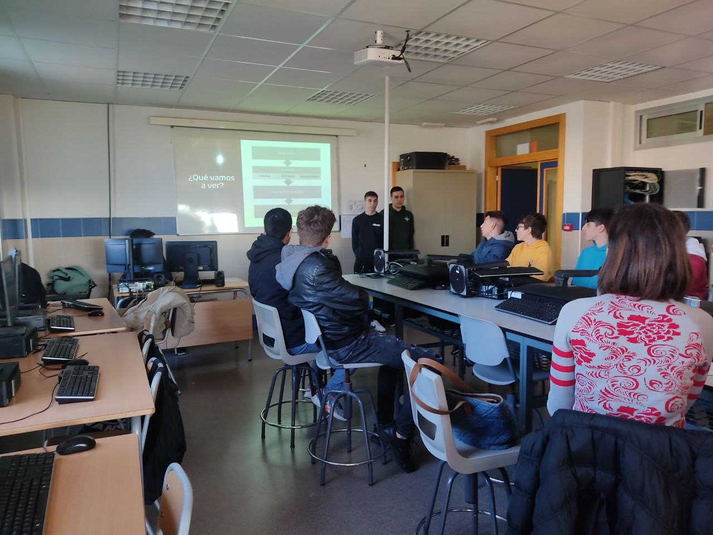

---

#### ESO i CFGM (I)

- **Objectius**:
    - Conèixer els conceptes bàsics de la IA.
    - Entendre com funciona.
    - **Veure exemples d'ús.**
- **Metodologia**:
    - Teoria i pràctica.
    - Treball en grup.
    - Projectes.

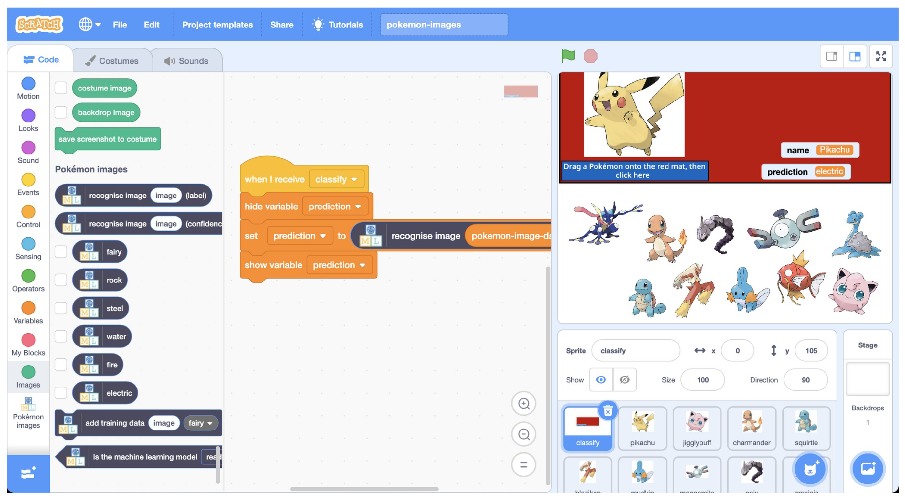

---

#### ESO i CFGM (II)

- **Continguts**:
    - Conceptes bàsics: Algorismes, Dades, Aprenentatge.
    - Aplicacions: Consulta, Jocs, Imatge i Veu, Robòtica.
    - Reflexió ètica: Privacitat, Seguretat.
- **Competències**:
    - Digital, Matemàtica, Lingüística, Social i Cívica.
    - Autonomia i iniciativa personal. Treball en equip.

---

#### Activitats ESO i CFGM - Guiades

- _Generar imatges per treballs_
    - Treballem la competència linguística per obtindre el resultat buscat.
- _Reescrivim textos_
    - Veiem les diferències entre els textos originals i els generats.
- _Generar esquemes, resums e infografies_
    - Ajudem als alumnes a sintetitzar la informació.
    - Tècniques d'estudi.

---

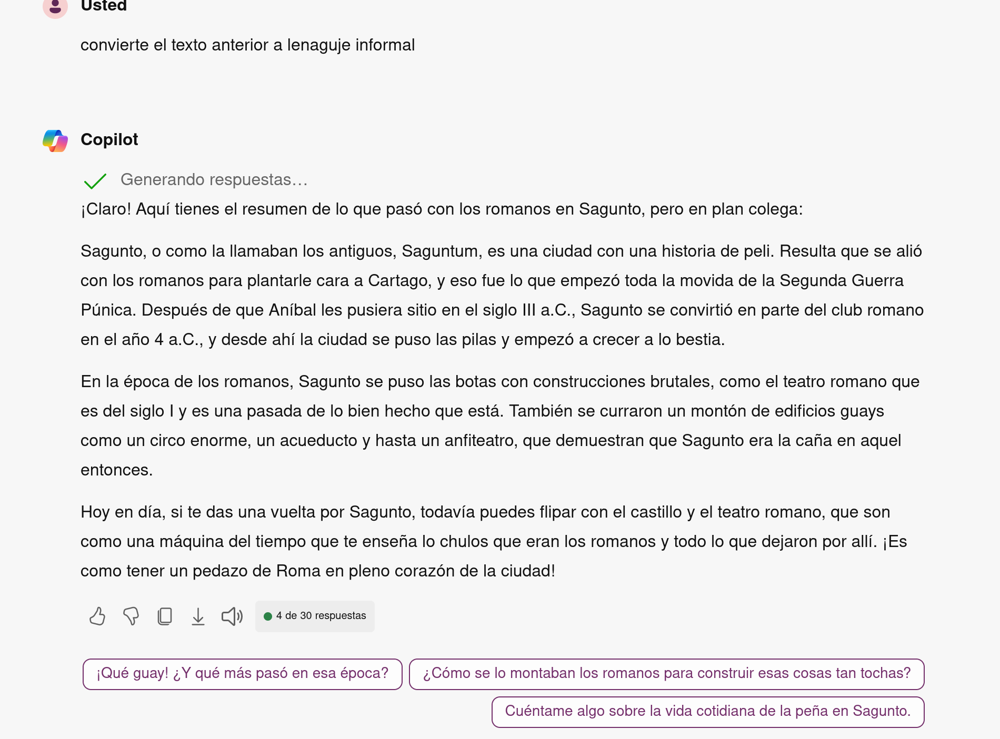

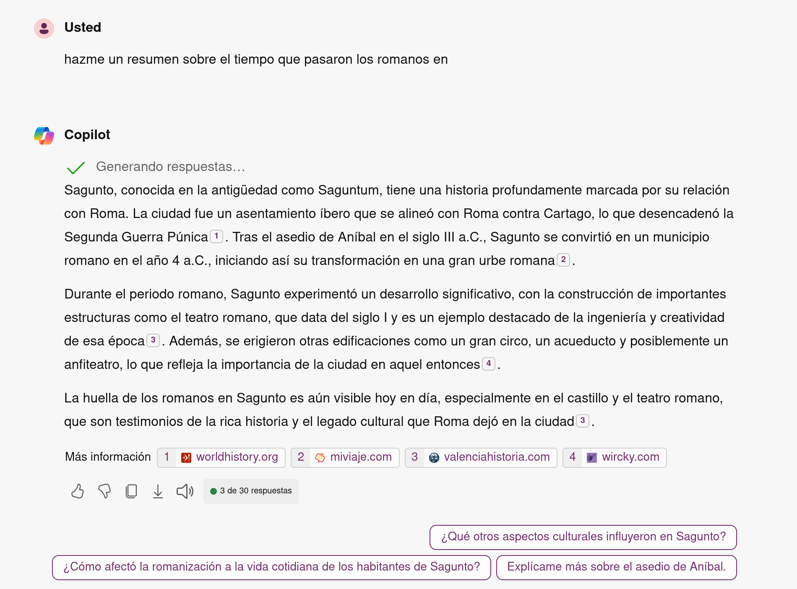

---
<!--
_class:  invert lead
-->

### Batxillerat i FPGS

Aplicant la IA

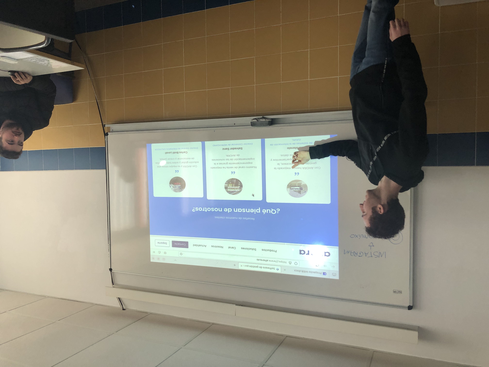

---

#### Batxillerat i CFGS (I)

- **Objectius**:
    - Aplicar la IA en la resolució de problemes.
    - **Desenvolupar projectes amb IA.**
    - Preparar per a estudis superiors i el món laboral.
- **Metodologia**:
    - Projectes.
    - Treball en grup.
    - Col·laboració amb empreses.

---

#### ESO i CFGM (II)

- **Continguts**:
    - Conceptes: Algorismes avançats, dades complexes, processament de llenguatge natural.
    - Aplicacions: utilizació d'assistents de programació, anàlisi documental.
    - Reflexió ètica: Privacitat, Seguretat.
- **Competències**:
    - Digital, Matemàtica, Lingüística, Social i Cívica.
    - Autonomia i iniciativa personal. Treball en equip.

---

##### Activitats en batxillerat

- Normativa APA
    - **Generació de bibliografies** i citacions.
- Investigació de temes
    - **Resumir** i **sintetitzar** la informació.
- Mapes conceptuals
    - **Generar mapes** a partir de textos.

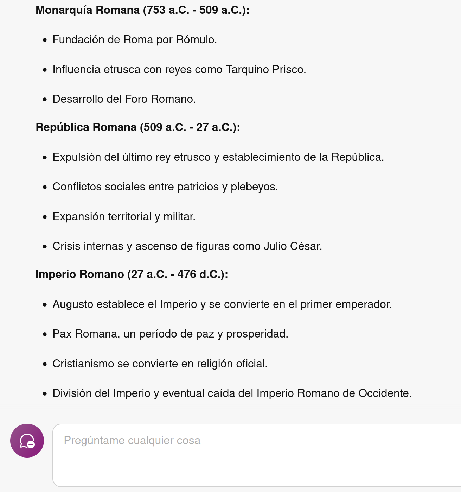

---

#### Activitats en CFGS

- Utilització d'assistents de programació
    - **Generar codi** a partir de preguntes i comentaris.
- Creació de dades de prova
    - **Generar dades fictícies** que es corresponen amb unes especificacions, per a provar els programes.
- Explicacions de codi:
    - Explica **pas a pas** codi complex o desconegut
- Integració en motors de IA:
    - **Utilitzar l'API del ChatGPT** en el nostre programa

.

---
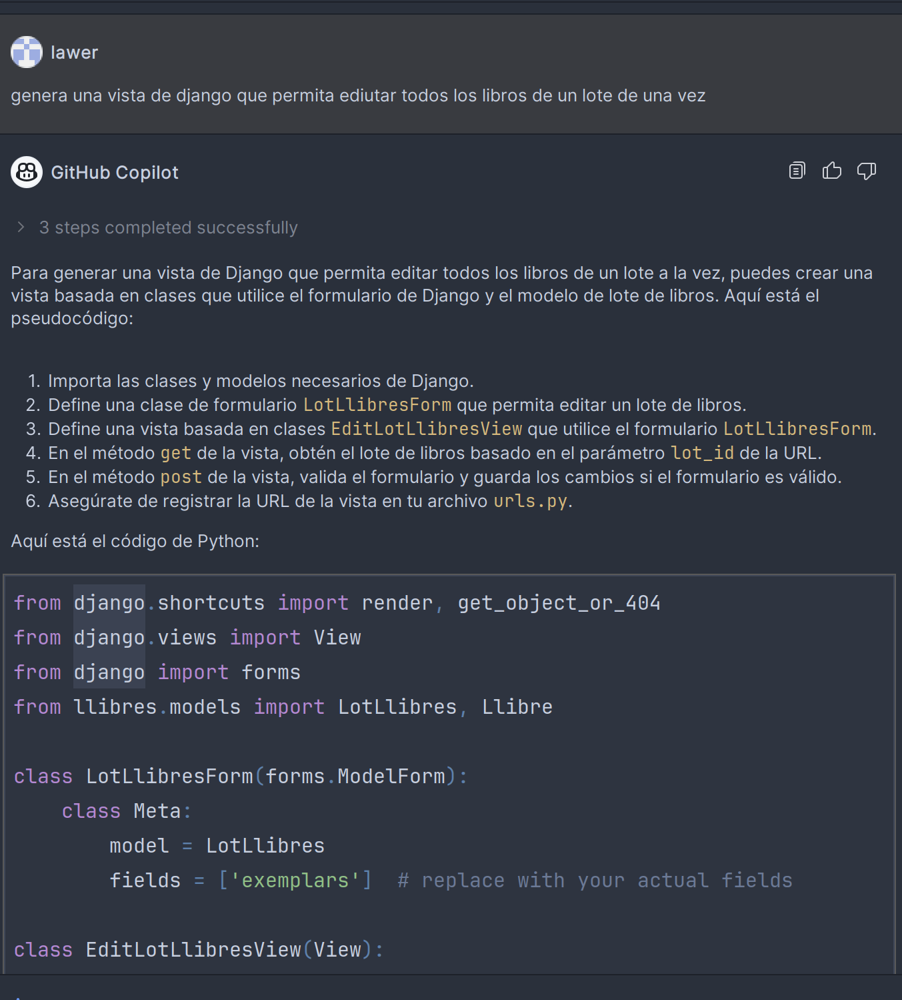
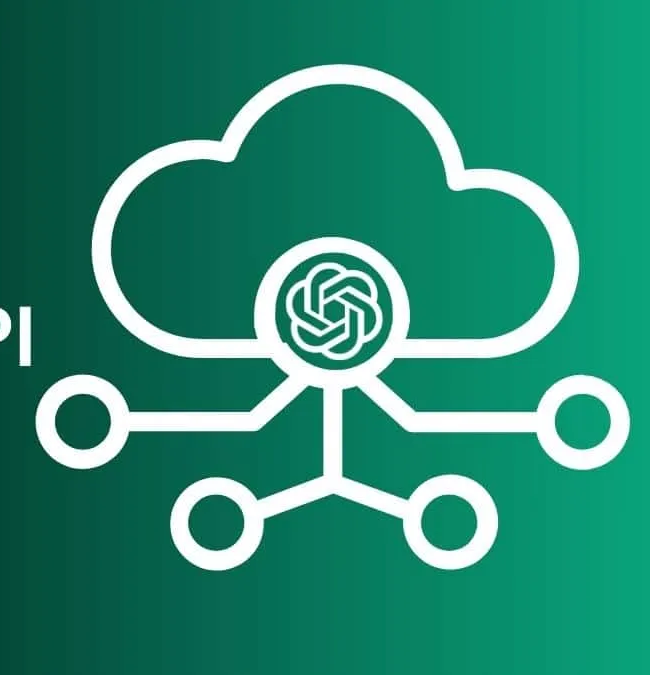
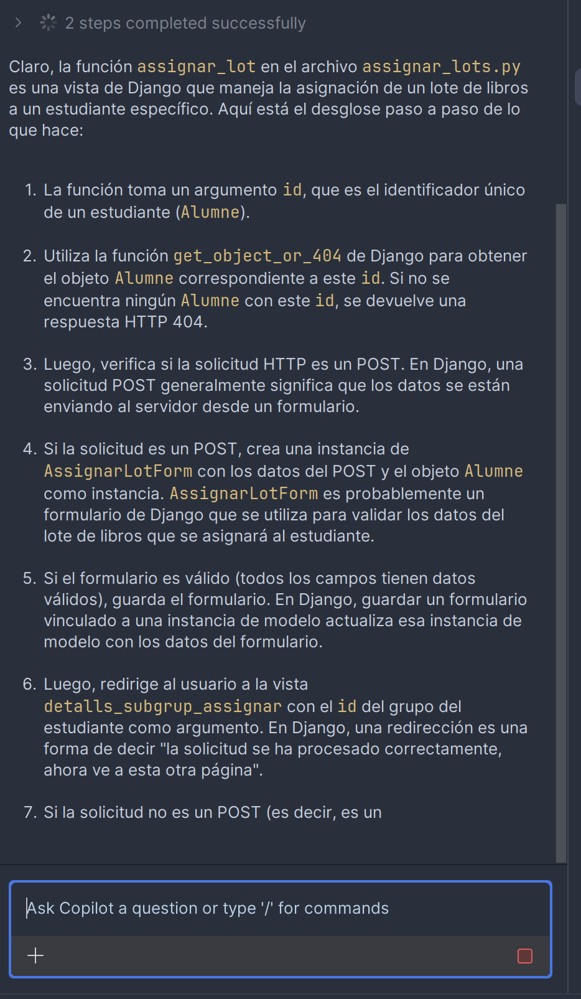

---

<!--
_class:  invert lead
-->

### Curs d'especialització en IA i Big Data

Desenvolupant la IA

---

#### Curs d'especialització (I)

- **Objectius**:
    - Entendre en profunditat el funcionament de la IA.
    - Veure les diferents tècniques i eines que s'utilitzen al món empresarial i acadèmic.
    - Creació de projectes reals amb IA i grans volums de dades.
- **Metodologia**:
    - Projectes.
    - Col·laboració amb empreses.
    - Conferències.

---

#### Curs d'especialització (II)

- **Continguts**:
    - Conceptes avançats de IA: Xarxes neuronals, Algorismes genètics, Lògica difusa, Processament de llenguatge natural, Visió artificial.
    - Aplicacions reals: Xatbots, anàlisi de dades, prediccions en medicina, robòtica industrial.
    - Ètica en la IA: Privacitat, Seguretat, Discriminació.
- **Competències personals**:
    - Pensament crític, Comunicació, Autonomia i iniciativa personal, Treball en equip.

---

#### Activitats curs d'especialització

- **Creació de models predictius**
    - Previsió de vendes en una empresa.
- **Reconeixement d'imatges**
    - Detecció d'objectes en imatges.
- **Processament de llenguatge natural**
    - Generació de textos seguint un patró marcat.
    - Anàlisi de sentiments en tuits i comentaris.
- **Robòtica**
    - Creació de robots que aprenen a moure's utilitzant IA.

---

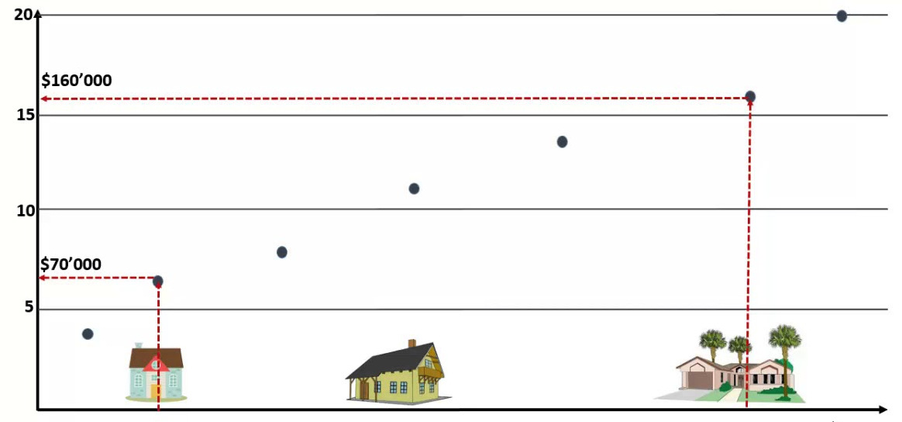

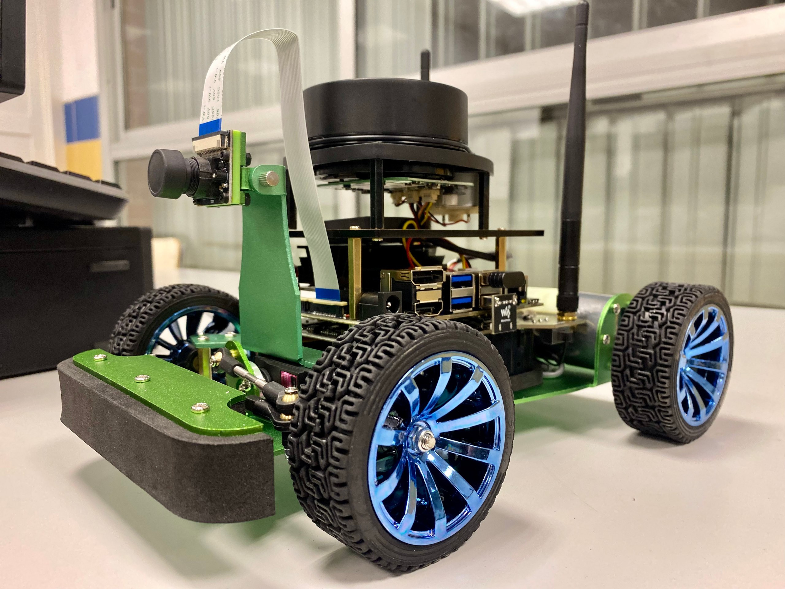

---

<!--
_class:  invert lead
-->

### Preguntes?

---