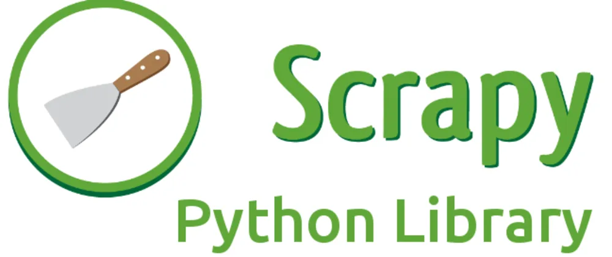
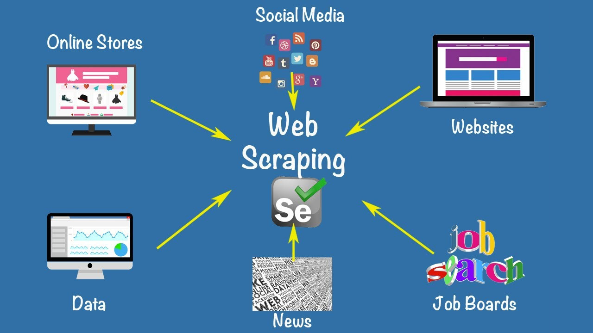
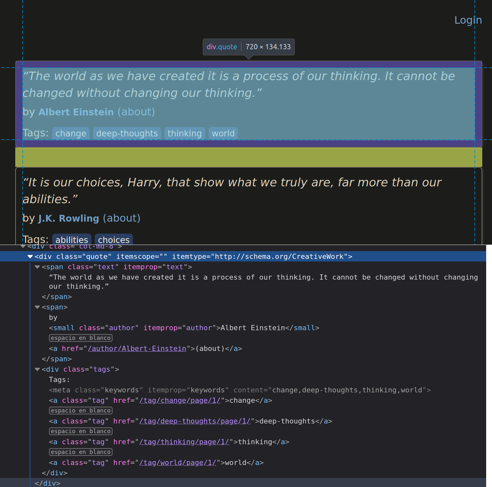

<style scoped>
h1, p {
  color: #FFFFFF;
  font-weight: 800;
  text-shadow:
    0px 0px 3px #000000;
}
</style>





---

## Què és Scrapy?

- Framework de web scraping (rastreig de pàgines web)
- Escrit en Python
- Orientat a la simplicitat i la facilitat d'ús
- Escalable i flexible
- Utilitza Spiders per definir com rastrejar un lloc web
- Pot utilitzar XPath o CSS per seleccionar elements de la pàgina

---

## Casos d'ús

- Recopilació de dades per a anàlisi
- Monitoratge de pàgines web
- Recerca de dades
- Creació de bots
- ...



---

## Instal·lació

```bash
pip install scrapy
```

- Requereix Python 3.6 o superior
- Per evitar problemes deuriem instalar-lo en un entorn virtual

```bash
python -m venv scrapy_env
source scrapy_env/bin/activate
pip install scrapy
```

---

## Exemple: Quotes to Scrape

- Pàgina web amb frases de llibres
- Pensades per ser extretes
- [https://quotes.toscrape.com/](https://quotes.toscrape.com/)
- Volem extreure les frases, els autors i les etiquetes



---

## Creació d'un projecte

```bash
scrapy startproject project_name
```

```
project_name/
    scrapy.cfg
    project_name/
        __init__.py
        items.py
        middlewares.py
        pipelines.py
        settings.py
        spiders/
            __init__.py
```

---

## Components d'un projecte Scrapy

- **Items**: defineixen els elements que volem extreure de la pàgina
- **Spiders**: defineixen com rastrejar la pàgina
- **Pipelines**: processen les dades extretes
- **Middlewares**: processen les peticions i respostes HTTP
- **Settings**: configuració del projecte

---

## Creació d'un Spider (I)

```bash
scrapy genspider quotes quotes.toscrape.com
```

```python
import scrapy

class QuotesSpider(scrapy.Spider):
    name = "quotes"
    allowed_domains = ["quotes.toscrape.com"]
    start_urls = ["https://quotes.toscrape.com"]

    def parse(self, response):
        pass
```

---

## Creació d'un Spider (II)

- Modifiquem parse per extreure dades

```python
def parse(self, response):
    for quote in response.css('div.quote'):
        text = quote.css('span.text::text').get() # extreu el text de l'span amb classe text
        author = quote.css('small.author::text').get() # extreu l'autor
        tags = quote.css('div.tags a.tag::text').getall() # extreu les etiquetes

        yield {
            'text': text,
            'author': author,
            'tags': tags
        }
```

---

## Execució del Spider (I)

Per defecte, el resultat es mostra per pantalla

```bash
scrapy crawl quotes
```


```
2024-06-04 22:33:17 [scrapy.utils.log] INFO: Scrapy 2.11.2 started (bot: quotes_scrap)
...
{'text': '“The world as we have created it is a process of our thinking. It cannot be changed without changing our thinking.”', 'author': 'Albert Einstein', 'tags': ['change', 'deep-thoughts', 'thinking', 'world']}
2024-06-04 22:33:20 [scrapy.core.scraper] DEBUG: Scraped from <200 https://quotes.toscrape.com>
{'text': '“It is our choices, Harry, that show what we truly are, far more than our abilities.”', 'author': 'J.K. Rowling', 'tags': ['abilities', 'choices']}
2024-06-04 22:33:20 [scrapy.core.scraper] DEBUG: Scraped from <200 https://quotes.toscrape.com>
{'text': '“There are only two ways to live your life. One is as though nothing is a miracle. The other is as though everything is a miracle.”', 'author': 'Albert Einstein', 'tags': ['inspirational', 'life', 'live', 'miracle', 'miracles']}
2024-06-04 22:33:20 [scrapy.core.scraper] DEBUG: Scraped from <200 https://quotes.toscrape.com>
{'text': '“The person, be it gentleman or lady, who has not pleasure in a good novel, must be intolerably stupid.”', 'author': 'Jane Austen', 'tags': ['aliteracy', 'books', 'classic', 'humor']}
2024-06-04 22:33:20 [scrapy.core.scraper] DEBUG: Scraped from <200 https://quotes.toscrape.com>
{'text': "“Imperfection is beauty, madness is genius and it's better to be absolutely ridiculous than absolutely boring.”", 'author': 'Marilyn Monroe', 'tags': ['be-yourself', 'inspirational']}
2024-06-04 22:33:20 [scrapy.core.scraper] DEBUG: Scraped from <200 https://quotes.toscrape.com>
{'text': '“Try not to become a man of success. Rather become a man of value.”', 'author': 'Albert Einstein', 'tags': ['adulthood', 'success', 'value']}
2024-06-04 22:33:20 [scrapy.core.scraper] DEBUG: Scraped from <200 https://quotes.toscrape.com>
{'text': '“It is better to be hated for what you are than to be loved for what you are not.”', 'author': 'André Gide', 'tags': ['life', 'love']}
2024-06-04 22:33:20 [scrapy.core.scraper] DEBUG: Scraped from <200 https://quotes.toscrape.com>
{'text': "“I have not failed. I've just found 10,000 ways that won't work.”", 'author': 'Thomas A. Edison', 'tags': ['edison', 'failure', 'inspirational', 'paraphrased']}
2024-06-04 22:33:20 [scrapy.core.scraper] DEBUG: Scraped from <200 https://quotes.toscrape.com>
{'text': "“A woman is like a tea bag; you never know how strong it is until it's in hot water.”", 'author': 'Eleanor Roosevelt', 'tags': ['misattributed-eleanor-roosevelt']}
2024-06-04 22:33:20 [scrapy.core.scraper] DEBUG: Scraped from <200 https://quotes.toscrape.com>
{'text': '“A day without sunshine is like, you know, night.”', 'author': 'Steve Martin', 'tags': ['humor', 'obvious', 'simile']}
2024-06-04 22:33:20 [scrapy.core.engine] INFO: Closing spider (finished)
2024-06-04 22:33:20 [scrapy.statscollectors] INFO: Dumping Scrapy stats:
...
2024-06-04 22:33:20 [scrapy.core.engine] INFO: Spider closed (finished)

```

---

## Execució del Spider (II)

Podem guardar-lo en un fitxer

```bash
scrapy crawl quotes -o quotes.json
```

```json
[
{"text": "“The world as we have created it is a process of our thinking. It cannot be changed without changing our thinking.”", "author": "Albert Einstein", "tags": ["change", "deep-thoughts", "thinking", "world"]},
{"text": "“It is our choices, Harry, that show what we truly are, far more than our abilities.”", "author": "J.K. Rowling", "tags": ["abilities", "choices"]},
{"text": "“There are only two ways to live your life. One is as though nothing is a miracle. The other is as though everything is a miracle.”", "author": "Albert Einstein", "tags": ["inspirational", "life", "live", "miracle", "miracles"]},
{"text": "“The person, be it gentleman or lady, who has not pleasure in a good novel, must be intolerably stupid.”", "author": "Jane Austen", "tags": ["aliteracy", "books", "classic", "humor"]},
{"text": "“Imperfection is beauty, madness is genius and it's better to be absolutely ridiculous than absolutely boring.”", "author": "Marilyn Monroe", "tags": ["be-yourself", "inspirational"]},
{"text": "“Try not to become a man of success. Rather become a man of value.”", "author": "Albert Einstein", "tags": ["adulthood", "success", "value"]},
{"text": "“It is better to be hated for what you are than to be loved for what you are not.”", "author": "André Gide", "tags": ["life", "love"]},
{"text": "“I have not failed. I've just found 10,000 ways that won't work.”", "author": "Thomas A. Edison", "tags": ["edison", "failure", "inspirational", "paraphrased"]},
{"text": "“A woman is like a tea bag; you never know how strong it is until it's in hot water.”", "author": "Eleanor Roosevelt", "tags": ["misattributed-eleanor-roosevelt"]},
{"text": "“A day without sunshine is like, you know, night.”", "author": "Steve Martin", "tags": ["humor", "obvious", "simile"]}
]

```

Altres formats: csv, xml, jsonlines, jl, marshal, pickle, yaml

```bash
scrapy crawl quotes -o quotes.csv
scrapy crawl quotes -o quotes.xml
```

---

<style scoped>section { font-size: 33px; }</style>

## Múltiples pàgines (I)

- Si volem extreure dades de més d'una pàgina podem utilitzar dos mètodes:
    - Si sabem totes les pàgines, podem generar les URLs i afegir-les a `start_urls`
        - Exemple: `start_urls = [f'https://quotes.toscrape.com/page/{ i }' for i in range(1, 11)]`
    - Si no sabem el nombre de pàgines, podem utilitzar el mètode `parse` per extreure la URL de la següent pàgina i la seguim amb `response.follow`. Veurem com fer-ho a continuació.

---

## Múltiples pàgines (II)

```python
def parse(self, response):
    for quote in response.css('div.quote'):
        text = quote.css('span.text::text').get()
        author = quote.css('small.author::text').get()
        tags = quote.css('div.tags a.tag::text').getall()

        yield {
            'text': text,
            'author': author,
            'tags': tags
        }

    next_page = response.css('li.next a::attr(href)').get()
    if next_page is not None:
        yield response.follow(next_page, self.parse)
```

---

<style scoped>section { font-size: 33px; }</style>


## Múltiples pàgines (III)

- `response.css('li.next a::attr(href)').get()` extreu l'atribut `href` de l'element `a` dins de l'element `li` amb classe `next`
- `response.follow(next_page, self.parse)` segueix la URL `next_page` i crida `parse` amb la resposta
    - Podriem definir un mètode diferent per processar la següent pàgina, segons el tipus de contingut

- Per evitar extreure la mateixa pàgina dues vegades, podem utilitzar `response.urljoin(next_page)`. Les urls visitades es guarden a `response.meta['visited']` i podem comprovar si ja hem visitat la pàgina. De totes maneres, Scrapy ja ho fa per nosaltres.

---

## Postprocessament amb pipelines (I)

- Les dades extretes poden ser processades abans de ser guardades
- Per exemple, podem netejar les dades, eliminar duplicats, guardar-les en una base de dades, etc.
- Per activar una pipeline, cal afegir-la a `ITEM_PIPELINES` a `settings.py`

```python
ITEM_PIPELINES = {
    'project_name.pipelines.QuotesPipeline': 300, 
}
# 300 és la prioritat de la pipeline, de 0 a 1000, 
# on 0 és la prioritat més alta
```

---

## Postprocessament amb pipelines (II)

- Creem una pipeline a `pipelines.py` que processi les dades netejant-les i eliminant espais en blanc, per després retornar-les.

```python
class QuotesPipeline:
    def process_item(self, item, spider):
        item['text'] = item['text'].strip()
        item['author'] = item['author'].strip()
        item['tags'] = [tag.strip() for tag in item['tags']]
        
        return item
```

---

## Postprocessament amb pipelines (III)

- Podem afegir tantes pipelines com vulguem, i s'executaran en l'ordre definit a `ITEM_PIPELINES`
- Per exemple, podem guardar les dades en una base de dades

```python
class QuotesPipeline:
    def open_spider(self, spider):
        self.conn = sqlite3.connect('quotes.db')
        self.cur = self.conn.cursor()
        self.cur.execute('CREATE TABLE IF NOT EXISTS quotes (text TEXT, author TEXT, tags TEXT)')

    def process_item(self, item, spider):
        self.cur.execute('INSERT INTO quotes VALUES (?, ?, ?)', (item['text'], item['author'], ', '.join(item['tags'])))
        return item

    def close_spider(self, spider):
        self.conn.commit()
        self.conn.close()
``` 

---

## Postprocessament amb pipelines (IV)

- Podem afegir més funcionalitats a la pipeline, com ara comprovar si les dades ja existeixen a la base de dades abans de guardar-les

```python
class QuotesPipeline:
    def open_spider(self, spider):
        self.conn = sqlite3.connect('quotes.db')
        self.cur = self.conn.cursor()
        self.cur.execute('CREATE TABLE IF NOT EXISTS quotes (text TEXT, author TEXT, tags TEXT)')

    def process_item(self, item, spider):
        self.cur.execute('SELECT * FROM quotes WHERE text = ? AND author = ?', (item['text'], item['author']))
        if not self.cur.fetchone():
            self.cur.execute('INSERT INTO quotes VALUES (?, ?, ?)', (item['text'], item['author'], ', '.join(item['tags']))
        return item

    def close_spider(self, spider):
        self.conn.commit()
        self.conn.close()
```

---

## Errors i logs (I)

- Scrapy té un sistema de logs que ens permet veure els errors i la informació de depuració
- Podem configurar el nivell de logs a `settings.py`

```python
LOG_LEVEL = 'INFO'
```

- Nivells de logs: `CRITICAL`, `ERROR`, `WARNING`, `INFO`, `DEBUG`

- Amb `logging` podem afegir logs personalitzats

---

## Errors i logs (II)

```python
import logging

# ...

def parse(self, response):
    logging.info('Processant la pàgina %s', response.url)

# ...
```

---

<style scoped>section { font-size: 30px; }</style>

## Errors i logs (III)

Podem capturar errors i processar-los

```python
def parse(self, response):
    if response.status == 404:
        logging.error('Pàgina no trobada: %s', response.url)
    elif response.status == 500:
        logging.error('Error del servidor: %s', response.url)
    else:
        for quote in response.css('div.quote'):
            text = quote.css('span.text::text').get()
            author = quote.css('small.author::text').get()
            tags = quote.css('div.tags a.tag::text').getall()

            yield {
                'text': text,
                'author': author,
                'tags': tags
            }
```

---

<style scoped>section { font-size: 32px; }</style>

## Exercici

- Crea un projecte Scrapy per extreure les dades de totes les noticies penjades a [https://portal.edu.gva.es/iesbenigaslo/entrades/](https://portal.edu.gva.es/iesbenigaslo/entrades/)
- Extreu el títol, la data, l'autor i el contingut de cada notícia
    - Haurás de seguir les pàgines per extreure totes les dades sol·licitades.
- Guarda les dades en un fitxer JSON.
- Utilitza pipelines per processar les dades abans de guardar-les
- Utilitza logs per mostrar informació de depuració i errors
- Extra: guarda les dades en una base de dades SQLite